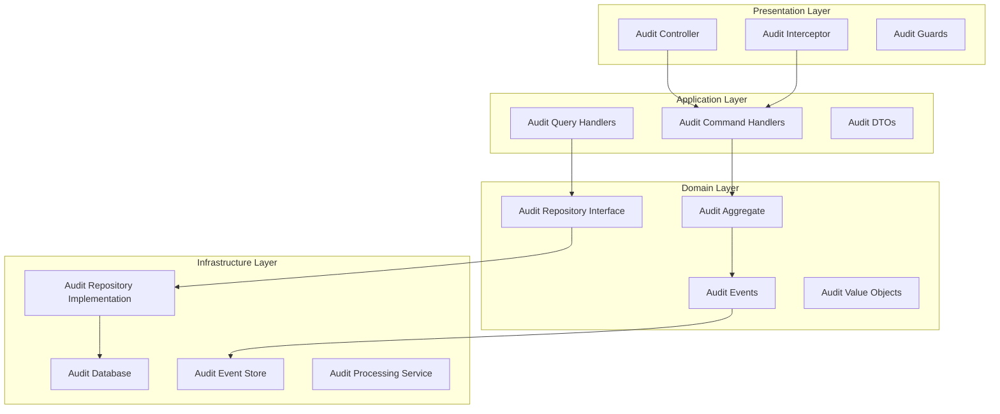

# Design Document

## Overview

The Audit Module Standardization system transforms the current audit functionality into a comprehensive, DDD-compliant module that provides enterprise-grade audit logging capabilities. The system implements proper layered architecture, comprehensive testing, and advanced audit features for compliance and security.

## Architecture

The audit module follows Domain-Driven Design with Clean Architecture principles:



## Components and Interfaces

### 1. Domain Layer Components

```typescript
// Audit Aggregate
interface AuditLog {
  id: AuditLogId;
  userId: UserId;
  action: AuditAction;
  resource: AuditResource;
  timestamp: AuditTimestamp;
  metadata: AuditMetadata;
  
  addEvent(event: AuditEvent): void;
  verify(): boolean;
  anonymize(): AuditLog;
}

// Audit Repository Interface
interface IAuditRepository {
  save(auditLog: AuditLog): Promise<void>;
  findById(id: AuditLogId): Promise<AuditLog | null>;
  findByUser(userId: UserId, filters: AuditFilters): Promise<AuditLog[]>;
  findByDateRange(start: Date, end: Date): Promise<AuditLog[]>;
  search(criteria: AuditSearchCriteria): Promise<AuditSearchResult>;
}

// Value Objects
interface AuditAction extends ValueObject<string> {
  isRead(): boolean;
  isWrite(): boolean;
  isDelete(): boolean;
}

interface AuditMetadata extends ValueObject<Record<string, any>> {
  getRequestData(): any;
  getResponseData(): any;
  getContext(): AuditContext;
}
```

### 2. Application Layer Components

```typescript
// Command Handlers
interface CreateAuditLogHandler {
  execute(command: CreateAuditLogCommand): Promise<void>;
}

interface ProcessAuditEventHandler {
  execute(command: ProcessAuditEventCommand): Promise<void>;
}

// Query Handlers
interface GetAuditLogsHandler {
  execute(query: GetAuditLogsQuery): Promise<AuditLogResponseDto[]>;
}

interface SearchAuditLogsHandler {
  execute(query: SearchAuditLogsQuery): Promise<AuditSearchResultDto>;
}

// DTOs
interface AuditLogResponseDto {
  id: string;
  userId: string;
  action: string;
  resource: string;
  timestamp: string;
  metadata: Record<string, any>;
}
```

### 3. Infrastructure Layer Components

```typescript
// Repository Implementation
interface AuditRepository extends IAuditRepository {
  save(auditLog: AuditLog): Promise<void>;
  findById(id: AuditLogId): Promise<AuditLog | null>;
  findByUser(userId: UserId, filters: AuditFilters): Promise<AuditLog[]>;
  archive(olderThan: Date): Promise<number>;
}

// Event Processing
interface AuditEventProcessor {
  process(event: AuditEvent): Promise<void>;
  batch(events: AuditEvent[]): Promise<void>;
  retry(failedEvent: AuditEvent): Promise<void>;
}

// Storage Backends
interface AuditStorageBackend {
  store(auditData: AuditData): Promise<void>;
  retrieve(criteria: StorageCriteria): Promise<AuditData[]>;
  archive(criteria: ArchiveCriteria): Promise<void>;
}
```

### 4. Presentation Layer Components

```typescript
// Audit Controller
interface AuditController {
  getAuditLogs(query: GetAuditLogsQueryDto): Promise<AuditLogResponseDto[]>;
  searchAuditLogs(query: SearchAuditLogsQueryDto): Promise<AuditSearchResultDto>;
  exportAuditLogs(query: ExportAuditLogsQueryDto): Promise<StreamableFile>;
}

// Audit Interceptor
interface AuditInterceptor {
  intercept(context: ExecutionContext, next: CallHandler): Observable<any>;
  shouldAudit(context: ExecutionContext): boolean;
  extractAuditData(context: ExecutionContext, response: any): AuditData;
}
```

## Data Models

### Audit Log Entity Model

```typescript
interface AuditLogEntity {
  id: string;
  userId: string;
  sessionId: string;
  action: string;
  resource: string;
  resourceId: string;
  method: string;
  endpoint: string;
  statusCode: number;
  requestData: any;
  responseData: any;
  userAgent: string;
  ipAddress: string;
  timestamp: Date;
  duration: number;
  metadata: Record<string, any>;
  createdAt: Date;
  updatedAt: Date;
}

interface AuditEventEntity {
  id: string;
  auditLogId: string;
  eventType: string;
  eventData: any;
  timestamp: Date;
  processed: boolean;
  processingAttempts: number;
  lastProcessingError: string;
  createdAt: Date;
}
```

### Configuration Models

```typescript
interface AuditConfiguration {
  enabled: boolean;
  logLevel: AuditLogLevel;
  storage: AuditStorageConfig;
  retention: AuditRetentionConfig;
  security: AuditSecurityConfig;
  performance: AuditPerformanceConfig;
}

interface AuditStorageConfig {
  backend: 'clickhouse' | 'postgresql' | 'elasticsearch';
  batchSize: number;
  flushInterval: number;
  compression: boolean;
  encryption: boolean;
}

interface AuditRetentionConfig {
  defaultRetentionDays: number;
  archiveAfterDays: number;
  deleteAfterDays: number;
  compressionAfterDays: number;
}
```

## Correctness Properties

*A property is a characteristic or behavior that should hold true across all valid executions of a system-essentially, a formal statement about what the system should do. Properties serve as the bridge between human-readable specifications and machine-verifiable correctness guarantees.*

### Property 1: Audit Log Integrity
*For any* audit log creation, the log should contain all required fields and maintain data integrity
**Validates: Requirements 5.1, 5.2, 5.3, 5.4, 7.1, 7.2**

### Property 2: Audit Event Processing
*For any* audit event, it should be processed exactly once and stored reliably
**Validates: Requirements 5.5, 5.6, 5.9, 6.1, 6.2**

### Property 3: Performance Compliance
*For any* audit operation, it should complete within acceptable performance thresholds
**Validates: Requirements 6.1, 6.2, 6.3, 6.4, 6.8**

### Property 4: Security Requirements
*For any* sensitive audit data, it should be encrypted and access-controlled appropriately
**Validates: Requirements 7.1, 7.2, 7.3, 7.4, 7.5**

### Property 5: Test Coverage Validation
*For any* audit module component, it should have appropriate test coverage meeting thresholds
**Validates: Requirements 3.1, 3.2, 3.3, 3.4, 3.5**

### Property 6: File Structure Compliance
*For any* file in the audit module, it should follow established naming and organization patterns
**Validates: Requirements 4.1, 4.2, 4.3, 4.4, 4.5**

### Property 7: Documentation Completeness
*For any* audit module documentation, it should meet completeness and quality standards
**Validates: Requirements 1.1, 1.2, 1.3, 1.4, 1.5**

### Property 8: Integration Extensibility
*For any* audit extension or integration, it should work seamlessly with the core audit system
**Validates: Requirements 8.1, 8.2, 8.3, 8.4, 8.5**

## Error Handling

### Audit Processing Errors
- **Storage Failures**: Implement retry mechanisms with exponential backoff
- **Network Issues**: Use circuit breaker pattern for external dependencies
- **Data Corruption**: Implement checksums and validation
- **Performance Degradation**: Implement graceful degradation and alerting

### Security Error Handling
- **Unauthorized Access**: Log security events and block access
- **Data Tampering**: Detect and alert on integrity violations
- **Encryption Failures**: Fail securely and alert administrators
- **Compliance Violations**: Generate compliance reports and alerts

## Testing Strategy

### Unit Testing
- Test all domain aggregates and value objects
- Test application command and query handlers
- Test audit interceptor logic
- Test security and encryption functions
- Mock external dependencies and storage

### Integration Testing
- Test audit repository implementations
- Test event processing pipelines
- Test storage backend integrations
- Test performance under load
- Test security controls and access patterns

### Property-Based Testing
- Use fast-check library for property-based testing
- Test audit log integrity across various inputs
- Test performance characteristics with generated data
- Test security properties with random sensitive data
- Minimum 100 iterations per property test
- Each test tagged with: **Feature: audit-module-standardization, Property {number}: {property_text}**

### End-to-End Testing
- Test complete audit workflows
- Test audit log generation and retrieval
- Test compliance reporting
- Test security controls in realistic scenarios
- Test performance under production-like conditions