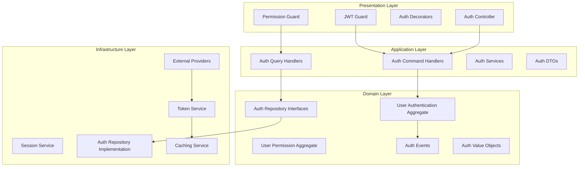

# Design Document

## Overview

The Auth Module Standardization system transforms the current authentication and authorization functionality into a comprehensive, security-focused, DDD-compliant module. The system implements proper layered architecture, advanced security features, and enterprise-grade authentication/authorization capabilities.

## Architecture

The auth module follows Domain-Driven Design with security-first principles:



## Components and Interfaces

### 1. Domain Layer Components

```typescript
// Authentication Aggregate
interface UserAuthentication {
  id: UserId;
  credentials: AuthCredentials;
  sessions: AuthSession[];
  mfaSettings: MFASettings;
  securitySettings: SecuritySettings;
  
  authenticate(credentials: AuthCredentials): AuthResult;
  createSession(context: AuthContext): AuthSession;
  enableMFA(settings: MFASettings): void;
  lockAccount(reason: LockReason): void;
  resetPassword(newPassword: Password): void;
}

// Authorization Aggregate
interface UserPermission {
  id: UserId;
  roles: Role[];
  permissions: Permission[];
  context: AuthorizationContext;
  
  hasPermission(permission: Permission, resource?: Resource): boolean;
  hasRole(role: Role): boolean;
  evaluateAccess(request: AccessRequest): AccessResult;
  grantPermission(permission: Permission): void;
  revokePermission(permission: Permission): void;
}

// Repository Interfaces
interface IAuthRepository {
  findByCredentials(credentials: AuthCredentials): Promise<UserAuthentication | null>;
  saveSession(session: AuthSession): Promise<void>;
  findSession(sessionId: SessionId): Promise<AuthSession | null>;
  revokeSession(sessionId: SessionId): Promise<void>;
}

interface IPermissionRepository {
  findUserPermissions(userId: UserId): Promise<UserPermission | null>;
  findRolePermissions(roleId: RoleId): Promise<Permission[]>;
  savePermissions(permissions: UserPermission): Promise<void>;
}
```

### 2. Application Layer Components

```typescript
// Command Handlers
interface AuthenticateUserHandler {
  execute(command: AuthenticateUserCommand): Promise<AuthenticationResult>;
}

interface AuthorizeAccessHandler {
  execute(command: AuthorizeAccessCommand): Promise<AuthorizationResult>;
}

interface CreateSessionHandler {
  execute(command: CreateSessionCommand): Promise<SessionResult>;
}

// Query Handlers
interface GetUserPermissionsHandler {
  execute(query: GetUserPermissionsQuery): Promise<UserPermissionsDto>;
}

interface ValidateTokenHandler {
  execute(query: ValidateTokenQuery): Promise<TokenValidationResult>;
}

// DTOs
interface AuthenticationResultDto {
  accessToken: string;
  refreshToken: string;
  expiresIn: number;
  tokenType: string;
  user: UserDto;
}

interface AuthorizationResultDto {
  authorized: boolean;
  permissions: string[];
  roles: string[];
  context: Record<string, any>;
}
```

### 3. Infrastructure Layer Components

```typescript
// Token Service
interface TokenService {
  generateAccessToken(user: UserAuthentication): Promise<string>;
  generateRefreshToken(user: UserAuthentication): Promise<string>;
  validateToken(token: string): Promise<TokenValidationResult>;
  revokeToken(token: string): Promise<void>;
  refreshToken(refreshToken: string): Promise<TokenRefreshResult>;
}

// Session Service
interface SessionService {
  createSession(user: UserAuthentication, context: AuthContext): Promise<AuthSession>;
  validateSession(sessionId: string): Promise<SessionValidationResult>;
  extendSession(sessionId: string): Promise<void>;
  terminateSession(sessionId: string): Promise<void>;
  cleanupExpiredSessions(): Promise<number>;
}

// External Auth Providers
interface ExternalAuthProvider {
  authenticate(credentials: ExternalCredentials): Promise<ExternalAuthResult>;
  validateToken(token: string): Promise<ExternalTokenValidation>;
  getUserInfo(token: string): Promise<ExternalUserInfo>;
}

// Caching Service
interface AuthCacheService {
  cachePermissions(userId: UserId, permissions: Permission[]): Promise<void>;
  getCachedPermissions(userId: UserId): Promise<Permission[] | null>;
  invalidateUserCache(userId: UserId): Promise<void>;
  cacheSession(session: AuthSession): Promise<void>;
}
```

### 4. Presentation Layer Components

```typescript
// Enhanced JWT Guard
interface JWTAuthGuard extends CanActivate {
  canActivate(context: ExecutionContext): Promise<boolean>;
  validateToken(token: string): Promise<TokenValidationResult>;
  extractTokenFromRequest(request: Request): string | null;
  handleAuthenticationFailure(context: ExecutionContext, error: AuthError): void;
}

// Enhanced Permission Guard
interface PermissionGuard extends CanActivate {
  canActivate(context: ExecutionContext): Promise<boolean>;
  checkPermissions(user: UserAuthentication, requiredPermissions: string[]): Promise<boolean>;
  evaluateContextualPermissions(user: UserAuthentication, context: AuthContext): Promise<boolean>;
  handleAuthorizationFailure(context: ExecutionContext, error: AuthError): void;
}

// Auth Controller
interface AuthController {
  login(credentials: LoginDto): Promise<AuthenticationResultDto>;
  refresh(refreshToken: RefreshTokenDto): Promise<AuthenticationResultDto>;
  logout(logoutDto: LogoutDto): Promise<void>;
  validateToken(token: ValidateTokenDto): Promise<TokenValidationResultDto>;
  getUserPermissions(userId: string): Promise<UserPermissionsDto>;
}
```

## Data Models

### Authentication Models

```typescript
interface AuthCredentials {
  username: string;
  password: string;
  mfaToken?: string;
  deviceId?: string;
  ipAddress: string;
  userAgent: string;
}

interface AuthSession {
  id: string;
  userId: string;
  accessToken: string;
  refreshToken: string;
  expiresAt: Date;
  createdAt: Date;
  lastAccessedAt: Date;
  ipAddress: string;
  userAgent: string;
  deviceId?: string;
  isActive: boolean;
}

interface MFASettings {
  enabled: boolean;
  method: 'totp' | 'sms' | 'email';
  secret?: string;
  backupCodes: string[];
  lastUsed?: Date;
}
```

### Authorization Models

```typescript
interface Permission {
  id: string;
  name: string;
  resource: string;
  action: string;
  conditions?: PermissionCondition[];
  metadata: Record<string, any>;
}

interface Role {
  id: string;
  name: string;
  permissions: Permission[];
  hierarchy: number;
  inheritsFrom?: Role[];
  metadata: Record<string, any>;
}

interface AccessRequest {
  userId: string;
  resource: string;
  action: string;
  context: AuthorizationContext;
  timestamp: Date;
}

interface AuthorizationContext {
  organizationId?: string;
  tenantId?: string;
  workspaceId?: string;
  ipAddress: string;
  userAgent: string;
  timeOfDay: Date;
  metadata: Record<string, any>;
}
```

## Correctness Properties

*A property is a characteristic or behavior that should hold true across all valid executions of a system-essentially, a formal statement about what the system should do. Properties serve as the bridge between human-readable specifications and machine-verifiable correctness guarantees.*

### Property 1: Authentication Security
*For any* authentication attempt, the system should validate credentials securely and generate valid tokens
**Validates: Requirements 5.1, 5.2, 5.3, 7.1, 7.2**

### Property 2: Authorization Consistency
*For any* authorization check, the system should consistently evaluate permissions based on current user roles and context
**Validates: Requirements 6.1, 6.2, 6.3, 6.4, 6.5**

### Property 3: Token Validity
*For any* token operation, the system should maintain token integrity and proper expiration handling
**Validates: Requirements 5.1, 5.3, 7.1, 7.2, 8.1**

### Property 4: Session Management
*For any* session operation, the system should maintain session security and proper lifecycle management
**Validates: Requirements 5.3, 5.8, 7.3, 8.2**

### Property 5: Security Compliance
*For any* security-sensitive operation, the system should follow security best practices and compliance requirements
**Validates: Requirements 7.1, 7.2, 7.3, 7.4, 7.5, 7.6, 7.7, 7.8, 7.9, 7.10**

### Property 6: Performance Efficiency
*For any* authentication or authorization operation, the system should complete within acceptable performance thresholds
**Validates: Requirements 8.1, 8.2, 8.3, 8.4, 8.5**

### Property 7: Test Coverage Validation
*For any* auth module component, it should have appropriate test coverage meeting security testing standards
**Validates: Requirements 3.1, 3.2, 3.3, 3.4, 3.5, 3.9**

### Property 8: File Structure Compliance
*For any* file in the auth module, it should follow established security-focused naming and organization patterns
**Validates: Requirements 4.1, 4.2, 4.3, 4.4, 4.5**

## Error Handling

### Authentication Errors
- **Invalid Credentials**: Secure error messages without information leakage
- **Account Lockout**: Implement progressive delays and notification
- **Token Expiration**: Automatic refresh with fallback to re-authentication
- **MFA Failures**: Secure handling with backup authentication methods

### Authorization Errors
- **Insufficient Permissions**: Clear error messages with required permissions
- **Role Conflicts**: Resolution strategies for conflicting role assignments
- **Context Violations**: Handling of contextual authorization failures
- **External Provider Failures**: Fallback to local authorization when possible

### Security Error Handling
- **Brute Force Attacks**: Rate limiting and account protection
- **Token Tampering**: Detection and immediate session termination
- **Session Hijacking**: Detection and security event generation
- **Compliance Violations**: Automatic reporting and remediation

## Testing Strategy

### Unit Testing
- Test all authentication and authorization logic
- Test security functions with various input scenarios
- Test token generation and validation
- Test permission evaluation algorithms
- Mock external dependencies and security providers

### Integration Testing
- Test complete authentication flows
- Test authorization with real permission data
- Test external provider integrations
- Test caching and performance optimizations
- Test security controls under realistic conditions

### Security Testing
- Penetration testing for authentication vulnerabilities
- Authorization bypass testing
- Token security and tampering tests
- Session security and hijacking tests
- Compliance validation testing

### Property-Based Testing
- Use fast-check library for property-based testing
- Test authentication security across various credential inputs
- Test authorization consistency with generated permission data
- Test token validity with random token scenarios
- Minimum 100 iterations per property test
- Each test tagged with: **Feature: auth-module-standardization, Property {number}: {property_text}**

### Performance Testing
- Load testing for authentication under high concurrency
- Performance testing for authorization with large permission sets
- Caching effectiveness testing
- Scalability testing for distributed scenarios