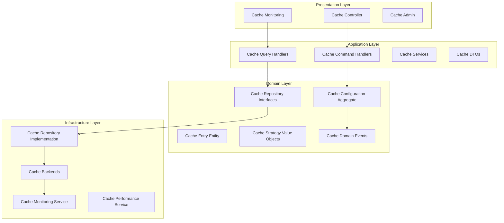

# Design Document

## Overview

The Cache Module Standardization system transforms the current basic caching functionality into a comprehensive, performance-focused, DDD-compliant module. The system implements proper layered architecture, advanced caching strategies, and enterprise-grade performance optimization capabilities.

## Architecture

The cache module follows Domain-Driven Design with performance-first principles:



## Components and Interfaces

### 1. Domain Layer Components

```typescript
// Cache Configuration Aggregate
interface CacheConfiguration {
  id: CacheConfigId;
  strategy: CacheStrategy;
  backend: CacheBackend;
  ttl: CacheTTL;
  maxSize: CacheSize;
  evictionPolicy: EvictionPolicy;
  
  updateStrategy(strategy: CacheStrategy): void;
  setEvictionPolicy(policy: EvictionPolicy): void;
  validateConfiguration(): boolean;
  optimizeForWorkload(workload: CacheWorkload): void;
}

// Cache Entry Entity
interface CacheEntry {
  key: CacheKey;
  value: CacheValue;
  metadata: CacheMetadata;
  createdAt: Date;
  lastAccessed: Date;
  accessCount: number;
  
  isExpired(): boolean;
  updateAccess(): void;
  calculatePriority(): number;
  serialize(): SerializedCacheEntry;
}

// Repository Interfaces
interface ICacheRepository {
  get(key: CacheKey): Promise<CacheEntry | null>;
  set(key: CacheKey, value: CacheValue, options?: CacheOptions): Promise<void>;
  delete(key: CacheKey): Promise<boolean>;
  clear(pattern?: string): Promise<number>;
  exists(key: CacheKey): Promise<boolean>;
  ttl(key: CacheKey): Promise<number>;
}

interface ICacheMetricsRepository {
  recordHit(key: CacheKey): Promise<void>;
  recordMiss(key: CacheKey): Promise<void>;
  getMetrics(timeRange: TimeRange): Promise<CacheMetrics>;
  getHitRatio(timeRange: TimeRange): Promise<number>;
}
```

### 2. Application Layer Components

```typescript
// Command Handlers
interface SetCacheEntryHandler {
  execute(command: SetCacheEntryCommand): Promise<void>;
}

interface InvalidateCacheHandler {
  execute(command: InvalidateCacheCommand): Promise<void>;
}

interface OptimizeCacheHandler {
  execute(command: OptimizeCacheCommand): Promise<CacheOptimizationResult>;
}

// Query Handlers
interface GetCacheEntryHandler {
  execute(query: GetCacheEntryQuery): Promise<CacheEntryDto | null>;
}

interface GetCacheMetricsHandler {
  execute(query: GetCacheMetricsQuery): Promise<CacheMetricsDto>;
}

// Cache Services
interface CacheService {
  get<T>(key: string): Promise<T | null>;
  set<T>(key: string, value: T, options?: CacheOptions): Promise<void>;
  delete(key: string): Promise<boolean>;
  clear(pattern?: string): Promise<number>;
  getOrSet<T>(key: string, factory: () => Promise<T>, options?: CacheOptions): Promise<T>;
}

// DTOs
interface CacheEntryDto {
  key: string;
  value: any;
  ttl: number;
  createdAt: string;
  lastAccessed: string;
  accessCount: number;
}

interface CacheMetricsDto {
  hitRatio: number;
  totalHits: number;
  totalMisses: number;
  totalOperations: number;
  averageLatency: number;
  memoryUsage: number;
}
```

### 3. Infrastructure Layer Components

```typescript
// Cache Backend Interface
interface CacheBackend {
  get(key: string): Promise<any>;
  set(key: string, value: any, ttl?: number): Promise<void>;
  delete(key: string): Promise<boolean>;
  clear(pattern?: string): Promise<number>;
  exists(key: string): Promise<boolean>;
  ttl(key: string): Promise<number>;
  keys(pattern?: string): Promise<string[]>;
}

// Redis Backend Implementation
interface RedisCacheBackend extends CacheBackend {
  pipeline(): RedisPipeline;
  multi(): RedisMulti;
  subscribe(channel: string, callback: (message: string) => void): Promise<void>;
  publish(channel: string, message: string): Promise<void>;
  cluster(): RedisCluster;
}

// In-Memory Backend Implementation
interface InMemoryCacheBackend extends CacheBackend {
  getStats(): MemoryCacheStats;
  optimize(): Promise<void>;
  export(): Promise<CacheSnapshot>;
  import(snapshot: CacheSnapshot): Promise<void>;
}

// Cache Strategy Implementations
interface CacheStrategy {
  shouldCache(key: string, value: any, context: CacheContext): boolean;
  getTTL(key: string, value: any, context: CacheContext): number;
  getEvictionCandidates(entries: CacheEntry[], count: number): CacheEntry[];
  onHit(entry: CacheEntry): void;
  onMiss(key: string): void;
}

// Monitoring Service
interface CacheMonitoringService {
  recordOperation(operation: CacheOperation): Promise<void>;
  getMetrics(timeRange: TimeRange): Promise<CacheMetrics>;
  getPerformanceReport(): Promise<CachePerformanceReport>;
  detectAnomalies(): Promise<CacheAnomaly[]>;
}
```

### 4. Presentation Layer Components

```typescript
// Cache Controller
interface CacheController {
  getCacheEntry(key: string): Promise<CacheEntryDto | null>;
  setCacheEntry(request: SetCacheEntryRequestDto): Promise<void>;
  deleteCacheEntry(key: string): Promise<boolean>;
  clearCache(pattern?: string): Promise<{ deletedCount: number }>;
  getCacheMetrics(timeRange?: string): Promise<CacheMetricsDto>;
}

// Cache Admin Controller
interface CacheAdminController {
  getConfiguration(): Promise<CacheConfigurationDto>;
  updateConfiguration(config: UpdateCacheConfigurationDto): Promise<void>;
  optimizeCache(): Promise<CacheOptimizationResultDto>;
  exportCache(): Promise<StreamableFile>;
  importCache(file: Express.Multer.File): Promise<{ importedCount: number }>;
}

// Cache Monitoring Controller
interface CacheMonitoringController {
  getHealthStatus(): Promise<CacheHealthStatusDto>;
  getPerformanceMetrics(): Promise<CachePerformanceMetricsDto>;
  getUsageStatistics(): Promise<CacheUsageStatisticsDto>;
  getAnomalies(): Promise<CacheAnomalyDto[]>;
}
```

## Data Models

### Cache Configuration Models

```typescript
interface CacheConfigurationEntity {
  id: string;
  name: string;
  strategy: string;
  backend: string;
  ttlSeconds: number;
  maxSizeBytes: number;
  evictionPolicy: string;
  compressionEnabled: boolean;
  serializationFormat: string;
  monitoringEnabled: boolean;
  createdAt: Date;
  updatedAt: Date;
}

interface CacheBackendConfiguration {
  type: 'redis' | 'memcached' | 'memory';
  connectionString?: string;
  host?: string;
  port?: number;
  password?: string;
  database?: number;
  cluster?: boolean;
  sentinel?: boolean;
  options: Record<string, any>;
}
```

### Cache Entry Models

```typescript
interface CacheEntryEntity {
  key: string;
  value: any;
  valueType: string;
  compressed: boolean;
  serialized: boolean;
  ttlSeconds: number;
  createdAt: Date;
  lastAccessedAt: Date;
  accessCount: number;
  sizeBytes: number;
  metadata: Record<string, any>;
}

interface CacheMetricsEntity {
  id: string;
  timestamp: Date;
  operation: string;
  key: string;
  hit: boolean;
  latencyMs: number;
  sizeBytes: number;
  backend: string;
  metadata: Record<string, any>;
}
```

### Performance Models

```typescript
interface CachePerformanceMetrics {
  hitRatio: number;
  missRatio: number;
  totalOperations: number;
  averageLatency: number;
  p95Latency: number;
  p99Latency: number;
  throughputOps: number;
  memoryUsageBytes: number;
  memoryUtilization: number;
  evictionCount: number;
  errorRate: number;
}

interface CacheWorkloadProfile {
  readWriteRatio: number;
  keyDistribution: string;
  valueSize: CacheSizeDistribution;
  accessPattern: string;
  temporalLocality: number;
  spatialLocality: number;
}
```

## Correctness Properties

*A property is a characteristic or behavior that should hold true across all valid executions of a system-essentially, a formal statement about what the system should do. Properties serve as the bridge between human-readable specifications and machine-verifiable correctness guarantees.*

### Property 1: Cache Consistency
*For any* cache operation, the cache should maintain data consistency and return the most recently stored value
**Validates: Requirements 5.1, 5.8, 6.5**

### Property 2: Performance Efficiency
*For any* cache access pattern, the cache should provide performance improvements over direct data access
**Validates: Requirements 5.7, 7.1, 7.4, 7.5**

### Property 3: Eviction Policy Compliance
*For any* cache eviction scenario, the cache should follow the configured eviction policy correctly
**Validates: Requirements 5.1, 5.5, 5.9**

### Property 4: Backend Integration Reliability
*For any* cache backend operation, the system should handle failures gracefully and maintain service availability
**Validates: Requirements 6.1, 6.3, 6.6, 6.8**

### Property 5: Monitoring Accuracy
*For any* cache operation, the monitoring system should accurately record metrics and performance data
**Validates: Requirements 7.1, 7.2, 7.3, 7.4, 7.8**

### Property 6: Configuration Validity
*For any* cache configuration change, the system should validate settings and maintain operational stability
**Validates: Requirements 5.2, 6.9, 8.6, 8.8**

### Property 7: Test Coverage Validation
*For any* cache module component, it should have appropriate test coverage meeting performance testing standards
**Validates: Requirements 3.1, 3.2, 3.3, 3.4, 3.5**

### Property 8: Extensibility Integration
*For any* cache extension or plugin, it should integrate seamlessly with the core caching system
**Validates: Requirements 8.1, 8.2, 8.3, 8.4, 8.5**

## Error Handling

### Cache Operation Errors
- **Backend Failures**: Implement circuit breaker and fallback mechanisms
- **Network Issues**: Use retry policies with exponential backoff
- **Memory Exhaustion**: Implement graceful degradation and emergency eviction
- **Serialization Errors**: Provide fallback serialization methods

### Performance Degradation Handling
- **High Latency**: Implement timeout controls and performance alerting
- **Low Hit Ratio**: Automatic cache warming and strategy optimization
- **Memory Pressure**: Proactive eviction and memory management
- **Backend Overload**: Load balancing and traffic shaping

### Configuration and Integration Errors
- **Invalid Configuration**: Validation and safe fallback to defaults
- **Plugin Failures**: Isolation and graceful degradation
- **Version Conflicts**: Compatibility checking and migration support
- **Hot-reload Issues**: Rollback mechanisms and state preservation

## Testing Strategy

### Unit Testing
- Test all cache strategies and eviction algorithms
- Test cache entry lifecycle and metadata management
- Test configuration validation and optimization
- Test error handling and recovery mechanisms
- Mock cache backends and external dependencies

### Integration Testing
- Test cache backend integrations with real systems
- Test distributed caching scenarios
- Test performance under various load conditions
- Test failover and redundancy mechanisms
- Test monitoring and metrics collection

### Performance Testing
- Load testing with high-throughput scenarios
- Latency testing under various conditions
- Memory usage and optimization testing
- Scalability testing with multiple backends
- Benchmark testing against performance baselines

### Property-Based Testing
- Use fast-check library for property-based testing
- Test cache consistency across various operation sequences
- Test performance characteristics with generated workloads
- Test eviction policy correctness with random data
- Minimum 100 iterations per property test
- Each test tagged with: **Feature: cache-module-standardization, Property {number}: {property_text}**

### Reliability Testing
- Test cache behavior under failure conditions
- Test data recovery and persistence mechanisms
- Test system behavior under resource constraints
- Test long-running stability and memory leaks
- Test concurrent access and thread safety