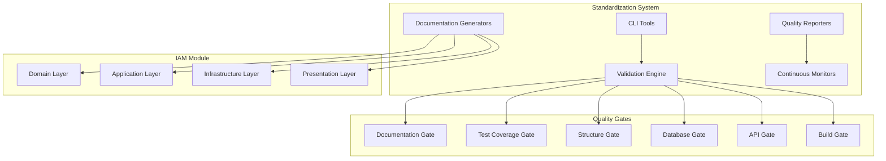

# Design Document

## Overview

The IAM Module Standardization system implements comprehensive quality gates and automation tools to ensure the TelemetryFlow Core IAM module meets all standardization requirements. The system provides automated validation, documentation generation, test coverage enforcement, and continuous improvement processes.

## Architecture

The standardization system follows a layered architecture with clear separation of concerns:



## Components and Interfaces

### 1. Standardization CLI

The command-line interface provides developers with tools to validate and improve module standardization:

```typescript
interface StandardizationCLI {
  validateModule(moduleName: string): Promise<ValidationResult>;
  generateDocs(moduleName: string): Promise<void>;
  checkCoverage(moduleName: string): Promise<CoverageReport>;
  fixStructure(moduleName: string): Promise<StructureFixes>;
  runQualityGates(moduleName: string): Promise<QualityGateResults>;
}
```

### 2. Quality Gate Validator

Each quality gate has a specific validator that checks compliance:

```typescript
interface QualityGateValidator {
  validate(module: ModuleStructure): Promise<ValidationResult>;
  getRequirements(): QualityRequirement[];
  generateReport(): Promise<QualityReport>;
}

interface DocumentationGateValidator extends QualityGateValidator {
  validateReadme(readmePath: string): Promise<ReadmeValidation>;
  validateApiDocs(docsPath: string): Promise<ApiDocsValidation>;
  validateDiagrams(diagramsPath: string): Promise<DiagramValidation>;
}

interface TestCoverageGateValidator extends QualityGateValidator {
  validateCoverage(coverageData: CoverageData): Promise<CoverageValidation>;
  validateTestStructure(testsPath: string): Promise<TestStructureValidation>;
  validateTestPatterns(testsPath: string): Promise<TestPatternValidation>;
}
```

### 3. Documentation Generator

Automated documentation generation for consistent module documentation:

```typescript
interface DocumentationGenerator {
  generateReadme(module: ModuleStructure): Promise<string>;
  generateApiDocs(controllers: Controller[]): Promise<OpenAPISpec>;
  generateERD(entities: Entity[]): Promise<string>;
  generateDFD(handlers: Handler[]): Promise<string>;
  generateTestingGuide(tests: TestStructure): Promise<string>;
}
```

### 4. Test Coverage Analyzer

Comprehensive test coverage analysis and reporting:

```typescript
interface TestCoverageAnalyzer {
  analyzeCoverage(modulePath: string): Promise<CoverageReport>;
  validateThresholds(coverage: CoverageReport): Promise<ThresholdValidation>;
  generateCoverageReport(coverage: CoverageReport): Promise<string>;
  identifyUncoveredCode(coverage: CoverageReport): Promise<UncoveredCode[]>;
}
```

### 5. File Structure Validator

Validates and fixes file structure and naming conventions:

```typescript
interface FileStructureValidator {
  validateStructure(modulePath: string): Promise<StructureValidation>;
  validateNaming(files: FileInfo[]): Promise<NamingValidation>;
  generateBarrelExports(directories: DirectoryInfo[]): Promise<BarrelExport[]>;
  fixStructureIssues(issues: StructureIssue[]): Promise<StructureFix[]>;
}
```

## Data Models

### Module Structure Model

```typescript
interface ModuleStructure {
  name: string;
  path: string;
  layers: {
    domain: DomainLayer;
    application: ApplicationLayer;
    infrastructure: InfrastructureLayer;
    presentation: PresentationLayer;
  };
  documentation: DocumentationStructure;
  tests: TestStructure;
  configuration: ModuleConfiguration;
}

interface DomainLayer {
  aggregates: AggregateInfo[];
  entities: EntityInfo[];
  valueObjects: ValueObjectInfo[];
  events: DomainEventInfo[];
  repositories: RepositoryInterfaceInfo[];
  services: DomainServiceInfo[];
}

interface ApplicationLayer {
  commands: CommandInfo[];
  queries: QueryInfo[];
  handlers: HandlerInfo[];
  dtos: DTOInfo[];
}

interface InfrastructureLayer {
  entities: EntityInfo[];
  repositories: RepositoryImplementationInfo[];
  mappers: MapperInfo[];
  migrations: MigrationInfo[];
  seeds: SeedInfo[];
}

interface PresentationLayer {
  controllers: ControllerInfo[];
  dtos: DTOInfo[];
  guards: GuardInfo[];
  decorators: DecoratorInfo[];
}
```

### Quality Gate Results Model

```typescript
interface QualityGateResults {
  overall: QualityStatus;
  gates: {
    documentation: QualityGateResult;
    testCoverage: QualityGateResult;
    fileStructure: QualityGateResult;
    databasePatterns: QualityGateResult;
    apiStandards: QualityGateResult;
    buildQuality: QualityGateResult;
  };
  recommendations: Recommendation[];
  automatedFixes: AutomatedFix[];
}

interface QualityGateResult {
  status: QualityStatus;
  score: number;
  requirements: RequirementResult[];
  issues: QualityIssue[];
  fixes: QualityFix[];
}

enum QualityStatus {
  PASSED = 'passed',
  FAILED = 'failed',
  WARNING = 'warning',
  NOT_CHECKED = 'not_checked'
}
```

### Test Coverage Model

```typescript
interface CoverageReport {
  overall: CoverageMetrics;
  byLayer: {
    domain: CoverageMetrics;
    application: CoverageMetrics;
    infrastructure: CoverageMetrics;
    presentation: CoverageMetrics;
  };
  byFile: FileCoverageInfo[];
  uncoveredLines: UncoveredLine[];
  thresholds: CoverageThresholds;
}

interface CoverageMetrics {
  lines: CoveragePercentage;
  functions: CoveragePercentage;
  branches: CoveragePercentage;
  statements: CoveragePercentage;
}

interface CoverageThresholds {
  domain: CoverageMetrics;
  application: CoverageMetrics;
  infrastructure: CoverageMetrics;
  presentation: CoverageMetrics;
  overall: CoverageMetrics;
}
```

## Correctness Properties

*A property is a characteristic or behavior that should hold true across all valid executions of a system-essentially, a formal statement about what the system should do. Properties serve as the bridge between human-readable specifications and machine-verifiable correctness guarantees.*

### Property 1: Documentation Completeness
*For any* IAM module validation, all required documentation files should exist and meet minimum content requirements
**Validates: Requirements 1.1, 1.2, 1.3, 1.4, 1.5, 1.6, 1.7, 1.8, 1.9, 1.10**

### Property 2: Test Coverage Thresholds
*For any* test coverage analysis, the coverage percentages should meet or exceed the defined thresholds for each layer
**Validates: Requirements 2.1, 2.2, 2.3, 2.4, 2.5**

### Property 3: File Structure Consistency
*For any* file in the IAM module, the file should follow the established naming conventions and be located in the correct directory structure
**Validates: Requirements 3.1, 3.2, 3.3, 3.4, 3.5, 3.6, 3.7, 3.8, 3.9, 3.10**

### Property 4: Database Pattern Compliance
*For any* database migration or seed file, it should follow the established naming patterns and include proper error handling
**Validates: Requirements 4.1, 4.2, 4.3, 4.4, 4.5, 4.6, 4.7, 4.8, 4.9, 4.10**

### Property 5: API Standards Adherence
*For any* API endpoint in the IAM module, it should include proper Swagger documentation, validation, and error handling
**Validates: Requirements 5.1, 5.2, 5.3, 5.4, 5.5, 5.6, 5.7, 5.8, 5.9, 5.10**

### Property 6: Build Quality Validation
*For any* build or quality check execution, it should complete successfully with zero errors or failures
**Validates: Requirements 6.1, 6.2, 6.3, 6.4, 6.5, 6.6, 6.7, 6.8, 6.9, 6.10**

### Property 7: Automation Tool Reliability
*For any* automated standardization tool execution, it should produce consistent and accurate results
**Validates: Requirements 7.1, 7.2, 7.3, 7.4, 7.5, 7.6, 7.7, 7.8, 7.9, 7.10**

### Property 8: Continuous Improvement Process
*For any* standardization review or assessment, it should follow the established process and produce actionable insights
**Validates: Requirements 8.1, 8.2, 8.3, 8.4, 8.5, 8.6, 8.7, 8.8, 8.9, 8.10**

## Error Handling

### Validation Errors

The system handles various types of validation errors:

1. **Missing Documentation**: When required documentation files are missing
2. **Insufficient Coverage**: When test coverage falls below thresholds
3. **Structure Violations**: When file structure doesn't match standards
4. **Naming Violations**: When files don't follow naming conventions
5. **API Standard Violations**: When APIs don't meet documentation requirements
6. **Build Failures**: When build or quality checks fail

### Error Recovery Strategies

1. **Automated Fixes**: For simple issues like missing barrel exports or naming violations
2. **Guided Remediation**: For complex issues requiring developer intervention
3. **Incremental Improvement**: For large-scale issues that need gradual resolution
4. **Fallback Documentation**: For missing documentation that can be auto-generated

### Error Reporting

All errors are reported with:
- Clear description of the issue
- Location of the problem
- Suggested fix or remediation steps
- Priority level (critical, warning, info)
- Automated fix availability

## Testing Strategy

### Unit Testing
- Test all validation logic with various input scenarios
- Test documentation generators with different module structures
- Test coverage analyzers with various coverage data
- Test file structure validators with different directory layouts
- Mock external dependencies (file system, test runners)

### Integration Testing
- Test complete quality gate validation workflows
- Test documentation generation with real module data
- Test coverage analysis with actual test results
- Test automated fixes with real file structures
- Validate CLI tool integration with all components

### Property-Based Testing
- Use fast-check library for property-based testing
- Generate random module structures for validation testing
- Test coverage threshold validation with various coverage data
- Test file naming validation with generated file names
- Test API documentation validation with generated API specs
- Minimum 100 iterations per property test
- Each test tagged with: **Feature: iam-module-standardization, Property {number}: {property_text}**

### End-to-End Testing
- Test complete standardization workflow on real IAM module
- Test CLI tools with various command combinations
- Test quality gate reporting with real data
- Test continuous improvement processes
- Validate automation tool reliability over time

The testing approach ensures both specific examples work correctly and universal properties hold across all inputs, providing comprehensive validation of the standardization system.