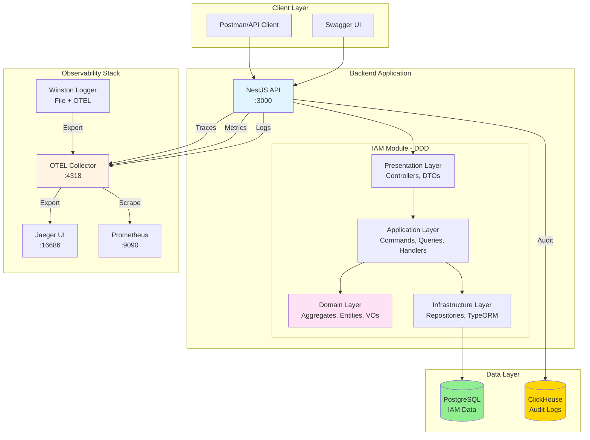
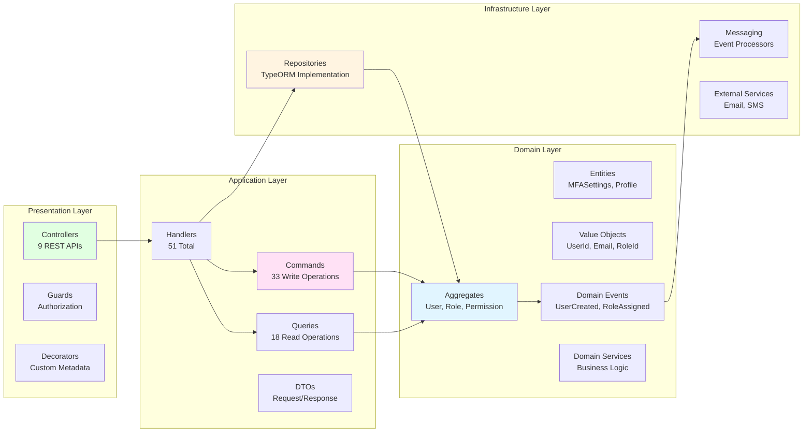

<div align="center">
  <picture>
    <source media="(prefers-color-scheme: dark)" srcset="https://github.com/telemetryflow/.github/raw/main/docs/assets/tfo-logo-core-dark.svg">
    <source media="(prefers-color-scheme: light)" srcset="https://github.com/telemetryflow/.github/raw/main/docs/assets/tfo-logo-core-light.svg">
    
  </picture>

  <h3>TelemetryFlow Core IAM service (5-Tier RBAC)</h3>

[](CHANGELOG.md)
[](https://opensource.org/licenses/Apache-2.0)
[](https://nestjs.com/)
[](https://www.typescriptlang.org/)
[](https://www.postgresql.org/)
[](https://clickhouse.com/)
[](src/modules/iam/)
[](README.md#5-tier-rbac-system)
[](src/database)
[](docs/postman/BDD_TESTS.md)
[](https://opentelemetry.io/)
[](https://hub.docker.com/r/telemetryflow/telemetryflow-core)

</div>

---

## Overview

**TelemetryFlow Core** is a lightweight, production-ready IAM service extracted from the TelemetryFlow Platform. It provides complete identity and access management with a 5-tier RBAC system, multi-tenancy support, and enterprise-grade security features.

## Features

### IAM Module
- **Multi-tenant architecture**: Tenant → Organization → Workspace hierarchy
- **User management**: Complete CRUD operations with role-based access
- **5-Tier RBAC System**: Super Admin, Administrator, Developer, Viewer, Demo
- **Role-Based Access Control**: Hierarchical roles with 22+ permissions
- **Group management**: User groups with permission inheritance
- **Region support**: Multi-region tenant deployment
- **CQRS pattern**: Separate read/write operations (33 commands, 18 queries)
- **Domain events**: Event-driven architecture (25+ events)

### Module Standardization
- **Quality Gates**: 6 comprehensive standardization gates for all modules
- **Test Coverage**: 90%+ overall coverage (95% domain layer requirement)
- **Documentation**: 500+ line README files with complete API documentation
- **Property-Based Testing**: 8 correctness properties per module
- **Automated Validation**: Quality enforcement and standardization tooling
- **DDD Compliance**: Strict Domain-Driven Design architecture patterns

### Architecture
- **Domain-Driven Design (DDD)**: 8 aggregates, 10 value objects, domain services
- **CQRS**: Command Query Responsibility Segregation
- **Clean Architecture**: Domain → Application → Infrastructure → Presentation
- **Event-Driven**: Domain events for all entity lifecycle changes

### Observability
- **Swagger/OpenAPI**: Interactive API documentation at `/api`
- **OpenTelemetry**: Distributed tracing with OTLP export
- **Winston Logging**: Structured logging with multiple levels
- **Health Checks**: Built-in health endpoint

### Security
- **JWT Authentication**: Secure token-based auth
- **Password Hashing**: Argon2 for secure password storage
- **Secret Generation**: Cryptographically secure secret generator
- **Multi-tenancy Isolation**: Organization-level data scoping

## Quick Start

### Prerequisites
- Node.js 18+
- pnpm 8+
- Docker & Docker Compose

### One-Command Setup

```bash
# Start all services
docker-compose --profile all up -d

# Or start specific profiles
docker-compose --profile core up -d                       # Core only
docker-compose --profile core --profile monitoring up -d  # Core + Monitoring
```

### Docker Profiles

**Available profiles:**
- `core` - Backend, PostgreSQL, ClickHouse
- `monitoring` - OTEL, Jaeger, Prometheus, Grafana
- `tools` - Portainer
- `all` - Everything

See [docs/DOCKER_SETUP.md](./docs/DOCKER_SETUP.md) for details.

### Manual Setup

```bash
# Clone repository
git clone https://github.com/telemetryflow/telemetryflow-core.git
cd telemetryflow-core

# Install dependencies
pnpm install

# Configure environment
cp .env.example .env
# Edit .env with your configuration

# Generate secrets
pnpm run generate:secrets

# Start infrastructure (PostgreSQL + ClickHouse + OTEL)
docker-compose up -d

# Initialize ClickHouse schema
docker exec -i telemetryflow_core_clickhouse clickhouse-client --multiquery < config/clickhouse/migrations/001-audit-logs.sql

# Seed database
pnpm run db:seed:iam

# Start development server
pnpm run dev
```

### Alternative: Bootstrap Script

```bash
bash scripts/bootstrap.sh --dev
```

## Architecture

### System Architecture



### DDD Layer Structure



### Directory Structure

```
src/
├── main.ts                     # Application entry point
├── app.module.ts               # Root module
├── shared/                     # Shared domain primitives
│   └── domain/
│       ├── Entity.ts
│       ├── ValueObject.ts
│       ├── AggregateRoot.ts
│       └── DomainEvent.ts
├── logger/                     # Winston logger module
├── otel/                       # OpenTelemetry tracing
├── health/                     # Health check endpoint
├── database/                   # Database configuration
│   ├── config/
│   └── typeorm.config.ts
└── modules/
    └── iam/                    # IAM Module (DDD)
        ├── domain/             # Business logic
        │   ├── aggregates/       # User, Role, Permission, Tenant, etc.
        │   ├── entities/         # MFASettings, UserProfile
        │   ├── value-objects/    # UserId, Email, RoleId, etc.
        │   ├── events/           # Domain events
        │   ├── repositories/     # Repository interfaces
        │   └── services/         # Domain services
        ├── application/        # Use cases (CQRS)
        │   ├── commands/         # Write operations (33)
        │   ├── queries/          # Read operations (18)
        │   ├── handlers/         # Command/Query handlers (51)
        │   └── dto/              # Application DTOs
        ├── infrastructure/     # Technical implementation
        │   ├── persistence/      # TypeORM repositories & entities
        │   └── messaging/        # Event processors
        └── presentation/       # API layer
            ├── controllers/      # REST controllers (9)
            ├── dto/              # Request/Response DTOs
            ├── guards/           # Authorization guards
            └── decorators/       # Custom decorators

.kiro/                          # Kiro specifications
└── specs/                      # Module standardization specs
    ├── iam-module-standardization/
    │   ├── requirements.md       # 8 requirements, 80 acceptance criteria
    │   ├── design.md            # DDD architecture, 8 correctness properties
    │   └── tasks.md             # 60 implementation tasks
    ├── audit-module-standardization/
    ├── auth-module-standardization/
    └── cache-module-standardization/
```

## Module Standardization

TelemetryFlow Core follows comprehensive module standardization guidelines to ensure consistency, quality, and maintainability across all modules.

### Standardization Framework

Each module includes detailed specifications in `.kiro/specs/`:

- **IAM Module**: Complete identity and access management standardization
- **Audit Module**: Audit logging and compliance standardization  
- **Auth Module**: Authentication and authorization standardization
- **Cache Module**: Caching and performance standardization

### Quality Gates

All modules must pass 6 comprehensive quality gates:

| Gate | Requirement | Standard |
|------|-------------|----------|
| **Documentation** | Complete documentation with 500+ line README | 100% |
| **Test Coverage** | Domain: ≥95%, Application: ≥90%, Overall: ≥90% | ≥90% |
| **File Structure** | DDD compliance with standardized naming | 100% |
| **Database Patterns** | Standardized migrations, seeds, and naming | 100% |
| **API Standards** | Swagger, validation, REST conventions | 100% |
| **Build Quality** | Zero errors in build, lint, and tests | 0 Errors |

### Property-Based Testing

Each module implements 8 correctness properties:

1. **Idempotency** - Operations produce same result when repeated
2. **Consistency** - Data remains consistent across operations  
3. **Validation** - All inputs are properly validated
4. **Authorization** - Access control is enforced
5. **Persistence** - Data is correctly saved and retrieved
6. **Event Handling** - Domain events are properly published
7. **Error Handling** - Errors are handled gracefully
8. **Performance** - Operations meet performance requirements

### Specification Structure

Each module specification includes:

```
.kiro/specs/{module}-module-standardization/
├── requirements.md    # 8 requirements, 80 acceptance criteria (EARS patterns)
├── design.md         # DDD architecture, components, correctness properties
└── tasks.md          # 52-60 implementation tasks with checkpoints
```

### Development Workflow

1. **Review Specifications**: Study requirements, design, and tasks
2. **Implement Features**: Follow DDD/CQRS patterns
3. **Validate Quality**: Ensure all quality gates pass
4. **Property Testing**: Implement correctness properties
5. **Documentation**: Maintain comprehensive documentation

For detailed contribution guidelines, see [CONTRIBUTING.md](./CONTRIBUTING.md#module-standardization).

## 5-Tier RBAC System

### Role Hierarchy

1. **Super Administrator** (Global)
   - Platform management across all organizations
   - All permissions

2. **Administrator** (Organization-scoped)
   - Full CRUD within organization
   - Cannot manage platform

3. **Developer** (Organization-scoped)
   - Create/Read/Update (no delete)
   - Cannot manage users/roles

4. **Viewer** (Organization-scoped)
   - Read-only access
   - Cannot modify resources

5. **Demo** (Demo org only)
   - Developer access in demo organization
   - Isolated from production data

### Default Users

| Email | Password | Role | Tier |
|-------|----------|------|------|
| superadmin.telemetryflow@telemetryflow.id | SuperAdmin@123456 | Super Administrator | 1 |
| administrator.telemetryflow@telemetryflow.id | Admin@123456 | Administrator | 2 |
| developer.telemetryflow@telemetryflow.id | Developer@123456 | Developer | 3 |
| viewer.telemetryflow@telemetryflow.id | Viewer@123456 | Viewer | 4 |
| demo.telemetryflow@telemetryflow.id | Demo@123456 | Demo | 5 |

## API Documentation

Once running, access Swagger UI at: `http://localhost:3000/api`

### Key Endpoints

- **Users**: `/api/users` - User management
- **Roles**: `/api/roles` - Role management
- **Permissions**: `/api/permissions` - Permission management
- **Tenants**: `/api/tenants` - Tenant management
- **Organizations**: `/api/organizations` - Organization management
- **Workspaces**: `/api/workspaces` - Workspace management
- **Groups**: `/api/groups` - Group management
- **Regions**: `/api/regions` - Region management
- **Health**: `/health` - Health check

### API Testing

**Postman Collection** (Recommended):
- Import `docs/postman/TelemetryFlow Core - IAM.postman_collection.json`
- Import `docs/postman/TelemetryFlow Core - Local.postman_environment.json`
- 54+ pre-configured requests with default credentials
- See [docs/postman/README.md](./docs/postman/README.md)

**BDD Automated Testing** (Newman):
```bash
# Run all BDD tests
pnpm test:bdd

# Run specific module
pnpm test:bdd:users
pnpm test:bdd:roles

# With detailed output
pnpm test:bdd:verbose
```
- 33 BDD test scenarios with Given-When-Then format
- 100% API coverage
- HTML and JSON reports
- See [docs/postman/BDD_TESTS.md](./docs/postman/BDD_TESTS.md)

**Export OpenAPI Spec**:
```bash
./scripts/export-swagger-docs.sh
```

## Makefile Commands (Recommended)

TelemetryFlow Core includes a comprehensive Makefile that simplifies development and CI operations. The Makefile provides standardized commands that work consistently across local development and CI environments.

```bash
# Quick Start
make help                    # Show all available commands
make install                 # Install dependencies
make dev                     # Start development server
make build                   # Build the application

# Development Workflow
make start                   # Install + build + start development
make reset                   # Clean + install + build (reset environment)
make check                   # Quick check (lint + test)

# Code Quality
make lint                    # Run ESLint
make lint-fix                # Run ESLint with auto-fix
make format                  # Alias for lint-fix

# Testing
make test                    # Run unit tests
make test-coverage           # Run tests with coverage
make test-bdd                # Run BDD tests (Newman/Postman)

# Database Operations
make db-migrate              # Run database migrations
make db-seed                 # Seed database with initial data
make db-setup                # Setup database (migrate + seed)
make db-cleanup              # Clean up database

# Docker Operations
make docker-build            # Build Docker image
make docker-run              # Run Docker container locally
make docker-stop             # Stop and remove Docker container
make up                      # Start all services with Docker Compose
make down                    # Stop all services

# CI/CD Pipeline (Used by GitHub Actions)
make ci-install              # CI: Install dependencies (frozen lockfile)
make ci-validate             # CI: Validate module standardization
make ci-lint                 # CI: Run linting
make ci-build                # CI: Build application
make ci-test                 # CI: Run tests with coverage
make ci-security             # CI: Run security audit
make ci-pipeline             # CI: Run complete pipeline

# Release Management
make release-build           # Build release version
make release-docker          # Build and push Docker release

# Utilities
make generate-secrets        # Generate JWT and session secrets
make bootstrap               # Bootstrap development environment
make health                  # Check application health
make version                 # Show version information
make clean                   # Clean build artifacts and dependencies
```

### Why Use Makefile?

1. **Consistency**: Same commands work in local development and CI
2. **Simplicity**: Single command for complex operations
3. **Documentation**: Self-documenting with `make help`
4. **Reliability**: Handles error cases and environment setup
5. **CI Integration**: GitHub Actions use the same Makefile targets

### Example Workflows

```bash
# New developer setup
make install
make generate-secrets
make db-setup
make dev

# Daily development
make check                   # Lint + test before committing
make reset                   # Reset environment if issues

# CI pipeline (what GitHub Actions runs)
make ci-pipeline             # Complete CI validation
```

## Available Scripts

```bash
# Development
pnpm dev              # Start with hot reload
pnpm start:debug      # Start with debugger

# Build & Run
pnpm build            # Build for production
pnpm start            # Start production server

# Database
pnpm db:cleanup              # Clean all databases (PostgreSQL + ClickHouse)
pnpm db:migrate              # Run all migrations (PostgreSQL + ClickHouse)
pnpm db:migrate:postgres     # Run PostgreSQL migrations only
pnpm db:migrate:clickhouse   # Run ClickHouse migrations only
pnpm db:migrate:seed         # Run migrations + seeds (full setup)
pnpm db:seed                 # Seed all data (PostgreSQL + ClickHouse)
pnpm db:seed:postgres        # Seed PostgreSQL only
pnpm db:seed:iam             # Seed IAM data only
pnpm db:seed:clickhouse      # Seed ClickHouse only
pnpm db:init-clickhouse      # Initialize ClickHouse schema
pnpm db:generate-sample      # Generate sample data (50 records)
pnpm db:reset                # Reset database

# Testing
pnpm test                    # Run unit tests
pnpm test:watch              # Watch mode
pnpm test:cov                # Coverage report
pnpm test:bdd                # Run BDD API tests (Newman)
pnpm test:bdd:verbose        # Run BDD tests with detailed output
pnpm test:bdd:users          # Run Users module BDD tests
pnpm test:bdd:roles          # Run Roles module BDD tests

# Security
pnpm generate:secrets        # Generate JWT & Session secrets

# Code Quality
pnpm lint                    # Lint and fix

# Docker
pnpm docker:up               # Start all containers
pnpm docker:down             # Stop all containers
pnpm docker:logs             # View logs
pnpm docker:clean            # Clean volumes

# Bootstrap
pnpm bootstrap               # Full setup (dependencies, Docker, migrations, seeds)

# API Documentation
./scripts/export-swagger-docs.sh  # Export OpenAPI spec
```

## Docker Deployment

### Development

```bash
# Start all services
docker-compose up -d

# View logs
docker-compose logs -f

# Stop services
docker-compose down
```

### Production

```bash
# Build and start
docker-compose up -d --build

# Check health
curl http://localhost:3000/health

# Access API
curl http://localhost:3000/api
```

### Services

- **PostgreSQL**: 172.151.151.20:5432
- **ClickHouse**: 172.151.151.40:8123/9000
- **Backend**: 172.151.151.10:3000
- **OTEL Collector**: 172.151.151.30:4317/4318
- **Prometheus**: 172.151.151.50:9090

## Database Schema

### Core Tables
- `users` - User accounts
- `roles` - Role definitions (5-tier RBAC)
- `permissions` - Permission definitions (22+ permissions)
- `tenants` - Tenant organizations
- `organizations` - Business units
- `workspaces` - Project workspaces
- `groups` - User groups
- `regions` - Geographic regions

### Mapping Tables
- `user_roles` - User-Role assignments
- `user_permissions` - Direct user-permission assignments
- `role_permissions` - Role-Permission mappings

## Technology Stack

- **Framework**: NestJS 11.x
- **Language**: TypeScript 5.9
- **Database**: PostgreSQL 16
- **ORM**: TypeORM 0.3
- **Architecture**: DDD + CQRS
- **API Documentation**: Swagger/OpenAPI
- **Logger**: Winston
- **Observability**: OpenTelemetry (OTEL)
- **Password Hashing**: Argon2
- **Package Manager**: pnpm

## Configuration

### Environment Variables

```env
# Application
NODE_ENV=development
PORT=3000

# PostgreSQL
POSTGRES_HOST=localhost
POSTGRES_PORT=5432
POSTGRES_DB=telemetryflow_db
POSTGRES_USERNAME=postgres
POSTGRES_PASSWORD=telemetryflow123

# JWT & Session
JWT_SECRET=your-secret-key-min-32-chars
JWT_EXPIRES_IN=24h
SESSION_SECRET=your-session-secret-min-32-chars

# Logging
LOG_LEVEL=info
LOG_PRETTY_PRINT=true

# OpenTelemetry
OTEL_ENABLED=true
OTEL_SERVICE_NAME=telemetryflow-core
OTEL_EXPORTER_OTLP_ENDPOINT=http://localhost:4318
```

## Documentation

### Core Documentation
- [README.md](./README.md) - Main documentation (this file)
- [CHANGELOG.md](./CHANGELOG.md) - Version history and changes
- [CONTRIBUTING.md](./CONTRIBUTING.md) - Contribution guidelines with module standardization

### Module Standardization
- [IAM Module Standardization](./.kiro/specs/iam-module-standardization/) - Complete IAM module specification
- [Audit Module Standardization](./.kiro/specs/audit-module-standardization/) - Audit logging standardization
- [Auth Module Standardization](./.kiro/specs/auth-module-standardization/) - Authentication standardization  
- [Cache Module Standardization](./.kiro/specs/cache-module-standardization/) - Caching standardization

### Features & Observability
- [OBSERVABILITY.md](./docs/OBSERVABILITY.md) - Observability features (OTEL, Prometheus, Swagger)
- [WINSTON_LOGGER.md](./docs/WINSTON_LOGGER.md) - Winston logger documentation
- [CLICKHOUSE_LOGGING.md](./docs/CLICKHOUSE_LOGGING.md) - ClickHouse logging (logs, metrics, traces)

### API & Testing
- [Postman Collection](./docs/postman/README.md) - API testing with Postman (54+ requests)
- [BDD Tests](./docs/postman/BDD_TESTS.md) - 33 BDD test scenarios (100% coverage)
- [BDD Quick Start](./docs/postman/QUICK_START_BDD.md) - Quick reference for automated testing
- [Swagger Export Script](./scripts/export-swagger-docs.sh) - Export OpenAPI specification

### Modules
- [IAM Module](./src/modules/iam/README.md) - Identity and Access Management

### Configuration
- [Configuration Overview](./config/README.md) - All service configurations
- [PostgreSQL Config](./config/postgresql/README.md) - PostgreSQL settings
- [ClickHouse Config](./config/clickhouse/README.md) - ClickHouse settings
- [OTEL Config](./config/otel/README.md) - OpenTelemetry Collector
- [Prometheus Config](./config/prometheus/README.md) - Metrics collection

### Database
- [Database README](./src/database/README.md) - Database structure and migrations
- [PostgreSQL Seeds](./src/database/postgres/seeds/README.md) - Seed data documentation
- [ClickHouse Seeds](./src/database/clickhouse/seeds/README.md) - ClickHouse seed data

### Maintenance & Security
- [SECURITY.md](./SECURITY.md) - Security policy and vulnerability reporting
- [DEPENDABOT.md](./docs/DEPENDABOT.md) - Automated dependency updates
- [DEPENDABOT_QUICK_REFERENCE.md](./docs/DEPENDABOT_QUICK_REFERENCE.md) - Quick reference
- [DEPENDENCY_NOTES.md](./docs/DEPENDENCY_NOTES.md) - Dependency management notes

## Project Statistics

| Metric              | Count    |
|---------------------|----------|
| Total Files         | 200+     |
| Lines of Code       | ~15,000+ |
| Aggregates          | 8        |
| Commands            | 33       |
| Queries             | 18       |
| Handlers            | 51       |
| Controllers         | 9        |
| Entities            | 13       |
| Domain Events       | 25+      |
| BDD Test Scenarios  | 33       |
| API Requests        | 54+      |

## Comparison with **TelemetryFlow Platform**

| Feature | Platform | Core |
|---------|----------|------|
| **Modules** | 25+ | 1 (IAM) |
| **Services** | 15+ | 5 (PostgreSQL, ClickHouse, Backend, OTEL, Prometheus) |
| **Size** | 150K+ LOC | 15K+ LOC |
| **Startup** | 10-15s | 2-3s |
| **Memory** | 500MB-1GB | 100-200MB |

## Contributing

We welcome contributions! Please follow these steps:

1. Fork the repository
2. Create your feature branch (`git checkout -b feature/amazing-feature`)
3. Commit your changes (`git commit -m 'Add amazing feature'`)
4. Push to the branch (`git push origin feature/amazing-feature`)
5. Open a Pull Request

**Important:**
- Read [CONTRIBUTING.md](./CONTRIBUTING.md) for detailed guidelines including module standardization
- Review module specifications in `.kiro/specs/` before working on modules
- Follow the 6 quality gates for module development
- Implement property-based testing for comprehensive validation
- Review [SECURITY.md](./SECURITY.md) for security best practices
- Follow [CODE_OF_CONDUCT.md](./CODE_OF_CONDUCT.md)

### Module Standardization

When contributing to modules, ensure compliance with standardization requirements:

- **Quality Gates**: All 6 gates must pass (Documentation, Test Coverage, File Structure, Database Patterns, API Standards, Build Quality)
- **Test Coverage**: ≥90% overall, ≥95% domain layer
- **Property Testing**: Implement all 8 correctness properties
- **Documentation**: Maintain 500+ line README with comprehensive sections
- **DDD Compliance**: Follow Domain-Driven Design patterns strictly

## Security

Security is a top priority. Please review our [Security Policy](./SECURITY.md) for:
- Reporting vulnerabilities
- Security best practices
- Supported versions
- Contact information

**Report security issues to**: security@devopscorner.id

## License

Apache-2.0 License - see [LICENSE](./LICENSE) file for details

## Support

- **Documentation**: [docs/](./docs/)
- **Issues**: [GitHub Issues](https://github.com/telemetryflow/telemetryflow-core/issues)
- **Discussions**: [GitHub Discussions](https://github.com/telemetryflow/telemetryflow-core/discussions)
- **Security**: [SECURITY.md](./SECURITY.md)

## Acknowledgments

Extracted from [TelemetryFlow Platform](https://github.com/telemetryflow/telemetryflow-platform) - Enterprise Telemetry & Observability Platform.

---

**Built with ❤️ by DevOpsCorner Indonesia** collaboration with [**Kiro**](https://kiro.dev/)
