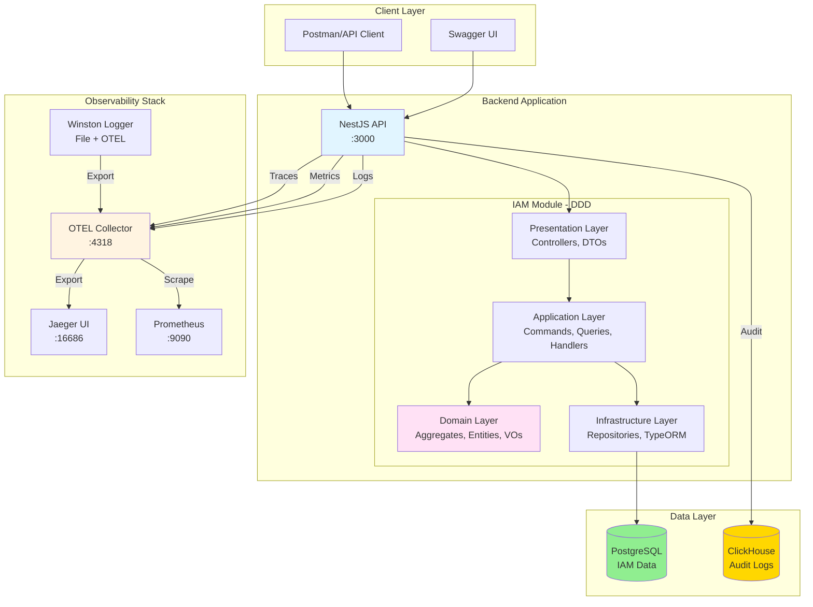
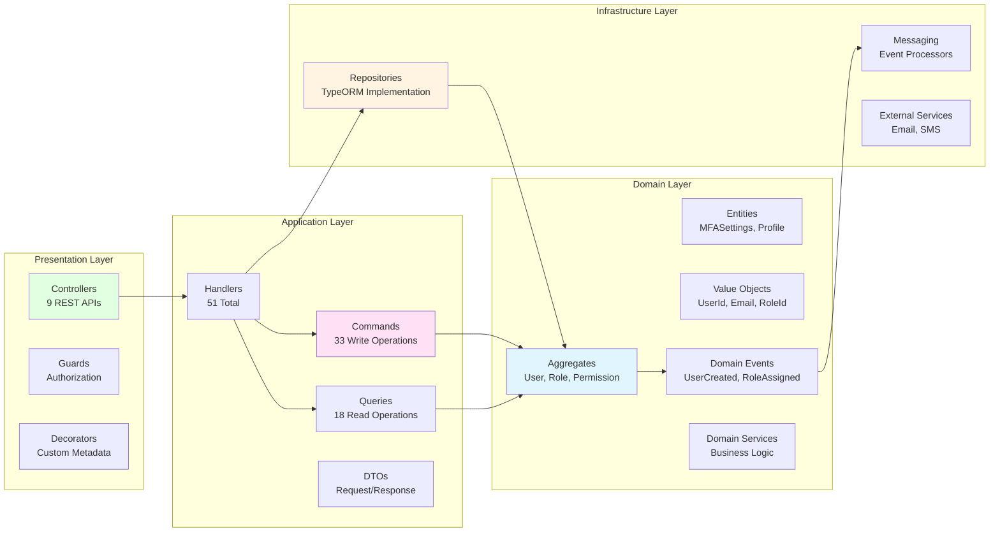

# TelemetryFlow Core

Backend-only application with IAM (Identity and Access Management) module following Domain-Driven Design (DDD) pattern.

## Overview

TelemetryFlow Core is a lightweight, production-ready IAM service extracted from the TelemetryFlow Platform. It provides complete identity and access management with a 5-tier RBAC system, multi-tenancy support, and enterprise-grade security features.

## Features

### IAM Module
- **Multi-tenant architecture**: Tenant → Organization → Workspace hierarchy
- **User management**: Complete CRUD operations with role-based access
- **5-Tier RBAC System**: Super Admin, Administrator, Developer, Viewer, Demo
- **Role-Based Access Control**: Hierarchical roles with 22+ permissions
- **Group management**: User groups with permission inheritance
- **Region support**: Multi-region tenant deployment
- **CQRS pattern**: Separate read/write operations (33 commands, 18 queries)
- **Domain events**: Event-driven architecture (25+ events)

### Architecture
- **Domain-Driven Design (DDD)**: 8 aggregates, 10 value objects, domain services
- **CQRS**: Command Query Responsibility Segregation
- **Clean Architecture**: Domain → Application → Infrastructure → Presentation
- **Event-Driven**: Domain events for all entity lifecycle changes

### Observability
- **Swagger/OpenAPI**: Interactive API documentation at `/api`
- **OpenTelemetry**: Distributed tracing with OTLP export
- **Winston Logging**: Structured logging with multiple levels
- **Health Checks**: Built-in health endpoint

### Security
- **JWT Authentication**: Secure token-based auth
- **Password Hashing**: Argon2 for secure password storage
- **Secret Generation**: Cryptographically secure secret generator
- **Multi-tenancy Isolation**: Organization-level data scoping

## Quick Start

### Prerequisites
- Node.js 18+
- pnpm 8+
- Docker & Docker Compose

### One-Command Setup

```bash
# Start all services (PostgreSQL, ClickHouse, Backend, OTEL)
./docker-start.sh
```

### Manual Setup

```bash
# Clone repository
git clone <repository-url>
cd telemetryflow-core

# Install dependencies
pnpm install

# Configure environment
cp .env.example .env
# Edit .env with your configuration

# Generate secrets
pnpm run generate:secrets

# Start infrastructure (PostgreSQL + ClickHouse + OTEL)
docker-compose up -d

# Initialize ClickHouse schema
docker exec -i telemetryflow_core_clickhouse clickhouse-client --multiquery < config/clickhouse/migrations/001-audit-logs.sql

# Seed database
pnpm run db:seed:iam

# Start development server
pnpm run dev
```

### Alternative: Bootstrap Script

```bash
bash scripts/bootstrap.sh --dev
```

## Architecture

### System Architecture


```mermaid
graph TB
    subgraph "Client Layer"
        Postman[Postman/API Client]
        Swagger[Swagger UI]
    end
    
    subgraph "Backend Application"
        API[NestJS API<br/>:3000]
        
        subgraph "IAM Module - DDD"
            Domain[Domain Layer<br/>Aggregates, Entities, VOs]
            App[Application Layer<br/>Commands, Queries, Handlers]
            Infra[Infrastructure Layer<br/>Repositories, TypeORM]
            Pres[Presentation Layer<br/>Controllers, DTOs]
        end
    end
    
    subgraph "Observability Stack"
        OTEL[OTEL Collector<br/>:4318]
        Jaeger[Jaeger UI<br/>:16686]
        Prom[Prometheus<br/>:9090]
        Winston[Winston Logger<br/>File + OTEL]
    end
    
    subgraph "Data Layer"
        PG[(PostgreSQL<br/>IAM Data)]
        CH[(ClickHouse<br/>Audit Logs)]
    end
    
    Postman --> API
    Swagger --> API
    
    API --> Pres
    Pres --> App
    App --> Domain
    App --> Infra
    Infra --> PG
    
    API -->|Traces| OTEL
    API -->|Metrics| OTEL
    API -->|Logs| OTEL
    API -->|Audit| CH
    
    OTEL -->|Export| Jaeger
    OTEL -->|Scrape| Prom
    Winston -->|Export| OTEL
    
    style API fill:#e1f5ff
    style Domain fill:#ffe1f5
    style OTEL fill:#fff4e1
    style PG fill:#90EE90
    style CH fill:#FFD700
```

### DDD Layer Structure


```mermaid
graph LR
    subgraph "Domain Layer"
        AGG[Aggregates<br/>User, Role, Permission]
        ENT[Entities<br/>MFASettings, Profile]
        VO[Value Objects<br/>UserId, Email, RoleId]
        EVT[Domain Events<br/>UserCreated, RoleAssigned]
        SVC[Domain Services<br/>Business Logic]
    end
    
    subgraph "Application Layer"
        CMD[Commands<br/>33 Write Operations]
        QRY[Queries<br/>18 Read Operations]
        HDL[Handlers<br/>51 Total]
        DTO[DTOs<br/>Request/Response]
    end
    
    subgraph "Infrastructure Layer"
        REPO[Repositories<br/>TypeORM Implementation]
        MSG[Messaging<br/>Event Processors]
        EXT[External Services<br/>Email, SMS]
    end
    
    subgraph "Presentation Layer"
        CTRL[Controllers<br/>9 REST APIs]
        GRD[Guards<br/>Authorization]
        DEC[Decorators<br/>Custom Metadata]
    end
    
    CTRL --> HDL
    HDL --> CMD
    HDL --> QRY
    CMD --> AGG
    QRY --> AGG
    AGG --> EVT
    HDL --> REPO
    REPO --> AGG
    EVT --> MSG
    
    style AGG fill:#e1f5ff
    style CMD fill:#ffe1f5
    style REPO fill:#fff4e1
    style CTRL fill:#e1ffe1
```

### Directory Structure

```
src/
├── main.ts                     # Application entry point
├── app.module.ts               # Root module
├── shared/                     # Shared domain primitives
│   └── domain/
│       ├── Entity.ts
│       ├── ValueObject.ts
│       ├── AggregateRoot.ts
│       └── DomainEvent.ts
├── logger/                     # Winston logger module
├── otel/                       # OpenTelemetry tracing
├── health/                     # Health check endpoint
├── database/                   # Database configuration
│   ├── config/
│   └── typeorm.config.ts
└── modules/
    └── iam/                    # IAM Module (DDD)
        ├── domain/             # Business logic
        │   ├── aggregates/       # User, Role, Permission, Tenant, etc.
        │   ├── entities/         # MFASettings, UserProfile
        │   ├── value-objects/    # UserId, Email, RoleId, etc.
        │   ├── events/           # Domain events
        │   ├── repositories/     # Repository interfaces
        │   └── services/         # Domain services
        ├── application/        # Use cases (CQRS)
        │   ├── commands/         # Write operations (33)
        │   ├── queries/          # Read operations (18)
        │   ├── handlers/         # Command/Query handlers (51)
        │   └── dto/              # Application DTOs
        ├── infrastructure/     # Technical implementation
        │   ├── persistence/      # TypeORM repositories & entities
        │   └── messaging/        # Event processors
        └── presentation/       # API layer
            ├── controllers/      # REST controllers (9)
            ├── dto/              # Request/Response DTOs
            ├── guards/           # Authorization guards
            └── decorators/       # Custom decorators
```

## 5-Tier RBAC System

### Role Hierarchy

1. **Super Administrator** (Global)
   - Platform management across all organizations
   - All permissions

2. **Administrator** (Organization-scoped)
   - Full CRUD within organization
   - Cannot manage platform

3. **Developer** (Organization-scoped)
   - Create/Read/Update (no delete)
   - Cannot manage users/roles

4. **Viewer** (Organization-scoped)
   - Read-only access
   - Cannot modify resources

5. **Demo** (Demo org only)
   - Developer access in demo organization
   - Isolated from production data

### Default Users

| Email | Password | Role | Tier |
|-------|----------|------|------|
| superadmin.telemetryflow@telemetryflow.id | SuperAdmin@123456 | Super Administrator | 1 |
| administrator.telemetryflow@telemetryflow.id | Admin@123456 | Administrator | 2 |
| developer.telemetryflow@telemetryflow.id | Developer@123456 | Developer | 3 |
| viewer.telemetryflow@telemetryflow.id | Viewer@123456 | Viewer | 4 |
| demo.telemetryflow@telemetryflow.id | Demo@123456 | Demo | 5 |

## API Documentation

Once running, access Swagger UI at: `http://localhost:3000/api`

### Key Endpoints

- **Users**: `/api/users` - User management
- **Roles**: `/api/roles` - Role management
- **Permissions**: `/api/permissions` - Permission management
- **Tenants**: `/api/tenants` - Tenant management
- **Organizations**: `/api/organizations` - Organization management
- **Workspaces**: `/api/workspaces` - Workspace management
- **Groups**: `/api/groups` - Group management
- **Regions**: `/api/regions` - Region management
- **Health**: `/health` - Health check

### API Testing

**Postman Collection** (Recommended):
- Import `docs/postman/TelemetryFlow-Core.postman_collection.json`
- Import `docs/postman/TelemetryFlow-Core.postman_environment.json`
- 30+ pre-configured requests with default credentials
- See [docs/postman/README.md](./docs/postman/README.md)

**Export OpenAPI Spec**:
```bash
./scripts/export-swagger-docs.sh
```

## Available Scripts

```bash
# Development
pnpm run dev              # Start with hot reload
pnpm run start:debug      # Start with debugger

# Build & Run
pnpm run build            # Build for production
pnpm run start            # Start production server

# Database
pnpm run db:seed          # Seed all data
pnpm run db:seed:iam      # Seed IAM only
pnpm run db:generate-sample --count 50  # Generate sample data

# Security
pnpm run generate:secrets # Generate JWT & Session secrets

# Testing
pnpm run test             # Run tests
pnpm run test:watch       # Watch mode
pnpm run test:cov         # Coverage report

# Code Quality
pnpm run lint             # Lint and fix

# API Documentation
./scripts/export-swagger-docs.sh  # Export OpenAPI spec

# Bootstrap
bash scripts/bootstrap.sh # Full setup
```

## Docker Deployment

### Development

```bash
# Start all services
docker-compose up -d

# View logs
docker-compose logs -f

# Stop services
docker-compose down
```

### Production

```bash
# Build and start
docker-compose up -d --build

# Check health
curl http://localhost:3000/health

# Access API
curl http://localhost:3000/api
```

### Services

- **PostgreSQL**: 172.151.151.20:5432
- **ClickHouse**: 172.151.151.40:8123/9000
- **Backend**: 172.151.151.10:3000
- **OTEL Collector**: 172.151.151.30:4317/4318
- **Prometheus**: 172.151.151.50:9090

## Database Schema

### Core Tables
- `users` - User accounts
- `roles` - Role definitions (5-tier RBAC)
- `permissions` - Permission definitions (22+ permissions)
- `tenants` - Tenant organizations
- `organizations` - Business units
- `workspaces` - Project workspaces
- `groups` - User groups
- `regions` - Geographic regions

### Mapping Tables
- `user_roles` - User-Role assignments
- `user_permissions` - Direct user-permission assignments
- `role_permissions` - Role-Permission mappings

## Technology Stack

- **Framework**: NestJS 11.x
- **Language**: TypeScript 5.9
- **Database**: PostgreSQL 16
- **ORM**: TypeORM 0.3
- **Architecture**: DDD + CQRS
- **API Documentation**: Swagger/OpenAPI
- **Logger**: Winston
- **Observability**: OpenTelemetry (OTEL)
- **Password Hashing**: Argon2
- **Package Manager**: pnpm

## Configuration

### Environment Variables

```env
# Application
NODE_ENV=development
PORT=3000

# PostgreSQL
POSTGRES_HOST=localhost
POSTGRES_PORT=5432
POSTGRES_DB=telemetryflow_db
POSTGRES_USERNAME=postgres
POSTGRES_PASSWORD=telemetryflow123

# JWT & Session
JWT_SECRET=your-secret-key-min-32-chars
JWT_EXPIRES_IN=24h
SESSION_SECRET=your-session-secret-min-32-chars

# Logging
LOG_LEVEL=info
LOG_PRETTY_PRINT=true

# OpenTelemetry
OTEL_ENABLED=true
OTEL_SERVICE_NAME=telemetryflow-core
OTEL_EXPORTER_OTLP_ENDPOINT=http://localhost:4318
```

## Documentation

### Core Documentation
- [CORE_MODULES.md](./docs/CORE_MODULES.md) - Complete modules documentation with Mermaid diagrams
- [ARCHITECTURE_DIAGRAMS.md](./docs/ARCHITECTURE_DIAGRAMS.md) - Visual architecture guide (35+ diagrams)

### Setup & Deployment
- [SETUP.md](./SETUP.md) - Detailed setup guide
- [DOCKER.md](./DOCKER.md) - Docker deployment guide
- [DOCKER_SETUP.md](./DOCKER_SETUP.md) - Complete Docker documentation
- [DOCKER_COMPLETE.md](./DOCKER_COMPLETE.md) - Docker setup summary
- [BOOTSTRAP.md](./BOOTSTRAP.md) - Bootstrap script documentation

### Features
- [OBSERVABILITY.md](./docs/OBSERVABILITY.md) - Observability features (OTEL, Prometheus, Swagger)
- [SECRETS.md](./SECRETS.md) - Secret generation guide
- [5-TIER-RBAC.md](./5-TIER-RBAC.md) - RBAC system overview
- [WINSTON_LOGGER.md](./docs/WINSTON_LOGGER.md) - Winston logger documentation

### API & Testing
- [Postman Collection](./docs/postman/README.md) - API testing with Postman (30+ requests)
- [Swagger Export Script](./scripts/export-swagger-docs.sh) - Export OpenAPI specification

### Modules
- [IAM Module](./src/modules/iam/README.md) - Identity and Access Management
- [Audit Module](./src/modules/audit/README.md) - Audit logging system
- [Audit Quick Start](./src/modules/audit/QUICK_START.md) - Quick reference guide

### Configuration
- [Configuration Overview](./config/README.md) - All service configurations
- [PostgreSQL Config](./config/postgresql/README.md) - PostgreSQL settings
- [ClickHouse Config](./config/clickhouse/README.md) - ClickHouse settings
- [OTEL Config](./config/otel/README.md) - OpenTelemetry Collector
- [Prometheus Config](./config/prometheus/README.md) - Metrics collection
- [CONFIG_SYNC.md](./docs/CONFIG_SYNC.md) - Configuration synchronization from Platform

### Integration
- [IAM_AUDIT_INTEGRATION.md](./docs/IAM_AUDIT_INTEGRATION.md) - IAM-Audit integration guide (51 points)
- [IAM_AUDIT_SYNC.md](./IAM_AUDIT_SYNC.md) - Integration summary

### Comparison
- [PLATFORM_VS_CORE.md](./PLATFORM_VS_CORE.md) - Platform comparison
- [PLATFORM_SYNC.md](./PLATFORM_SYNC.md) - Platform synchronization status
- [CHANGELOG.md](./CHANGELOG.md) - Version history

## Project Statistics

- **Total Files**: 200+
- **Lines of Code**: ~15,000+
- **Aggregates**: 8
- **Commands**: 33
- **Queries**: 18
- **Handlers**: 51
- **Controllers**: 9
- **Entities**: 13
- **Domain Events**: 25+
- **Tests**: 18+

## Comparison with Platform

| Feature | Platform | Core |
|---------|----------|------|
| **Modules** | 25+ | 1 (IAM) |
| **Services** | 15+ | 5 (PostgreSQL, ClickHouse, Backend, OTEL, Prometheus) |
| **Size** | 150K+ LOC | 15K+ LOC |
| **Cost** | $260-1100/mo | $50-250/mo |
| **Startup** | 10-15s | 2-3s |
| **Memory** | 500MB-1GB | 100-200MB |

## Contributing

1. Fork the repository
2. Create your feature branch (`git checkout -b feature/amazing-feature`)
3. Commit your changes (`git commit -m 'Add amazing feature'`)
4. Push to the branch (`git push origin feature/amazing-feature`)
5. Open a Pull Request

## License

Apache-2.0 License - see LICENSE file for details

## Support

- Documentation: [docs/](./docs/)
- Issues: GitHub Issues
- Discussions: GitHub Discussions

## Acknowledgments

Extracted from [TelemetryFlow Platform](https://github.com/devopscorner/telemetryflow-platform) - Enterprise Telemetry & Observability Platform.

---

**Built with ❤️ by DevOpsCorner Indonesia**
