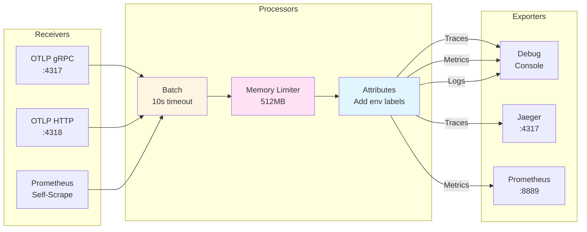

# OpenTelemetry Collector Configuration

OTEL Collector configuration for TelemetryFlow Core observability.

## Architecture



## Files

- `otel-collector-config.yaml` - OTEL Collector configuration

## Components

### Receivers
- **OTLP**: gRPC (4317) and HTTP (4318)
- **Prometheus**: Self-scraping on port 8888

### Processors
- **batch**: Batches telemetry data
- **memory_limiter**: Prevents OOM (512MB limit)
- **resourcedetection**: Detects environment, system, docker
- **attributes**: Enriches with environment labels

### Exporters
- **prometheus**: Exports metrics on port 8889
- **logging**: Console output for debugging

### Extensions
- **health_check**: Port 13133
- **pprof**: Port 1777
- **zpages**: Port 55679

## Endpoints

- OTLP gRPC: `http://localhost:4317`
- OTLP HTTP: `http://localhost:4318`
- Prometheus metrics: `http://localhost:8889/metrics`
- Health check: `http://localhost:13133`
- zPages: `http://localhost:55679/debug/tracez`

## Pipelines

1. **Traces**: OTLP → memory_limiter → resourcedetection → batch → logging
2. **Metrics**: OTLP/Prometheus → memory_limiter → resourcedetection → batch → prometheus/logging
3. **Logs**: OTLP → memory_limiter → resourcedetection → batch → logging

## Usage

```bash
# Test OTLP endpoint
curl -X POST http://localhost:4318/v1/traces \
  -H "Content-Type: application/json" \
  -d '{"resourceSpans":[]}'

# Check health
curl http://localhost:13133

# View metrics
curl http://localhost:8889/metrics
```
