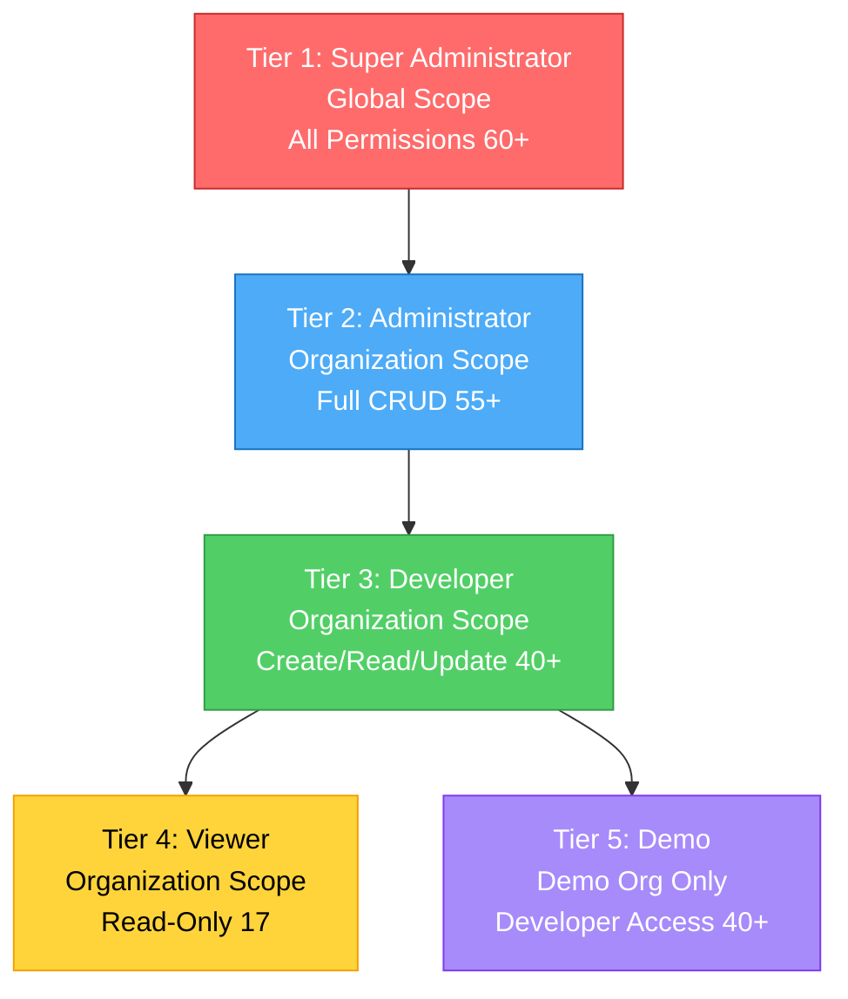
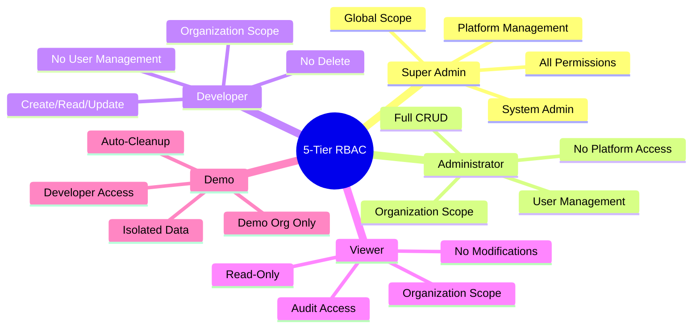
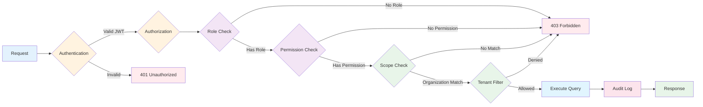
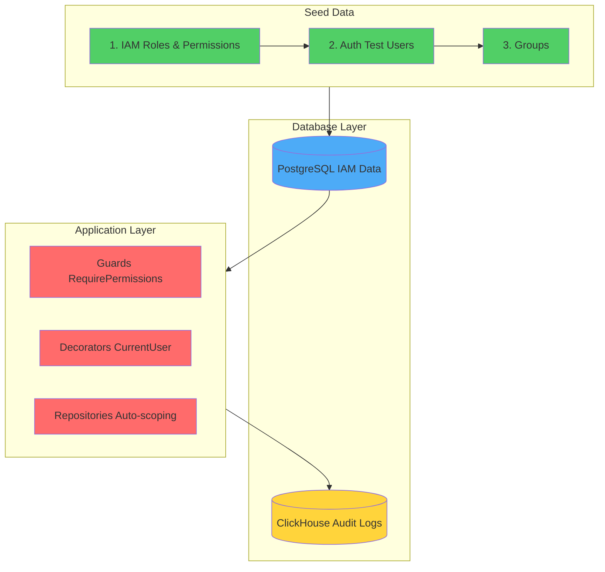

# 5-Tier RBAC System

- **Date**: 2025-11-15
- **Status**: ✅ Complete

---

## 📋 Overview

TelemetryFlow implements a 5-tier Role-Based Access Control (RBAC) system with hierarchical permissions and organizational scoping.

---

## 🎯 Role Hierarchy



---

## 🔐 Role Details



### Tier 1: Super Administrator

| Attribute | Details |
|-----------|---------|
| **Scope** | Global (all organizations, regions, workspaces, tenants) |
| **Description** | Can manage all the SaaS Platform across all organizations and regions |
| **Permission Count** | 60+ |
| **Key Permissions** | • Platform management<br/>• All IAM operations<br/>• System administration<br/>• Audit log access |
| **Use Cases** | • Platform administrators<br/>• DevOps team managing infrastructure<br/>• System maintenance |
| **Restrictions** | None |

---

### Tier 2: Administrator

| Attribute | Details |
|-----------|---------|
| **Scope** | Organization-scoped (single organization, multiple regions) |
| **Description** | Can manage all permissions within their organization across multiple regions |
| **Permission Count** | 55+ |
| **Key Permissions** | • Organization read/update<br/>• Full user management (CRUD)<br/>• Full role management (CRUD)<br/>• Full tenant/workspace management<br/>• Audit log read/export |
| **Use Cases** | • Organization administrators<br/>• Team leads<br/>• Department managers |
| **Restrictions** | • No platform management<br/>• No system administration<br/>• Cannot create/delete organizations |

---

### Tier 3: Developer

| Attribute | Details |
|-----------|---------|
| **Scope** | Organization-scoped (single organization) |
| **Description** | Can create and update resources within their organization, but cannot delete |
| **Permission Count** | 40+ |
| **Key Permissions** | • User create/read/update<br/>• Tenant/workspace create/read/update<br/>• Dashboard/alert create/read/update<br/>• Agent management<br/>• Audit log read-only |
| **Use Cases** | • Software developers<br/>• DevOps engineers<br/>• QA engineers |
| **Restrictions** | • No delete operations<br/>• No user/role management<br/>• No export operations<br/>• Read-only for roles/permissions |

---

### Tier 4: Viewer

| Attribute | Details |
|-----------|---------|
| **Scope** | Organization-scoped (single organization) |
| **Description** | Read-only access to resources within their organization |
| **Permission Count** | 17 |
| **Key Permissions** | • All resources read-only<br/>• Audit log read-only<br/>• Uptime check access |
| **Use Cases** | • Business analysts<br/>• Stakeholders<br/>• External auditors<br/>• Read-only monitoring |
| **Restrictions** | • No write operations<br/>• No create/update/delete operations |

---

### Tier 5: Demo

| Attribute | Details |
|-----------|---------|
| **Scope** | Demo Organization ONLY (org-demo, ws-demo, tn-demo) |
| **Description** | Developer access limited to Demo Organization, Demo Workspace, and Demo Tenant only |
| **Permission Count** | 40+ (same as Developer) |
| **Key Permissions** | • All Developer permissions<br/>• User create/read/update<br/>• Dashboard/alert create/read/update<br/>• Agent management |
| **Use Cases** | • Product demonstrations<br/>• Trial accounts<br/>• Training environments<br/>• Customer evaluations |
| **Restrictions** | • Limited to Demo Organization only<br/>• Cannot access production data<br/>• Data auto-deleted every 6 hours<br/>• No delete operations |

---

## 📋 IAM Permissions List

### User Management
- `iam:users:read` - View users
- `iam:users:create` - Create users
- `iam:users:update` - Update users
- `iam:users:delete` - Delete users

### Role Management
- `iam:roles:read` - View roles
- `iam:roles:create` - Create roles
- `iam:roles:update` - Update roles
- `iam:roles:delete` - Delete roles

### Permission Management
- `iam:permissions:read` - View permissions

### Organization Management
- `iam:organizations:read` - View organizations
- `iam:organizations:create` - Create organizations
- `iam:organizations:update` - Update organizations
- `iam:organizations:delete` - Delete organizations

### Tenant Management
- `iam:tenants:read` - View tenants
- `iam:tenants:create` - Create tenants
- `iam:tenants:update` - Update tenants
- `iam:tenants:delete` - Delete tenants

### Workspace Management
- `iam:workspaces:read` - View workspaces
- `iam:workspaces:create` - Create workspaces
- `iam:workspaces:update` - Update workspaces
- `iam:workspaces:delete` - Delete workspaces

### Region Management
- `iam:regions:read` - View regions
- `iam:regions:create` - Create regions
- `iam:regions:update` - Update regions
- `iam:regions:delete` - Delete regions

### Group Management
- `iam:groups:read` - View groups
- `iam:groups:create` - Create groups
- `iam:groups:update` - Update groups
- `iam:groups:delete` - Delete groups

### Platform & System
- `platform:manage` - Platform management (Super Admin only)
- `system:admin` - System administration (Super Admin only)

---

## 📊 Permission Comparison Matrix

### Quick Reference

| Permission Category | Super Admin | Administrator | Developer | Viewer | Demo |
|---------------------|:-----------:|:-------------:|:---------:|:------:|:----:|
| **Scope** | 🌍 Global | 🏢 Organization | 🏢 Organization | 🏢 Organization | 🎭 Demo Org |
| **Permission Count** | 60+ | 55+ | 40+ | 17 | 40+ |
| **Platform Management** | ✅ | ❌ | ❌ | ❌ | ❌ |
| **System Admin** | ✅ | ❌ | ❌ | ❌ | ❌ |
| **Delete Operations** | ✅ | ✅ | ❌ | ❌ | ❌ |
| **Data Retention** | ♾️ Permanent | ♾️ Permanent | ♾️ Permanent | ♾️ Permanent | ⏱️ 6 hours |

### Detailed Permissions

| Resource | Super Admin | Administrator | Developer | Viewer | Demo |
|----------|:-----------:|:-------------:|:---------:|:------:|:----:|
| **Organizations** | 🔴 CRUD | 🟡 R/U | 🟢 R | 🟢 R | 🟢 R |
| **Users** | 🔴 CRUD | 🔴 CRUD | 🟡 CRU | 🟢 R | 🟡 CRU |
| **Roles** | 🔴 CRUD | 🔴 CRUD | 🟢 R | 🟢 R | 🟢 R |
| **Permissions** | 🔴 CRUD | 🟢 R | 🟢 R | 🟢 R | 🟢 R |
| **Tenants** | 🔴 CRUD | 🔴 CRUD | 🟡 CRU | 🟢 R | 🟡 CRU |
| **Workspaces** | 🔴 CRUD | 🔴 CRUD | 🟡 CRU | 🟢 R | 🟡 CRU |
| **Regions** | 🔴 CRUD | 🟢 R | 🟢 R | 🟢 R | 🟢 R |
| **Groups** | 🔴 CRUD | 🔴 CRUD | 🟡 CRU | 🟢 R | 🟡 CRU |
| **Audit Logs** | 🔴 R/Export | 🔴 R/Export | 🟢 R | 🟢 R | 🟢 R |

**Legend:**
- 🔴 **CRUD** = Create, Read, Update, Delete (Full Access)
- 🟡 **CRU** = Create, Read, Update (No Delete)
- 🟡 **R/U** = Read, Update (No Create/Delete)
- 🟢 **R** = Read Only
- 🔴 **R/Export** = Read + Export capabilities

---

## 🔄 Role Assignment

### Default Users

| User | Email | Password | Role | Organization | Tenant |
|------|-------|----------|------|--------------|--------|
| Super Administrator | superadmin.telemetryflow@telemetryflow.id | SuperAdmin@123456 | super_administrator | All | All |
| Administrator TelemetryFlow | administrator.telemetryflow@telemetryflow.id | Admin@123456 | administrator | TelemetryFlow | TelemetryFlow |
| Developer TelemetryFlow | developer.telemetryflow@telemetryflow.id | Developer@123456 | developer | TelemetryFlow | TelemetryFlow |
| Viewer TelemetryFlow | viewer.telemetryflow@telemetryflow.id | Viewer@123456 | viewer | TelemetryFlow | TelemetryFlow |
| Demo TelemetryFlow | demo.telemetryflow@telemetryflow.id | Demo@123456 | demo | Demo Org | Demo Tenant |

---

## 🛡️ Security Features



### Multi-Tenancy Isolation

| Feature | Description | Implementation |
|---------|-------------|----------------|
| **Organization-level** | Data isolated by organization | Query filters: `WHERE organizationId = :orgId` |
| **Tenant-level** | Query filtering per tenant | Automatic tenant scoping in repositories |
| **Workspace-level** | Resource scoping per workspace | Workspace-based access control |
| **Demo isolation** | Complete separation from production | Separate organization with auto-cleanup |

### Demo Environment Protection

| Feature | Description | Status |
|---------|-------------|--------|
| **Auto-cleanup** | Data deleted every 6 hours | ✅ Implemented |
| **Production isolation** | Cannot access production orgs | ✅ Enforced |
| **Workspace isolation** | Cannot access production workspaces | ✅ Enforced |
| **Tenant isolation** | Cannot access production tenants | ✅ Enforced |
| **Separate domain** | `demo.telemetryflow.id` | ✅ Configured |

### Permission Enforcement

| Layer | Mechanism | Description |
|-------|-----------|-------------|
| **Authentication** | JWT tokens | Validates user identity |
| **Authorization** | `@RequirePermissions()` decorator | Checks user permissions before execution |
| **Scoping** | Query filters | Automatically filters by organization/tenant |
| **Audit** | ClickHouse audit_logs | Logs all actions with user context |
| **Validation** | Guards & Interceptors | Validates request data and permissions |

---

## 📝 Implementation Notes



### Database Structure

| Database | Purpose | Tables |
|----------|---------|--------|
| **PostgreSQL** | IAM data storage | users, roles, permissions, role_permissions, user_roles, organizations, tenants, workspaces, regions, groups |
| **ClickHouse** | Audit log storage | audit_logs, audit_logs_stats, audit_logs_user_activity |

### Seed Files

| Order | File | Purpose | Records |
|-------|------|---------|---------|
| 1 | `1704240000001-seed-iam-roles-permissions.ts` | Create 5 roles with explicit permissions | 5 roles, 22+ permissions |
| 2 | `1704240000002-seed-auth-test-users.ts` | Create test users for each role | 5 users |
| 3 | `1704240000003-seed-groups.ts` | Create user groups | 4 groups |

### Permission Enforcement

| Component | Location | Purpose |
|-----------|----------|---------|
| **Guards** | `@RequirePermissions()` decorator | Checks user permissions before controller execution |
| **Decorators** | `@CurrentUser()` | Extracts authenticated user from request |
| **Repositories** | Auto-scoping queries | Automatically filters by organization/tenant |
| **Audit** | ClickHouse service | Logs all actions to audit_logs table |

### Multi-Tenancy Implementation

| Level | Implementation | Example |
|-------|----------------|---------|
| **Organization** | Query filter | `WHERE organizationId = :orgId` |
| **Tenant** | Repository scoping | `findByTenant(tenantId)` |
| **Workspace** | Resource filtering | `WHERE workspaceId = :wsId` |
| **Demo** | Separate organization | `organizationId = 'org-demo'` |

---

## 🚀 Usage

### Login Credentials

```bash
# Super Administrator
Email: superadmin.telemetryflow@telemetryflow.id
Password: SuperAdmin@123456

# Administrator
Email: administrator.telemetryflow@telemetryflow.id
Password: Admin@123456

# Developer
Email: developer.telemetryflow@telemetryflow.id
Password: Developer@123456

# Viewer
Email: viewer.telemetryflow@telemetryflow.id
Password: Viewer@123456

# Demo
Email: demo.telemetryflow@telemetryflow.id
Password: Demo@123456
```

### API Access

All users can access the API at: **http://localhost:3000/api**

Use Swagger UI to test different permission levels and see which endpoints are accessible for each role.

### Testing Permissions

1. **Login with different roles** to see permission differences
2. **Try CRUD operations** to verify access control
3. **Check Swagger UI** for available endpoints per role
4. **Review audit logs** to track all actions

### Seeding RBAC System

The 5-tier RBAC system is automatically seeded when running:

```bash
# Seed IAM data only
pnpm db:seed:iam

# Seed all data (PostgreSQL + ClickHouse)
pnpm db:seed

# Run migrations + seeds
pnpm db:migrate:seed

# Full bootstrap (dependencies, Docker, migrations, seeds)
bash scripts/bootstrap.sh --dev
```

---

## 🎯 Best Practices

1. **Principle of Least Privilege**: Assign minimum required permissions
2. **Role Separation**: Use appropriate role for each user type
3. **Demo Isolation**: Keep demo users in demo organization only
4. **Regular Audits**: Review role assignments periodically
5. **Password Security**: Enforce strong passwords (12+ chars, uppercase, special char)
6. **MFA Enforcement**: Enable MFA for Super Admin and Administrator roles

---

## 📚 Related Documentation

- [IAM Module README](../src/modules/iam/README.md)
- [PostgreSQL Seeds README](../src/database/postgres/seeds/README.md)
- [ClickHouse Audit Logs](./CLICKHOUSE_LOGGING.md)
- [Testing Guide](./TESTING.md)

---

- **Last Updated**: 2025-12-05
- **Status**: ✅ 5-Tier RBAC System Complete
