# TelemetryFlow Core - Architecture Diagrams

Quick visual reference for system architecture and data flows.

## System Overview

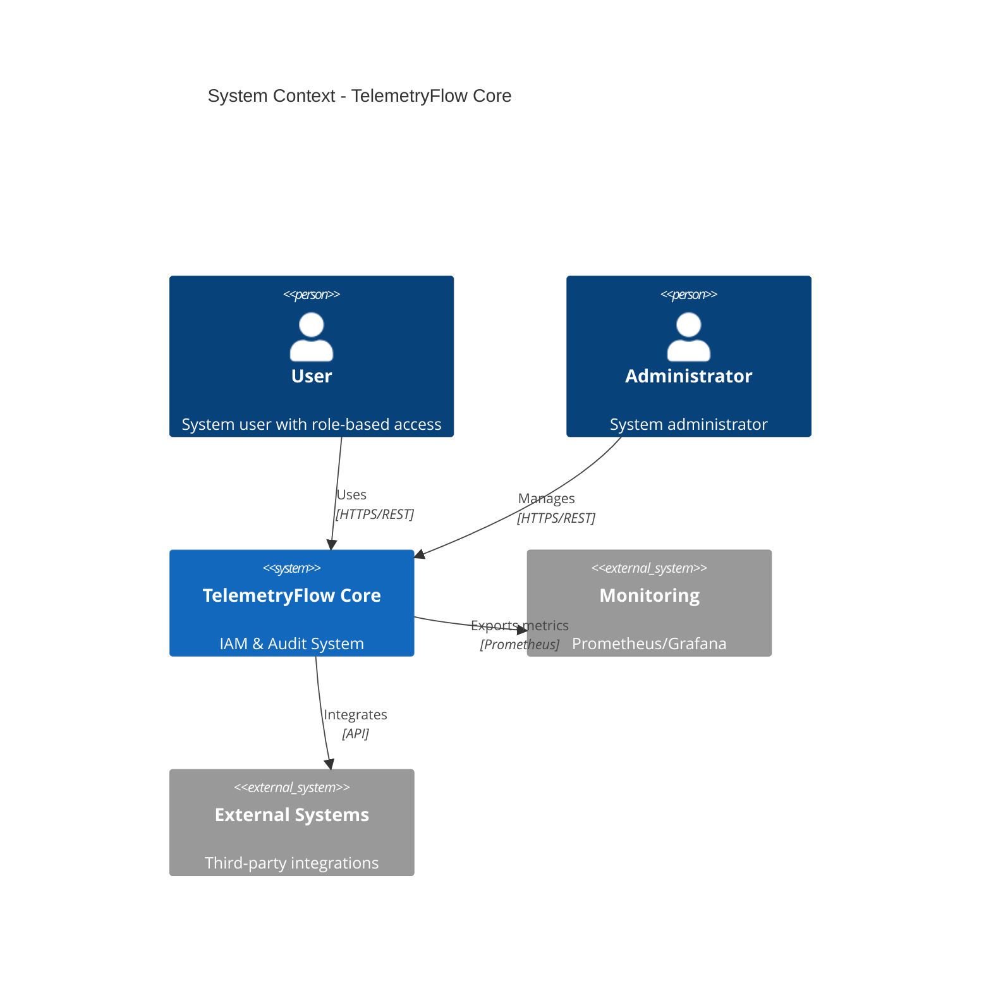

## Container Diagram

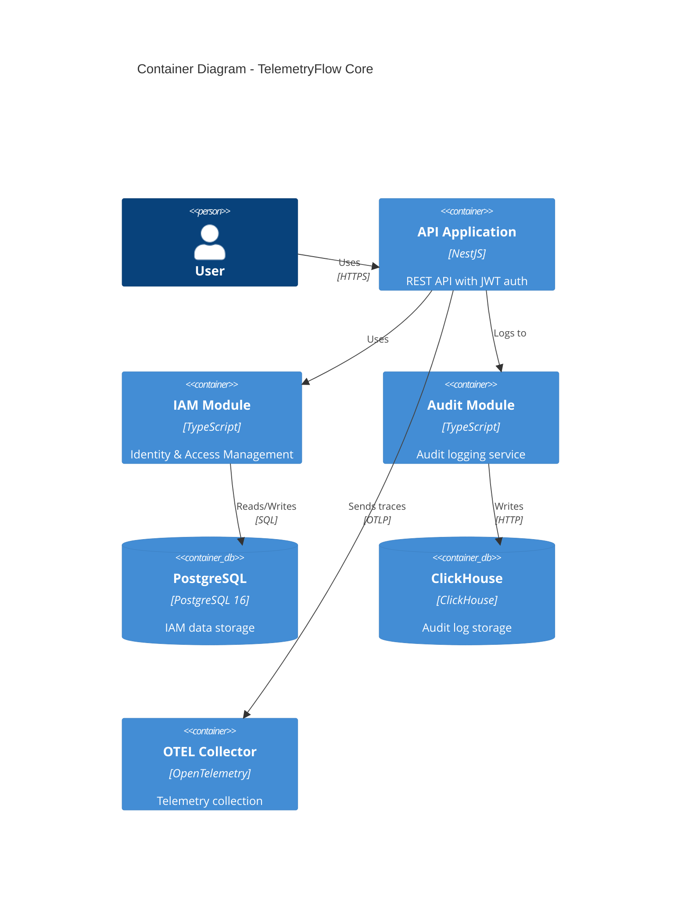

## Component Diagram - IAM Module

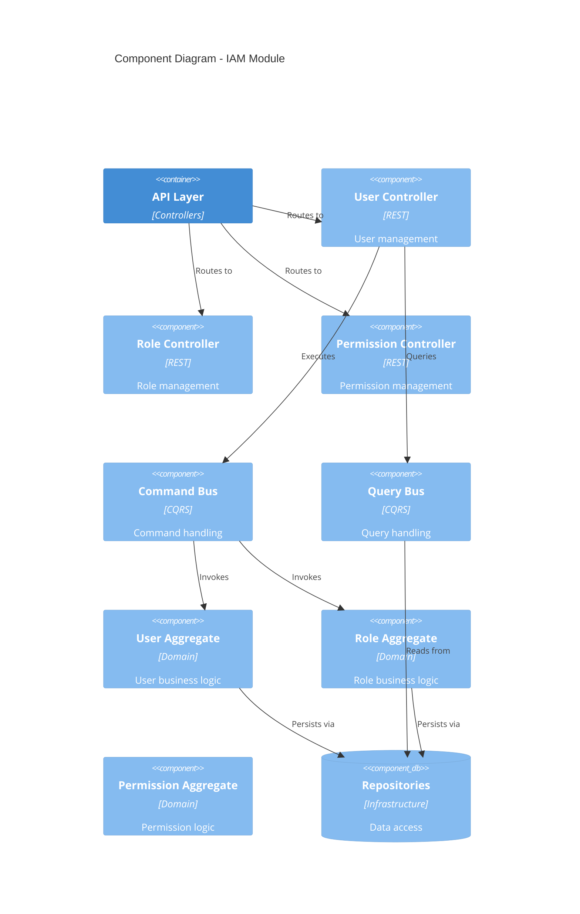

## Deployment Diagram

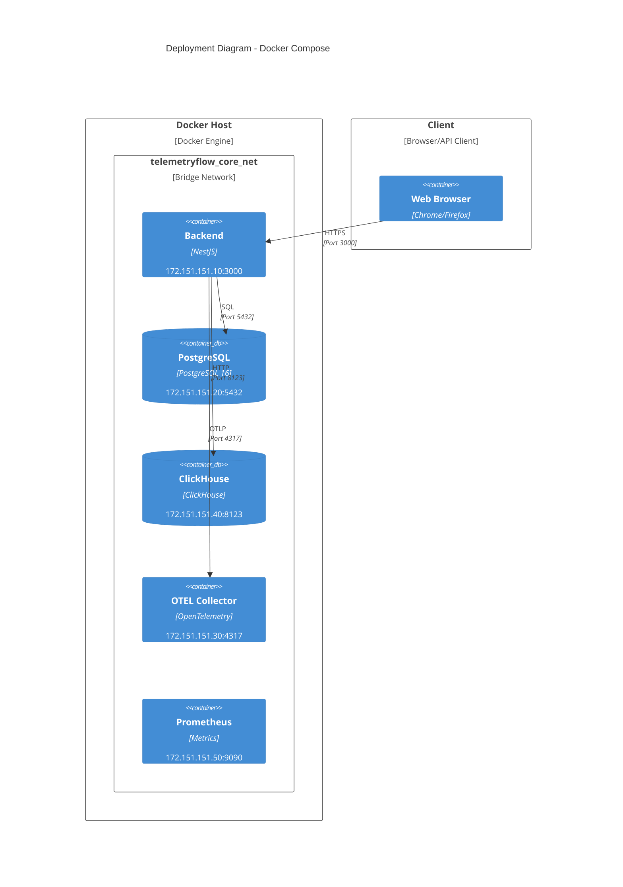

## Request Flow - User Creation

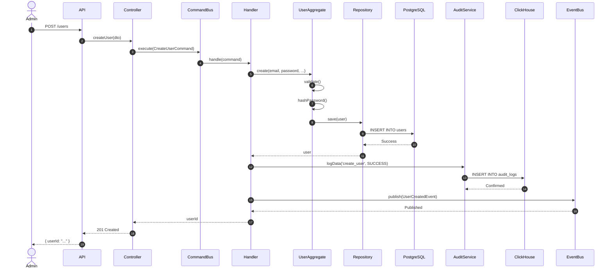

## Permission Check Flow

## Data Model - Complete

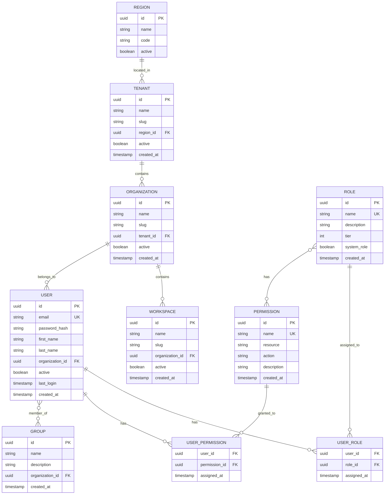

## Audit Log Schema

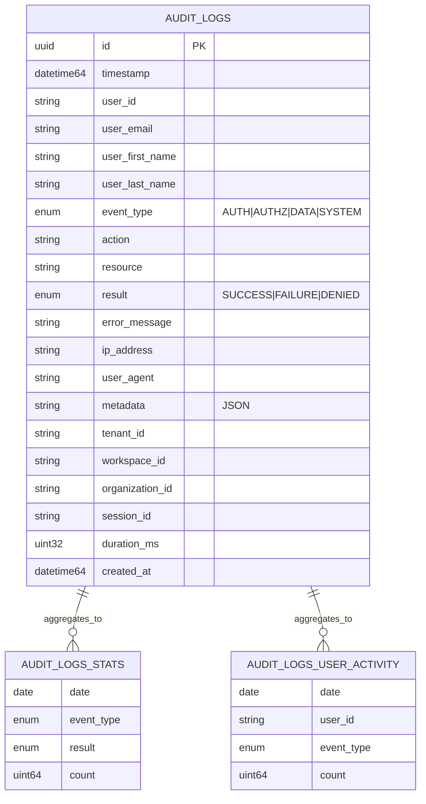

## State Machines

### User Lifecycle

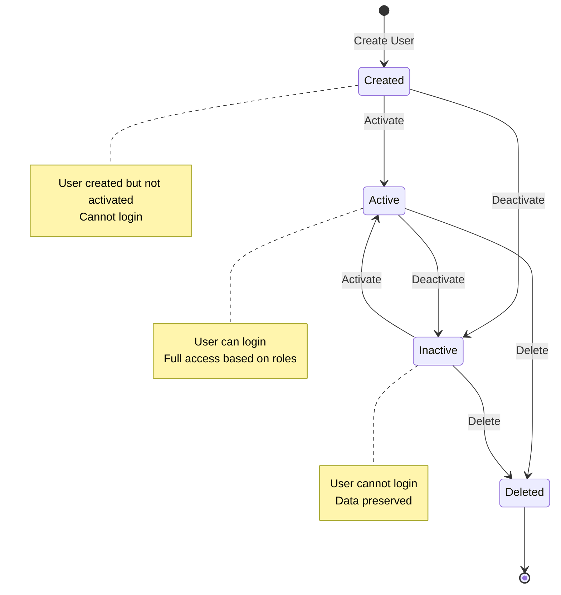

### Role Assignment

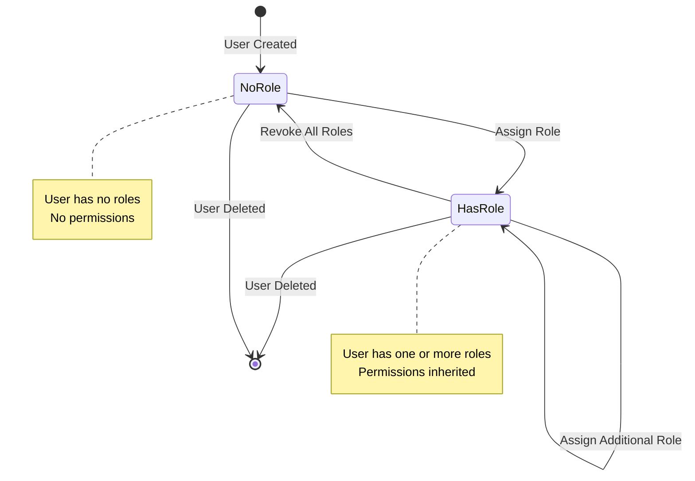

## Network Topology

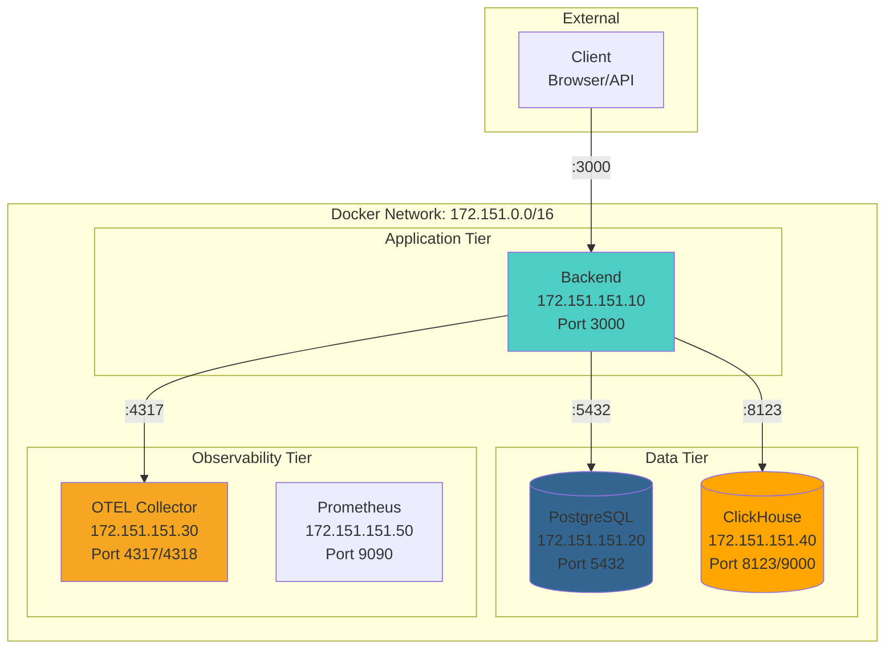

## Technology Stack

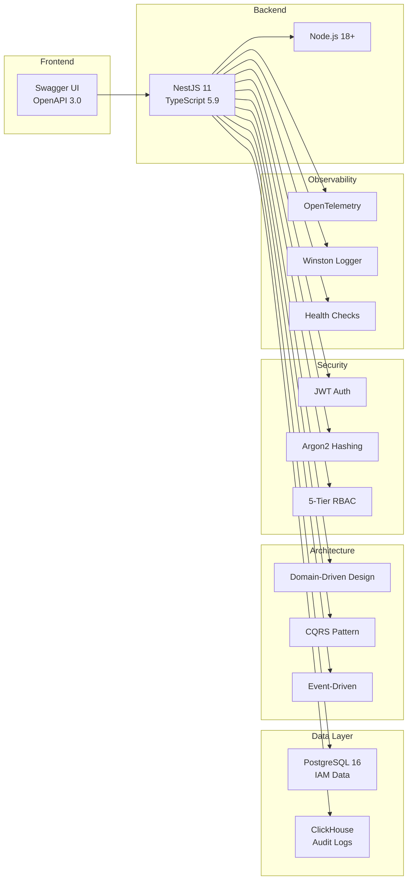

## Scaling Strategy

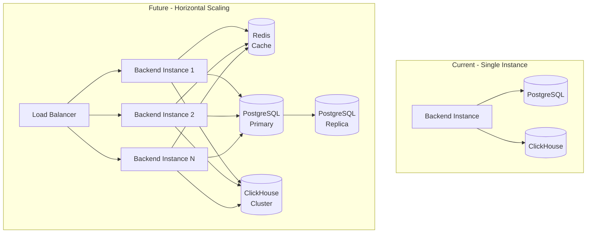

## Monitoring Dashboard

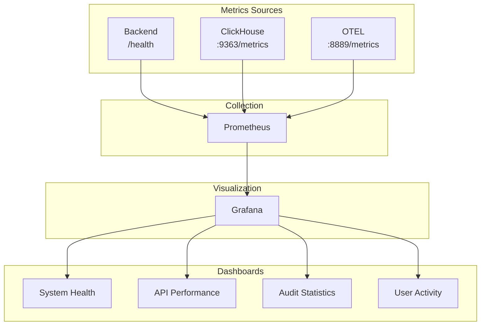

---

## Quick Reference

### Service Ports

| Service | Port | Protocol | Purpose |
|---------|------|----------|---------|
| Backend | 3000 | HTTP | REST API |
| PostgreSQL | 5432 | TCP | Database |
| ClickHouse HTTP | 8123 | HTTP | Queries |
| ClickHouse Native | 9000 | TCP | Native Protocol |
| ClickHouse Metrics | 9363 | HTTP | Prometheus |
| OTEL gRPC | 4317 | gRPC | Telemetry |
| OTEL HTTP | 4318 | HTTP | Telemetry |
| OTEL Metrics | 8889 | HTTP | Prometheus |

### IP Addresses

| Service | IP Address |
|---------|-----------|
| Backend | 172.151.151.10 |
| PostgreSQL | 172.151.151.20 |
| OTEL Collector | 172.151.151.30 |
| ClickHouse | 172.151.151.40 |

### Key Metrics

| Metric | Value |
|--------|-------|
| Aggregates | 9 |
| Commands | 33 |
| Queries | 18 |
| Handlers | 51 |
| Controllers | 9 |
| Domain Events | 25+ |
| Integration Points | 51 |
| Database Tables | 14 |

---

## References

- [Core Modules Documentation](./CORE_MODULES.md)
- [IAM Module](../src/modules/iam/README.md)
- [Audit Module](../src/modules/audit/README.md)
- [Docker Setup](../DOCKER_SETUP.md)
