# TelemetryFlow Core - Architecture Diagrams

Quick visual reference for system architecture and data flows.

## System Overview

**Purpose**: High-level view of TelemetryFlow Core and its external interactions.

**Key Components**:
- **Users**: Regular users with role-based access (Viewer, Developer, Administrator)
- **Administrators**: Super administrators managing the entire platform
- **TelemetryFlow Core**: The main IAM and audit system
- **Monitoring**: External observability stack (Prometheus/Grafana)
- **External Systems**: Third-party integrations via REST API

**Interactions**:
- Users and admins access the system via HTTPS REST API
- Core exports metrics to Prometheus for monitoring
- Core can integrate with external systems through its API

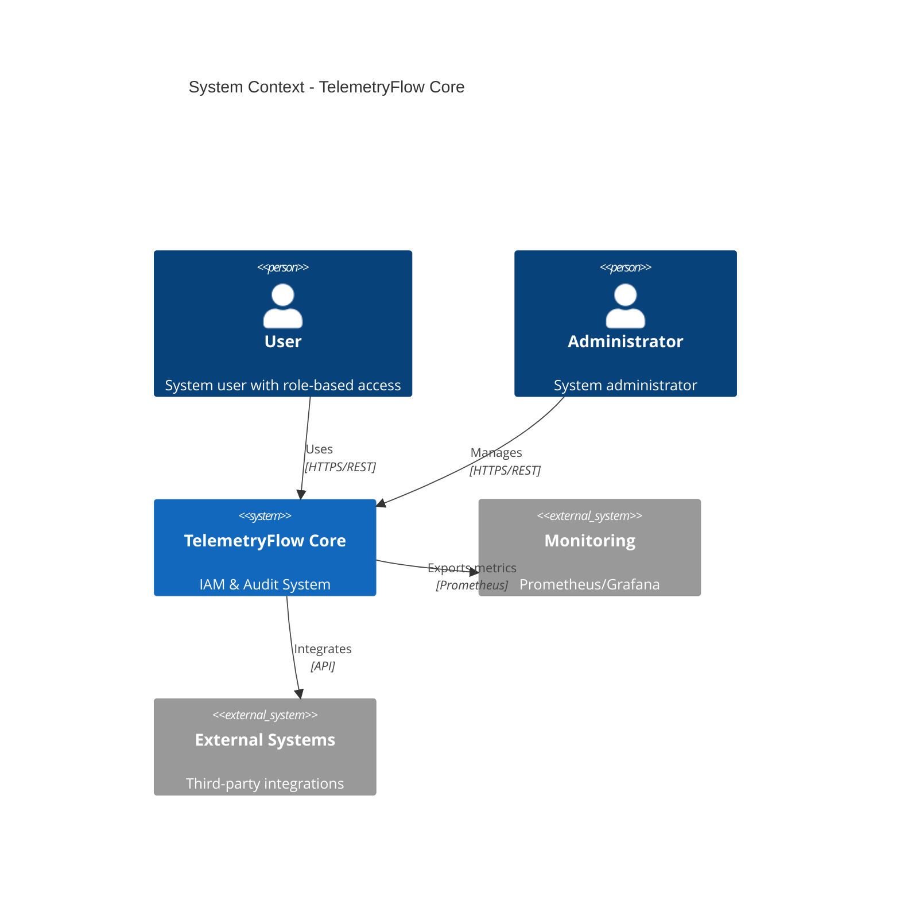

## Container Diagram

**Purpose**: Shows the major containers (applications/services) and their relationships.

**Key Containers**:
- **API Application**: NestJS REST API with JWT authentication
- **IAM Module**: Identity and Access Management (users, roles, permissions)
- **Audit Module**: Audit logging service for tracking all actions
- **PostgreSQL**: Stores IAM data (users, roles, organizations, etc.)
- **ClickHouse**: Stores audit logs for compliance and analysis
- **OTEL Collector**: Collects and processes telemetry data (traces, metrics)

**Data Flow**:
1. User sends HTTPS requests to API
2. API uses IAM module for authentication/authorization
3. API logs all actions to Audit module
4. IAM reads/writes to PostgreSQL
5. Audit writes to ClickHouse
6. API sends traces to OTEL Collector

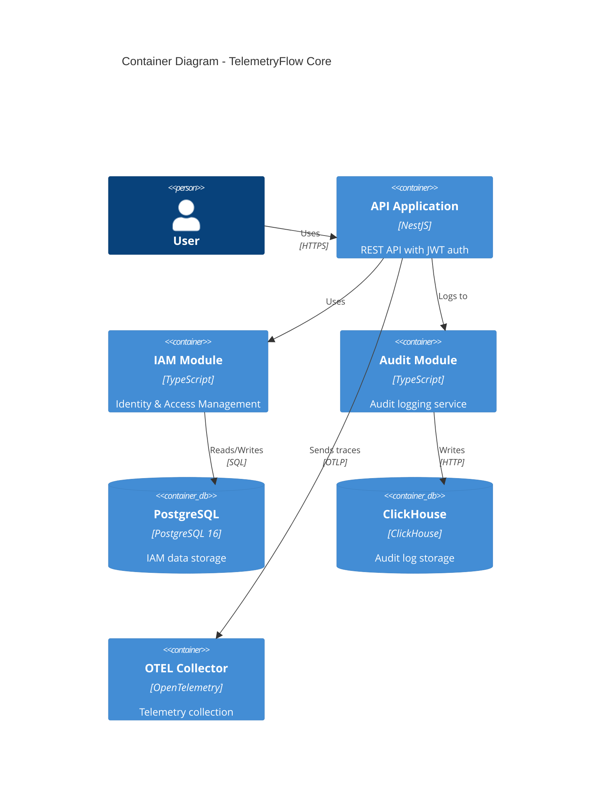

## Component Diagram - IAM Module

**Purpose**: Detailed view of IAM module internal components using DDD and CQRS patterns.

**Architecture Layers**:
1. **Presentation Layer**: Controllers handle HTTP requests
2. **Application Layer**: Command/Query buses implement CQRS pattern
3. **Domain Layer**: Aggregates contain business logic
4. **Infrastructure Layer**: Repositories handle data persistence

**Key Components**:
- **Controllers**: User, Role, Permission REST endpoints
- **Command Bus**: Handles write operations (Create, Update, Delete)
- **Query Bus**: Handles read operations (Get, List, Search)
- **Aggregates**: User, Role, Permission domain models with business rules
- **Repositories**: Data access layer using TypeORM

**Flow**:
1. Controller receives HTTP request
2. Routes to Command Bus (write) or Query Bus (read)
3. Command Bus invokes Aggregate for business logic
4. Query Bus reads directly from Repository
5. Aggregate persists changes via Repository

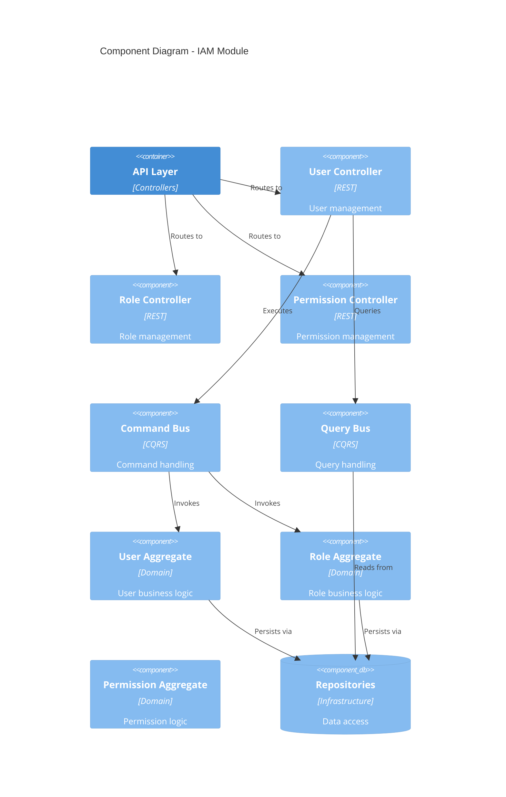

## Deployment Diagram

**Purpose**: Shows physical deployment architecture using Docker Compose.

**Network Configuration**:
- **Network**: `telemetryflow_core_net` (Bridge network)
- **Subnet**: 172.151.151.0/24
- **Static IPs**: Each service has a fixed IP for reliable communication

**Services**:
- **Backend** (172.151.151.10:3000): NestJS application
- **PostgreSQL** (172.151.151.20:5432): IAM database
- **ClickHouse** (172.151.151.40:8123): Audit log database
- **OTEL Collector** (172.151.151.30:4317): Telemetry collection
- **Prometheus** (172.151.151.50:9090): Metrics storage

**Access**:
- Client connects to Backend on port 3000
- Backend communicates with databases and OTEL internally
- All services isolated in Docker network

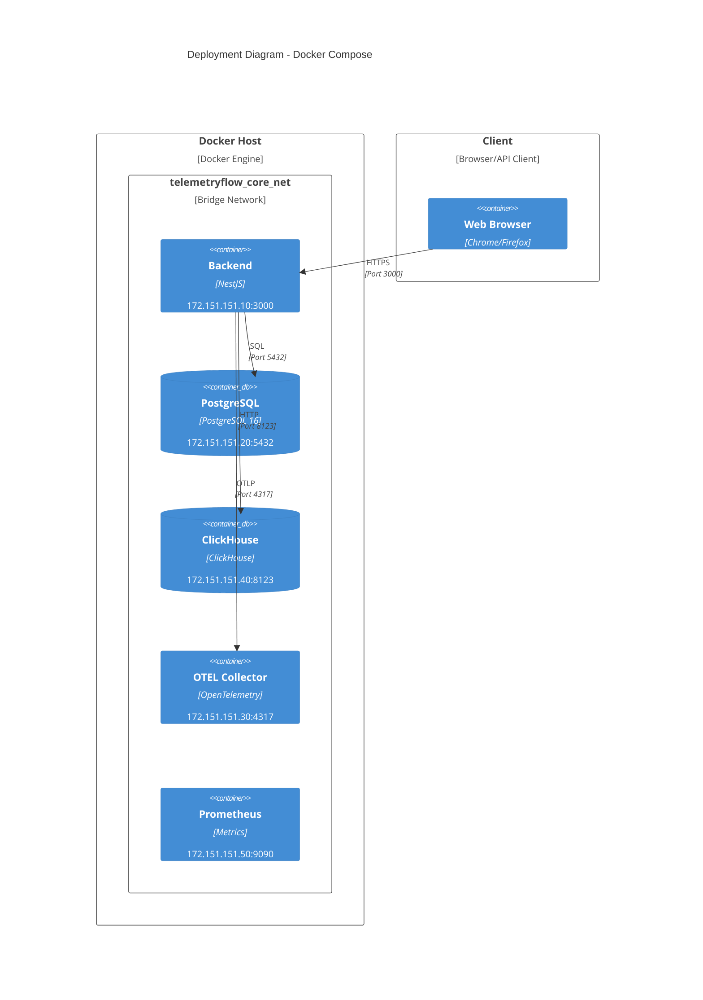

## Request Flow - User Creation

**Purpose**: Detailed sequence of creating a new user, showing CQRS and event-driven architecture.

**Steps**:
1. **Request**: Admin sends POST /users with user data
2. **Routing**: API routes to UserController
3. **Command**: Controller creates CreateUserCommand and sends to CommandBus
4. **Handling**: CommandHandler receives and processes command
5. **Domain Logic**: UserAggregate validates data and hashes password
6. **Persistence**: Repository saves user to PostgreSQL
7. **Audit**: AuditService logs action to ClickHouse
8. **Event**: UserCreatedEvent published to EventBus
9. **Response**: Returns userId to client with 201 Created

**Key Patterns**:
- **CQRS**: Separate command handling from queries
- **DDD**: Business logic in UserAggregate
- **Event-Driven**: UserCreatedEvent for async processing
- **Audit Trail**: All actions logged to ClickHouse

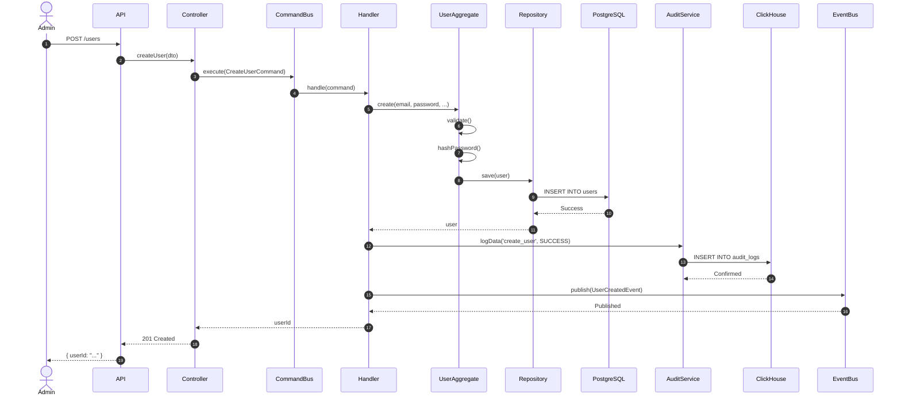

## Permission Check Flow

**Purpose**: Shows how the system validates user permissions for every API request.

**Security Layers**:
1. **Authentication**: Validates JWT token
2. **User Extraction**: Extracts user info from token
3. **Cache Check**: Checks if permissions are cached (performance optimization)
4. **Database Query**: Loads permissions from database if not cached
5. **Permission Check**: Verifies user has required permission
6. **Execution**: Executes operation if authorized
7. **Audit Logging**: Logs all attempts (success and failure)

**Outcomes**:
- **401 Unauthorized**: Invalid or missing JWT token (AUTH FAILURE)
- **403 Forbidden**: Valid token but insufficient permissions (AUTHZ DENIED)
- **200 OK**: Authorized and executed successfully (DATA SUCCESS)

**Performance**:
- Permissions cached after first load
- Reduces database queries
- Fast permission checks

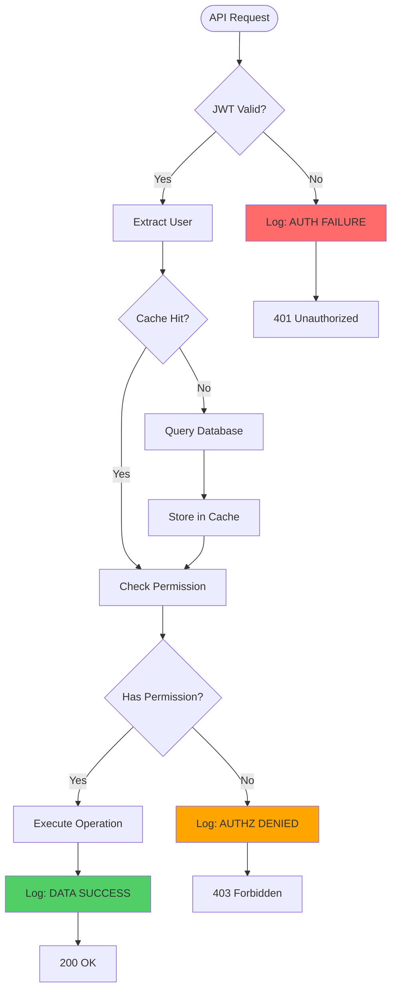

## Data Model - Complete

**Purpose**: Complete entity-relationship diagram for PostgreSQL IAM database.

**Core Entities**:
- **REGION**: Geographic regions (e.g., US-East, EU-West)
- **TENANT**: Top-level tenant organizations
- **ORGANIZATION**: Business units within tenants
- **WORKSPACE**: Project workspaces within organizations
- **USER**: System users with authentication
- **ROLE**: Predefined roles (5-tier RBAC)
- **PERMISSION**: Granular permissions (22+ IAM permissions)
- **GROUP**: User groups for organization

**Relationships**:
- **Hierarchy**: Region → Tenant → Organization → Workspace
- **User Assignment**: User belongs to Organization
- **Role Assignment**: User has multiple Roles (many-to-many via USER_ROLE)
- **Permission Assignment**:
  - Roles have Permissions (many-to-many via ROLE_PERMISSION)
  - Users can have direct Permissions (many-to-many via USER_PERMISSION)
- **Group Membership**: Users can belong to multiple Groups

**Key Features**:
- UUID primary keys for all entities
- Timestamps for audit trail (created_at, updated_at)
- Soft deletes (deleted_at)
- Unique constraints on emails, slugs, codes
- Foreign key relationships for data integrity

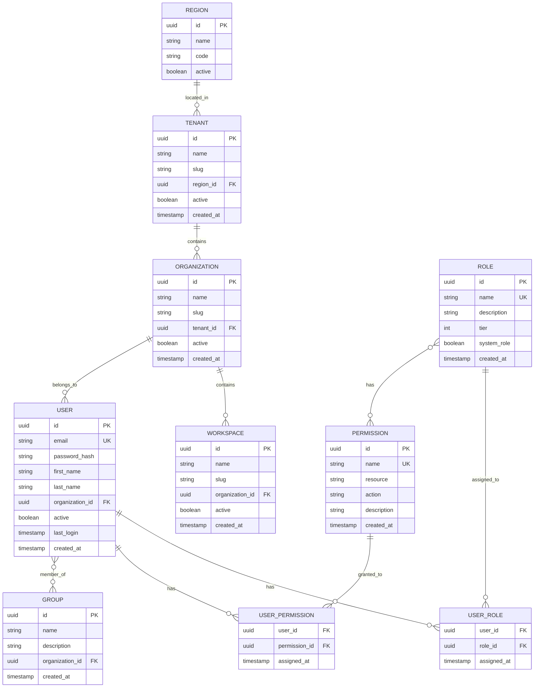

## Audit Log Schema

**Purpose**: ClickHouse schema for audit logging and compliance.

**Main Table: AUDIT_LOGS**
- **Event Tracking**: Records all user actions (AUTH, AUTHZ, DATA, SYSTEM)
- **User Context**: Captures user ID, email, name for accountability
- **Action Details**: Event type, action, resource, result
- **Request Metadata**: IP address, user agent, session ID
- **Performance**: Duration in milliseconds
- **Multi-tenancy**: Organization, workspace, tenant IDs
- **Error Tracking**: Error messages for failed operations

**Materialized Views** (Pre-aggregated for performance):
- **AUDIT_LOGS_STATS**: Daily statistics by event type and result
- **AUDIT_LOGS_USER_ACTIVITY**: Daily user activity counts by event type

**Data Types**:
- `datetime64(3)`: Millisecond precision timestamps
- `enum`: Efficient storage for event_type and result
- `string`: Flexible JSON metadata storage
- `uint32/uint64`: Numeric counters

**Retention**: 90 days (configurable via TTL)

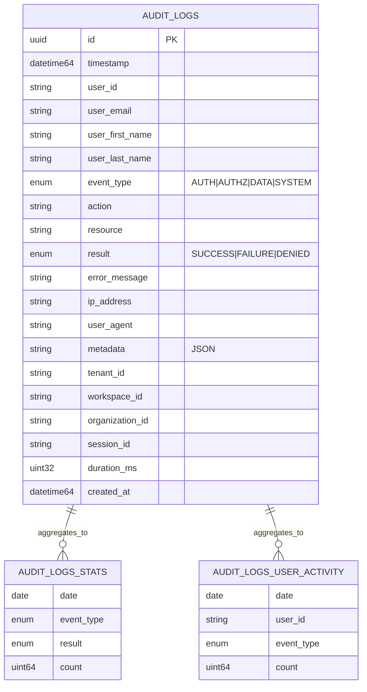

## State Machines

### User Lifecycle

**Purpose**: Shows possible states and transitions for a user account.

**States**:
- **Created**: User account created but not yet activated
  - Cannot login
  - Awaiting activation
- **Active**: User is active and can login
  - Full access based on assigned roles
  - Can perform operations
- **Inactive**: User is deactivated but data preserved
  - Cannot login
  - Can be reactivated
- **Deleted**: User is permanently deleted
  - Terminal state
  - Data may be archived

**Transitions**:
- `Create User` → Created
- `Activate` → Active (from Created or Inactive)
- `Deactivate` → Inactive (from Created or Active)
- `Delete` → Deleted (from Active or Inactive)

**Use Cases**:
- Onboarding: Created → Active
- Suspension: Active → Inactive
- Reactivation: Inactive → Active
- Offboarding: Active/Inactive → Deleted

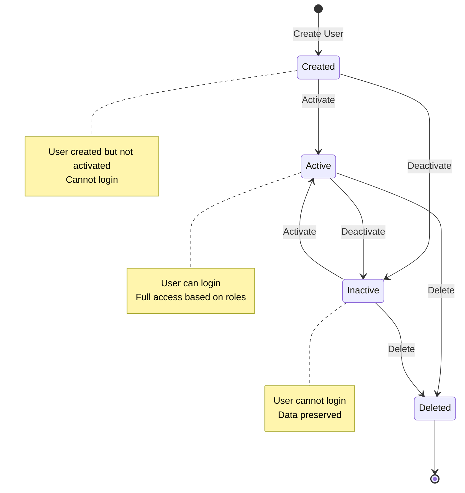

### Role Assignment

**Purpose**: Shows how roles are assigned and managed for users.

**States**:
- **NoRole**: User has no roles assigned
  - No permissions
  - Cannot access protected resources
- **HasRole**: User has one or more roles
  - Permissions inherited from roles
  - Can access resources based on permissions

**Transitions**:
- `User Created` → NoRole (initial state)
- `Assign Role` → HasRole (from NoRole)
- `Assign Additional Role` → HasRole (accumulate roles)
- `Revoke All Roles` → NoRole (remove all roles)
- `User Deleted` → Terminal state (from any state)

**Key Points**:
- Users can have multiple roles simultaneously
- Permissions are cumulative (union of all role permissions)
- Revoking all roles removes all inherited permissions
- Direct user permissions persist even without roles

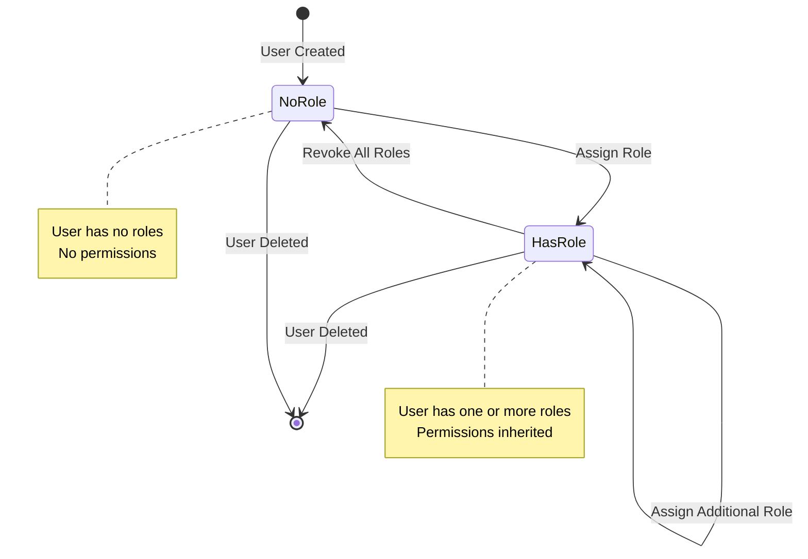

## Network Topology

**Purpose**: Shows network architecture and service communication within Docker.

**Network Design**:
- **Subnet**: 172.151.0.0/16 (65,536 addresses)
- **Network Type**: Bridge network (isolated from host)
- **Static IPs**: Each service has fixed IP for reliable DNS-free communication

**Tiers**:
1. **Application Tier**: Backend API (172.151.151.10)
2. **Data Tier**: PostgreSQL (172.151.151.20), ClickHouse (172.151.151.40)
3. **Observability Tier**: OTEL (172.151.151.30), Prometheus (172.151.151.50)

**Communication**:
- **External → Backend**: Client connects via port 3000 (mapped to host)
- **Backend → PostgreSQL**: Internal communication on port 5432
- **Backend → ClickHouse**: Internal communication on port 8123
- **Backend → OTEL**: Internal communication on port 4317

**Security**:
- Services isolated in Docker network
- Only Backend port exposed to host
- Database ports not exposed externally

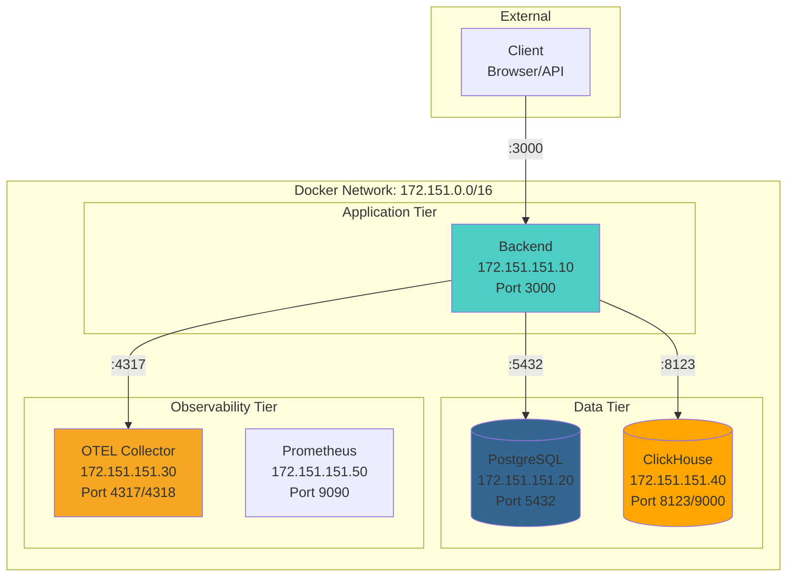

## Technology Stack

**Purpose**: Complete technology stack and dependencies.

**Frontend**:
- **Swagger UI**: Interactive API documentation (OpenAPI 3.0 spec)

**Backend**:
- **NestJS 11**: Progressive Node.js framework
- **TypeScript 5.9**: Type-safe JavaScript
- **Node.js 18+**: JavaScript runtime

**Data Layer**:
- **PostgreSQL 16**: Relational database for IAM data
- **ClickHouse**: Columnar database for audit logs

**Architecture Patterns**:
- **DDD**: Domain-Driven Design for business logic
- **CQRS**: Command Query Responsibility Segregation
- **Event-Driven**: Domain events for async processing

**Security**:
- **JWT Auth**: JSON Web Tokens for authentication
- **Argon2**: Password hashing algorithm
- **5-Tier RBAC**: Role-Based Access Control system

**Observability**:
- **OpenTelemetry**: Distributed tracing and metrics
- **Winston**: Structured logging
- **Health Checks**: Liveness and readiness probes

**Dependencies**:
- All components integrated through NestJS
- Modular architecture for maintainability
- Production-ready with enterprise features

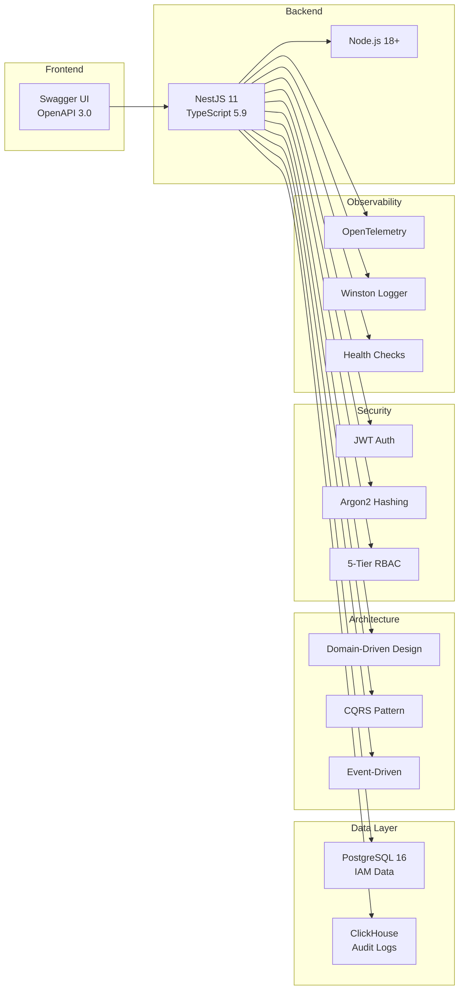

## Scaling Strategy

**Purpose**: Shows current single-instance deployment and future horizontal scaling plan.

**Current Architecture** (Single Instance):
- **Backend**: Single NestJS instance
- **PostgreSQL**: Single database instance
- **ClickHouse**: Single database instance
- **Limitations**:
  - Single point of failure
  - Limited throughput
  - Vertical scaling only

**Future Architecture** (Horizontal Scaling):
- **Load Balancer**: Distributes traffic across backend instances
- **Backend Instances**: Multiple NestJS instances (N instances)
- **Redis Cache**: Shared cache for session and permission data
- **PostgreSQL**: Primary-replica setup for read scaling
- **ClickHouse**: Cluster for distributed queries
- **Benefits**:
  - High availability
  - Horizontal scalability
  - Better performance
  - Fault tolerance

**Scaling Path**:
1. Add Redis for caching (reduce database load)
2. Add load balancer (enable multiple backends)
3. Scale backend horizontally (add more instances)
4. Add PostgreSQL replicas (scale reads)
5. Cluster ClickHouse (scale audit logs)

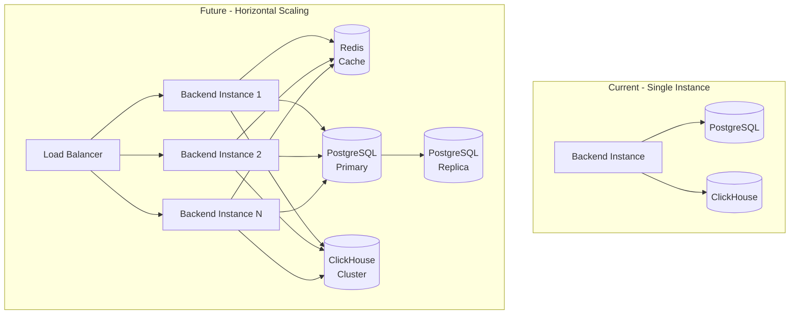

## Monitoring Dashboard

**Purpose**: Shows observability stack and monitoring data flow.

**Metrics Sources**:
- **Backend**: Health endpoint at `/health`
  - Application metrics
  - Request/response times
  - Error rates
- **ClickHouse**: Prometheus metrics at `:9363/metrics`
  - Query performance
  - Storage metrics
  - Table statistics
- **OTEL Collector**: Metrics at `:8889/metrics`
  - Trace statistics
  - Pipeline metrics
  - Export status

**Collection**:
- **Prometheus**: Scrapes metrics from all sources
  - 15-second scrape interval
  - Time-series storage
  - Query language (PromQL)

**Visualization**:
- **Grafana**: Dashboards for metrics visualization
  - Real-time monitoring
  - Historical analysis
  - Alerting capabilities

**Dashboards**:
1. **System Health**: Overall system status, uptime, resource usage
2. **API Performance**: Request rates, latency, error rates
3. **Audit Statistics**: Audit log counts, event types, user activity
4. **User Activity**: Active users, login patterns, permission usage

**Benefits**:
- Real-time visibility
- Performance monitoring
- Proactive alerting
- Historical analysis

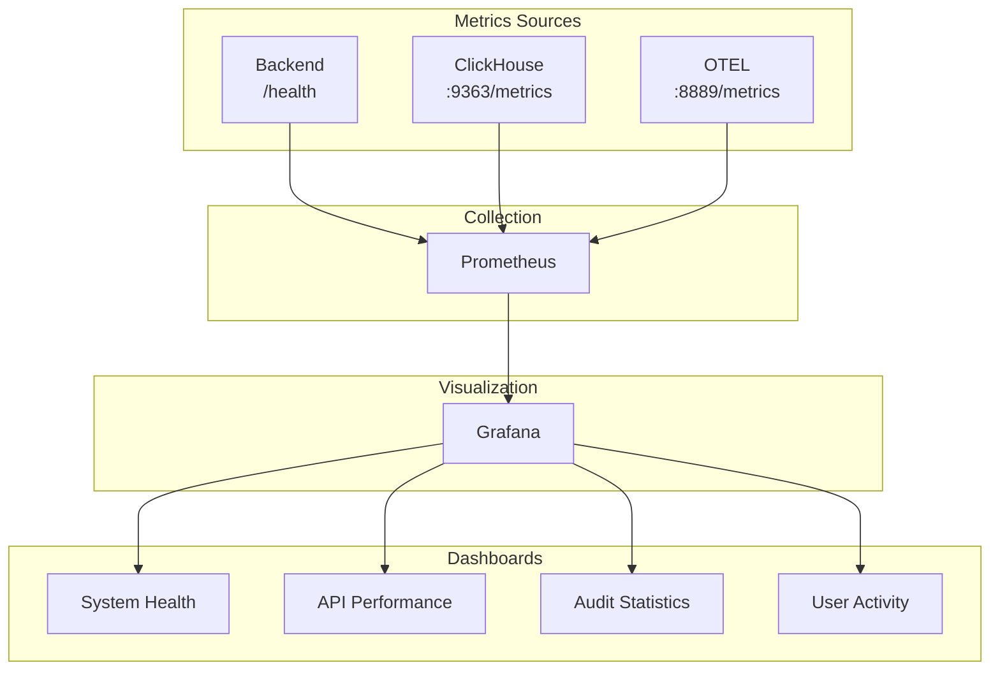

---

## Quick Reference

### Service Ports

| Service | Port | Protocol | Purpose |
|---------|------|----------|---------|
| Backend | 3000 | HTTP | REST API |
| PostgreSQL | 5432 | TCP | Database |
| ClickHouse HTTP | 8123 | HTTP | Queries |
| ClickHouse Native | 9000 | TCP | Native Protocol |
| ClickHouse Metrics | 9363 | HTTP | Prometheus |
| OTEL gRPC | 4317 | gRPC | Telemetry |
| OTEL HTTP | 4318 | HTTP | Telemetry |
| OTEL Metrics | 8889 | HTTP | Prometheus |

### IP Addresses

| Service | IP Address |
|---------|-----------|
| Backend | 172.151.151.10 |
| PostgreSQL | 172.151.151.20 |
| OTEL Collector | 172.151.151.30 |
| ClickHouse | 172.151.151.40 |

### Key Metrics

| Metric | Value |
|--------|-------|
| Aggregates | 9 |
| Commands | 33 |
| Queries | 18 |
| Handlers | 51 |
| Controllers | 9 |
| Domain Events | 25+ |
| Integration Points | 51 |
| Database Tables | 14 |

---

## References

- [Core Modules Documentation](./CORE_MODULES.md)
- [IAM Module](../src/modules/iam/README.md)
- [Audit Module](../src/modules/audit/README.md)
- [Docker Setup](./DOCKER_SETUP.md)
