# TelemetryFlow Core v1.4.0 - Architecture Diagrams

Quick visual reference for system architecture and data flows.

## System Overview

**Purpose**: High-level view of TelemetryFlow Core and its external interactions.

**Key Components**:

- **Users**: Regular users with role-based access (Viewer, Developer, Administrator)
- **Administrators**: Super administrators managing the entire platform
- **TelemetryFlow Core**: Monorepo — Backend (`@telemetryflow/backend`) + Frontend (`@telemetryflow/viz`)
- **External Systems**: Third-party integrations via REST API

**Interactions**:

- Users and admins access the system via HTTPS REST API or the Vue 3 web UI
- Core can integrate with external systems through its API

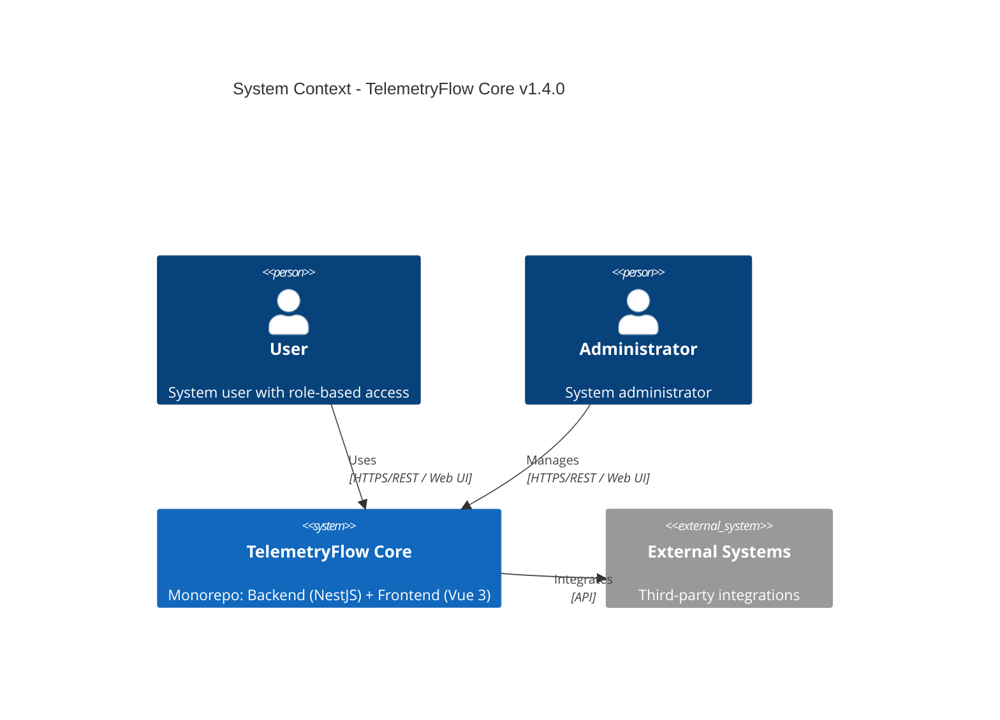
```mermaid
C4Context
    title System Context - TelemetryFlow Core v1.4.0

    Person(user, "User", "System user with role-based access")
    Person(admin, "Administrator", "System administrator")

    System(core, "TelemetryFlow Core", "Monorepo: Backend (NestJS) + Frontend (Vue 3)")

    System_Ext(external, "External Systems", "Third-party integrations")

    Rel(user, core, "Uses", "HTTPS/REST / Web UI")
    Rel(admin, core, "Manages", "HTTPS/REST / Web UI")
    Rel(core, external, "Integrates", "API")
```

## Container Diagram

**Purpose**: Shows the major containers (applications/services) and their relationships.

**Key Containers**:

- **Frontend**: Vue 3 web application (`@telemetryflow/viz`)
- **API Application**: NestJS REST API with JWT authentication (`@telemetryflow/backend`)
- **IAM Module**: Identity and Access Management (users, roles, permissions)
- **Audit Module**: Audit logging service for tracking all actions
- **PostgreSQL**: Stores IAM data (users, roles, organizations, etc.)
- **ClickHouse**: Stores audit logs for compliance and analysis
- **Redis**: Caching and session storage
- **NATS**: Message broker for event-driven communication

**Data Flow**:

1. User interacts with Vue 3 Frontend
2. Frontend sends HTTPS requests to API
3. API uses IAM module for authentication/authorization
4. API logs all actions to Audit module
5. IAM reads/writes to PostgreSQL
6. Audit writes to ClickHouse
7. API uses Redis for caching and NATS for event publishing

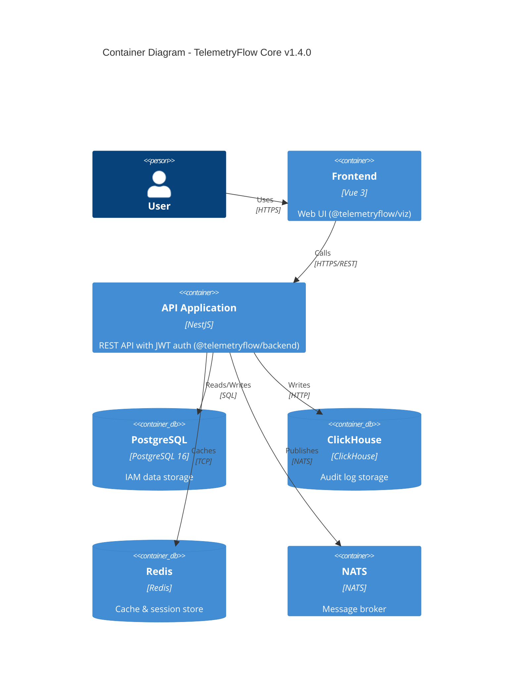
```mermaid
C4Container
    title Container Diagram - TelemetryFlow Core v1.4.0

    Person(user, "User")

    Container(frontend, "Frontend", "Vue 3", "Web UI (@telemetryflow/viz)")
    Container(api, "API Application", "NestJS", "REST API with JWT auth (@telemetryflow/backend)")

    ContainerDb(postgres, "PostgreSQL", "PostgreSQL 16", "IAM data storage")
    ContainerDb(clickhouse, "ClickHouse", "ClickHouse", "Audit log storage")
    ContainerDb(redis, "Redis", "Redis", "Cache & session store")
    Container(nats, "NATS", "NATS", "Message broker")

    Rel(user, frontend, "Uses", "HTTPS")
    Rel(frontend, api, "Calls", "HTTPS/REST")
    Rel(api, postgres, "Reads/Writes", "SQL")
    Rel(api, clickhouse, "Writes", "HTTP")
    Rel(api, redis, "Caches", "TCP")
    Rel(api, nats, "Publishes", "NATS")
```

## Component Diagram - IAM Module

**Purpose**: Detailed view of IAM module internal components using DDD and CQRS patterns.

**Architecture Layers**:

1. **Presentation Layer**: Controllers handle HTTP requests
2. **Application Layer**: Command/Query buses implement CQRS pattern
3. **Domain Layer**: Aggregates contain business logic
4. **Infrastructure Layer**: Repositories handle data persistence

**Backend Modules** (12 total):

iam, auth, sso, api-keys, audit, tenancy, alerting, query, llm, notification, data-masking, cache

**Key Components**:

- **Controllers**: User, Role, Permission REST endpoints
- **Command Bus**: Handles write operations (Create, Update, Delete)
- **Query Bus**: Handles read operations (Get, List, Search)
- **Aggregates**: User, Role, Permission domain models with business rules
- **Repositories**: Data access layer using TypeORM

**Flow**:

1. Controller receives HTTP request
2. Routes to Command Bus (write) or Query Bus (read)
3. Command Bus invokes Aggregate for business logic
4. Query Bus reads directly from Repository
5. Aggregate persists changes via Repository

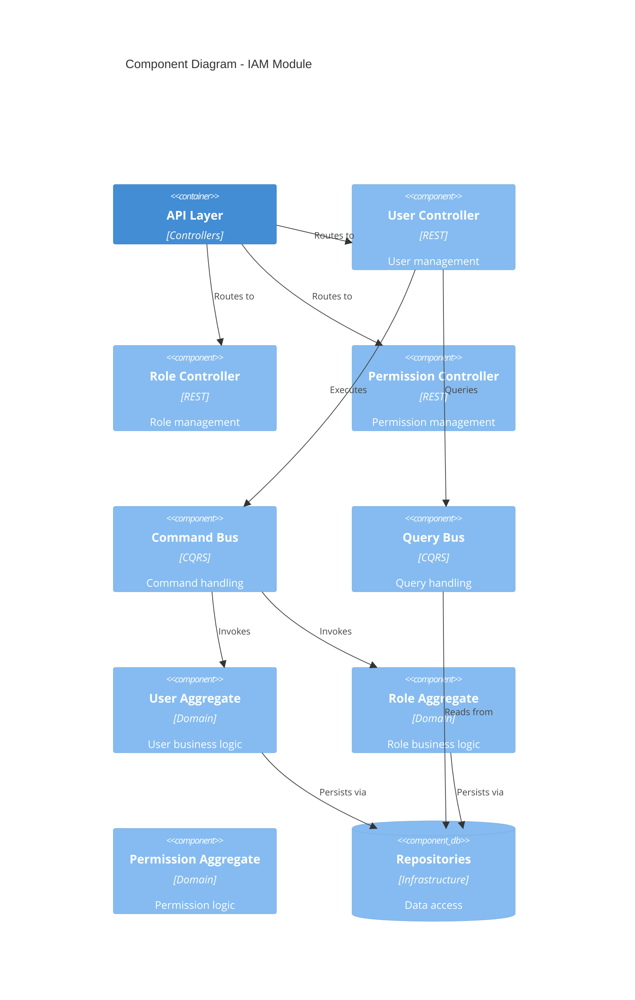
```mermaid
C4Component
    title Component Diagram - IAM Module

    Container(api, "API Layer", "Controllers")

    Component(userCtrl, "User Controller", "REST", "User management")
    Component(roleCtrl, "Role Controller", "REST", "Role management")
    Component(permCtrl, "Permission Controller", "REST", "Permission management")

    Component(cmdBus, "Command Bus", "CQRS", "Command handling")
    Component(queryBus, "Query Bus", "CQRS", "Query handling")

    Component(userAgg, "User Aggregate", "Domain", "User business logic")
    Component(roleAgg, "Role Aggregate", "Domain", "Role business logic")
    Component(permAgg, "Permission Aggregate", "Domain", "Permission logic")

    ComponentDb(repo, "Repositories", "Infrastructure", "Data access")

    Rel(api, userCtrl, "Routes to")
    Rel(api, roleCtrl, "Routes to")
    Rel(api, permCtrl, "Routes to")

    Rel(userCtrl, cmdBus, "Executes")
    Rel(userCtrl, queryBus, "Queries")

    Rel(cmdBus, userAgg, "Invokes")
    Rel(cmdBus, roleAgg, "Invokes")
    Rel(queryBus, repo, "Reads from")

    Rel(userAgg, repo, "Persists via")
    Rel(roleAgg, repo, "Persists via")
```

## Deployment Diagram

**Purpose**: Shows physical deployment architecture using Docker Compose.

**Network Configuration**:

- **Network**: `telemetryflow_core_net` (Bridge network)
- **Subnet**: 172.154.0.0/16
- **Static IPs**: Each service has a fixed IP for reliable communication

**Services**:

- **Frontend** (172.154.154.80:80): Vue 3 web application
- **Backend** (172.154.154.10:3000): NestJS application
- **PostgreSQL** (172.154.154.20:5432): IAM database
- **Redis** (172.154.154.30:6379): Cache & session store
- **NATS** (172.154.154.35:4222): Message broker
- **ClickHouse** (172.154.154.40:8123): Audit log database
- **Portainer** (172.154.154.5:9000): Container management (optional)

**Access**:

- Client connects to Frontend on port 80 or Backend on port 3000
- Backend communicates with databases, Redis, and NATS internally
- All services isolated in Docker network

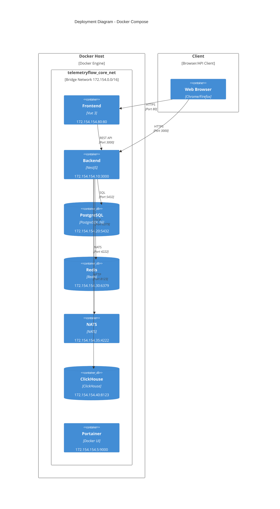
```mermaid
C4Deployment
    title Deployment Diagram - Docker Compose

    Deployment_Node(docker, "Docker Host", "Docker Engine") {
        Deployment_Node(network, "telemetryflow_core_net", "Bridge Network 172.154.0.0/16") {
            Container(frontend, "Frontend", "Vue 3", "172.154.154.80:80")
            Container(backend, "Backend", "NestJS", "172.154.154.10:3000")
            ContainerDb(postgres, "PostgreSQL", "PostgreSQL 16", "172.154.154.20:5432")
            ContainerDb(redis, "Redis", "Redis", "172.154.154.30:6379")
            Container(nats, "NATS", "NATS", "172.154.154.35:4222")
            ContainerDb(clickhouse, "ClickHouse", "ClickHouse", "172.154.154.40:8123")
            Container(portainer, "Portainer", "Docker UI", "172.154.154.5:9000")
        }
    }

    Deployment_Node(client, "Client", "Browser/API Client") {
        Container(browser, "Web Browser", "Chrome/Firefox")
    }

    Rel(browser, frontend, "HTTPS", "Port 80")
    Rel(browser, backend, "HTTPS", "Port 3000")
    Rel(frontend, backend, "REST API", "Port 3000")
    Rel(backend, postgres, "SQL", "Port 5432")
    Rel(backend, redis, "TCP", "Port 6379")
    Rel(backend, nats, "NATS", "Port 4222")
    Rel(backend, clickhouse, "HTTP", "Port 8123")
```

## Request Flow - User Creation

**Purpose**: Detailed sequence of creating a new user, showing CQRS and event-driven architecture.

**Steps**:

1. **Request**: Admin sends POST /users with user data
2. **Routing**: API routes to UserController
3. **Command**: Controller creates CreateUserCommand and sends to CommandBus
4. **Handling**: CommandHandler receives and processes command
5. **Domain Logic**: UserAggregate validates data and hashes password
6. **Persistence**: Repository saves user to PostgreSQL
7. **Audit**: AuditService logs action to ClickHouse
8. **Event**: UserCreatedEvent published to EventBus (via NATS)
9. **Response**: Returns userId to client with 201 Created

**Key Patterns**:

- **CQRS**: Separate command handling from queries
- **DDD**: Business logic in UserAggregate
- **Event-Driven**: UserCreatedEvent published via NATS
- **Audit Trail**: All actions logged to ClickHouse

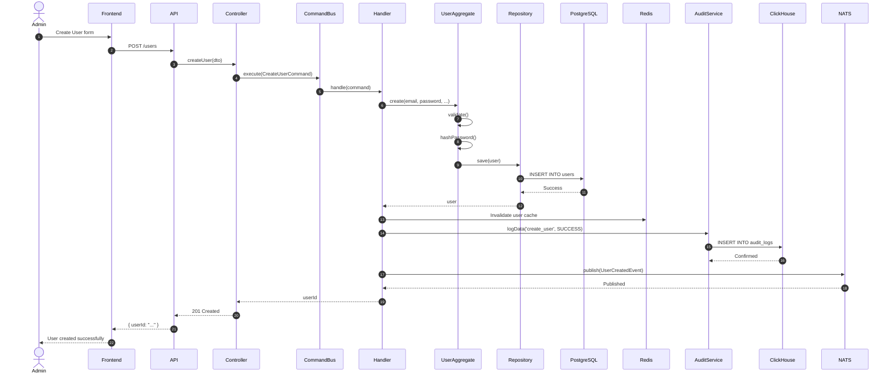
```mermaid
sequenceDiagram
    autonumber
    actor Admin
    participant Frontend
    participant API
    participant Controller
    participant CommandBus
    participant Handler
    participant UserAggregate
    participant Repository
    participant PostgreSQL
    participant Redis
    participant AuditService
    participant ClickHouse
    participant NATS

    Admin->>Frontend: Create User form
    Frontend->>API: POST /users
    API->>Controller: createUser(dto)
    Controller->>CommandBus: execute(CreateUserCommand)
    CommandBus->>Handler: handle(command)
    Handler->>UserAggregate: create(email, password, ...)
    UserAggregate->>UserAggregate: validate()
    UserAggregate->>UserAggregate: hashPassword()
    UserAggregate->>Repository: save(user)
    Repository->>PostgreSQL: INSERT INTO users
    PostgreSQL-->>Repository: Success
    Repository-->>Handler: user
    Handler->>Redis: Invalidate user cache
    Handler->>AuditService: logData('create_user', SUCCESS)
    AuditService->>ClickHouse: INSERT INTO audit_logs
    ClickHouse-->>AuditService: Confirmed
    Handler->>NATS: publish(UserCreatedEvent)
    NATS-->>Handler: Published
    Handler-->>Controller: userId
    Controller-->>API: 201 Created
    API-->>Frontend: { userId: "..." }
    Frontend-->>Admin: User created successfully
```

## Permission Check Flow

**Purpose**: Shows how the system validates user permissions for every API request.

**Security Layers**:

1. **Authentication**: Validates JWT token
2. **User Extraction**: Extracts user info from token
3. **Cache Check**: Checks Redis for cached permissions (performance optimization)
4. **Database Query**: Loads permissions from database if not cached
5. **Permission Check**: Verifies user has required permission
6. **Execution**: Executes operation if authorized
7. **Audit Logging**: Logs all attempts (success and failure)

**Outcomes**:

- **401 Unauthorized**: Invalid or missing JWT token (AUTH FAILURE)
- **403 Forbidden**: Valid token but insufficient permissions (AUTHZ DENIED)
- **200 OK**: Authorized and executed successfully (DATA SUCCESS)

**Performance**:

- Permissions cached in Redis after first load
- Reduces database queries
- Fast permission checks

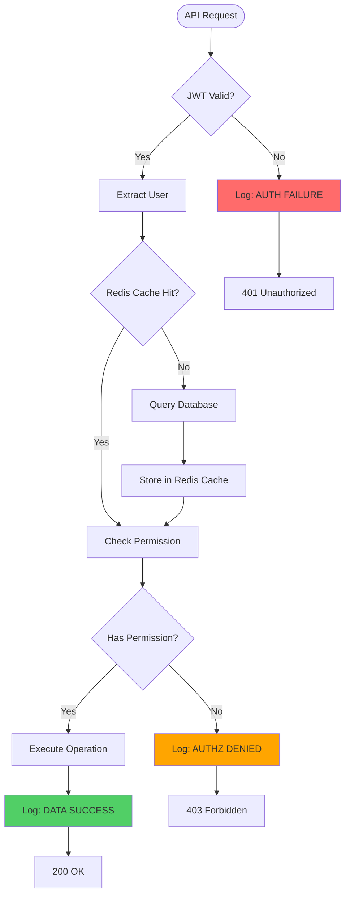
```mermaid
flowchart TD
    Start([API Request]) --> JWT{JWT Valid?}
    JWT -->|No| Audit1[Log: AUTH FAILURE]
    JWT -->|Yes| Extract[Extract User]
    Extract --> Cache{Redis Cache Hit?}
    Cache -->|Yes| Check[Check Permission]
    Cache -->|No| DB[Query Database]
    DB --> Store[Store in Redis Cache]
    Store --> Check
    Check --> Has{Has Permission?}
    Has -->|No| Audit2[Log: AUTHZ DENIED]
    Has -->|Yes| Execute[Execute Operation]
    Execute --> Audit3[Log: DATA SUCCESS]

    Audit1 --> Return1[401 Unauthorized]
    Audit2 --> Return2[403 Forbidden]
    Audit3 --> Return3[200 OK]

    style Audit1 fill:#ff6b6b
    style Audit2 fill:#ffa500
    style Audit3 fill:#51cf66
```

## Data Model - Complete

**Purpose**: Complete entity-relationship diagram for PostgreSQL IAM database.

**Core Entities**:

- **REGION**: Geographic regions (e.g., US-East, EU-West)
- **TENANT**: Top-level tenant organizations
- **ORGANIZATION**: Business units within tenants
- **WORKSPACE**: Project workspaces within organizations
- **USER**: System users with authentication
- **ROLE**: Predefined roles (5-tier RBAC)
- **PERMISSION**: Granular permissions (22+ IAM permissions)
- **GROUP**: User groups for organization

**Relationships**:

- **Hierarchy**: Region → Tenant → Organization → Workspace
- **User Assignment**: User belongs to Organization
- **Role Assignment**: User has multiple Roles (many-to-many via USER_ROLE)
- **Permission Assignment**:
  - Roles have Permissions (many-to-many via ROLE_PERMISSION)
  - Users can have direct Permissions (many-to-many via USER_PERMISSION)
- **Group Membership**: Users can belong to multiple Groups

**Key Features**:

- UUID primary keys for all entities
- Timestamps for audit trail (created_at, updated_at)
- Soft deletes (deleted_at)
- Unique constraints on emails, slugs, codes
- Foreign key relationships for data integrity

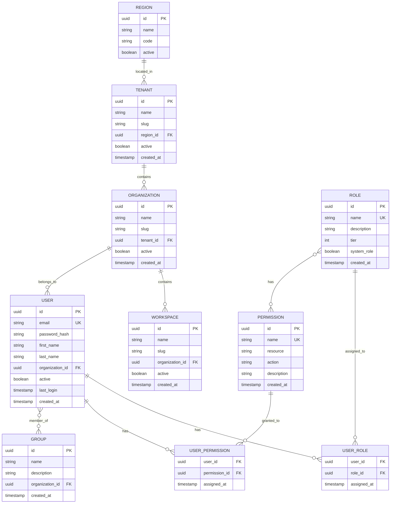
```mermaid
erDiagram
    REGION ||--o{ TENANT : "located_in"
    TENANT ||--o{ ORGANIZATION : "contains"
    ORGANIZATION ||--o{ WORKSPACE : "contains"
    ORGANIZATION ||--o{ USER : "belongs_to"
    USER ||--o{ USER_ROLE : "has"
    USER ||--o{ USER_PERMISSION : "has"
    USER }o--o{ GROUP : "member_of"
    ROLE ||--o{ USER_ROLE : "assigned_to"
    ROLE }o--o{ PERMISSION : "has"
    PERMISSION ||--o{ USER_PERMISSION : "granted_to"

    REGION {
        uuid id PK
        string name
        string code
        boolean active
    }

    TENANT {
        uuid id PK
        string name
        string slug
        uuid region_id FK
        boolean active
        timestamp created_at
    }

    ORGANIZATION {
        uuid id PK
        string name
        string slug
        uuid tenant_id FK
        boolean active
        timestamp created_at
    }

    WORKSPACE {
        uuid id PK
        string name
        string slug
        uuid organization_id FK
        boolean active
        timestamp created_at
    }

    USER {
        uuid id PK
        string email UK
        string password_hash
        string first_name
        string last_name
        uuid organization_id FK
        boolean active
        timestamp last_login
        timestamp created_at
    }

    ROLE {
        uuid id PK
        string name UK
        string description
        int tier
        boolean system_role
        timestamp created_at
    }

    PERMISSION {
        uuid id PK
        string name UK
        string resource
        string action
        string description
        timestamp created_at
    }

    GROUP {
        uuid id PK
        string name
        string description
        uuid organization_id FK
        timestamp created_at
    }

    USER_ROLE {
        uuid user_id FK
        uuid role_id FK
        timestamp assigned_at
    }

    USER_PERMISSION {
        uuid user_id FK
        uuid permission_id FK
        timestamp assigned_at
    }
```

## Audit Log Schema

**Purpose**: ClickHouse schema for audit logging and compliance.

**Main Table: AUDIT_LOGS**

- **Event Tracking**: Records all user actions (AUTH, AUTHZ, DATA, SYSTEM)
- **User Context**: Captures user ID, email, name for accountability
- **Action Details**: Event type, action, resource, result
- **Request Metadata**: IP address, user agent, session ID
- **Performance**: Duration in milliseconds
- **Multi-tenancy**: Organization, workspace, tenant IDs
- **Error Tracking**: Error messages for failed operations

**Materialized Views** (Pre-aggregated for performance):

- **AUDIT_LOGS_STATS**: Daily statistics by event type and result
- **AUDIT_LOGS_USER_ACTIVITY**: Daily user activity counts by event type

**Data Types**:

- `datetime64(3)`: Millisecond precision timestamps
- `enum`: Efficient storage for event_type and result
- `string`: Flexible JSON metadata storage
- `uint32/uint64`: Numeric counters

**Retention**: 90 days (configurable via TTL)

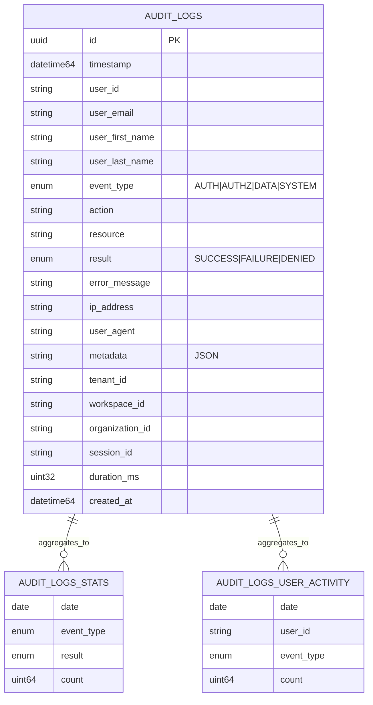
```mermaid
erDiagram
    AUDIT_LOGS {
        uuid id PK
        datetime64 timestamp
        string user_id
        string user_email
        string user_first_name
        string user_last_name
        enum event_type "AUTH|AUTHZ|DATA|SYSTEM"
        string action
        string resource
        enum result "SUCCESS|FAILURE|DENIED"
        string error_message
        string ip_address
        string user_agent
        string metadata "JSON"
        string tenant_id
        string workspace_id
        string organization_id
        string session_id
        uint32 duration_ms
        datetime64 created_at
    }

    AUDIT_LOGS_STATS {
        date date
        enum event_type
        enum result
        uint64 count
    }

    AUDIT_LOGS_USER_ACTIVITY {
        date date
        string user_id
        enum event_type
        uint64 count
    }

    AUDIT_LOGS ||--o{ AUDIT_LOGS_STATS : "aggregates_to"
    AUDIT_LOGS ||--o{ AUDIT_LOGS_USER_ACTIVITY : "aggregates_to"
```

## State Machines

### User Lifecycle

**Purpose**: Shows possible states and transitions for a user account.

**States**:

- **Created**: User account created but not yet activated
  - Cannot login
  - Awaiting activation
- **Active**: User is active and can login
  - Full access based on assigned roles
  - Can perform operations
- **Inactive**: User is deactivated but data preserved
  - Cannot login
  - Can be reactivated
- **Deleted**: User is permanently deleted
  - Terminal state
  - Data may be archived

**Transitions**:

- `Create User` → Created
- `Activate` → Active (from Created or Inactive)
- `Deactivate` → Inactive (from Created or Active)
- `Delete` → Deleted (from Active or Inactive)

**Use Cases**:

- Onboarding: Created → Active
- Suspension: Active → Inactive
- Reactivation: Inactive → Active
- Offboarding: Active/Inactive → Deleted

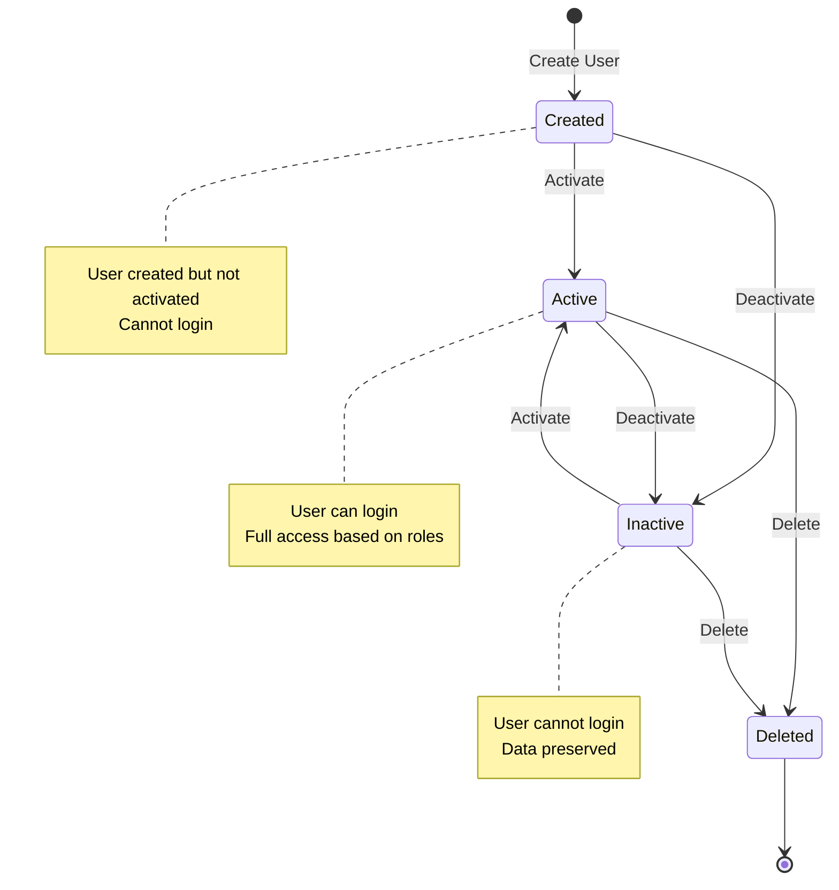
```mermaid
stateDiagram-v2
    [*] --> Created: Create User
    Created --> Active: Activate
    Created --> Inactive: Deactivate
    Active --> Inactive: Deactivate
    Inactive --> Active: Activate
    Active --> Deleted: Delete
    Inactive --> Deleted: Delete
    Deleted --> [*]

    note right of Created
        User created but not activated
        Cannot login
    end note

    note right of Active
        User can login
        Full access based on roles
    end note

    note right of Inactive
        User cannot login
        Data preserved
    end note
```

### Role Assignment

**Purpose**: Shows how roles are assigned and managed for users.

**States**:

- **NoRole**: User has no roles assigned
  - No permissions
  - Cannot access protected resources
- **HasRole**: User has one or more roles
  - Permissions inherited from roles
  - Can access resources based on permissions

**Transitions**:

- `User Created` → NoRole (initial state)
- `Assign Role` → HasRole (from NoRole)
- `Assign Additional Role` → HasRole (accumulate roles)
- `Revoke All Roles` → NoRole (remove all roles)
- `User Deleted` → Terminal state (from any state)

**Key Points**:

- Users can have multiple roles simultaneously
- Permissions are cumulative (union of all role permissions)
- Revoking all roles removes all inherited permissions
- Direct user permissions persist even without roles

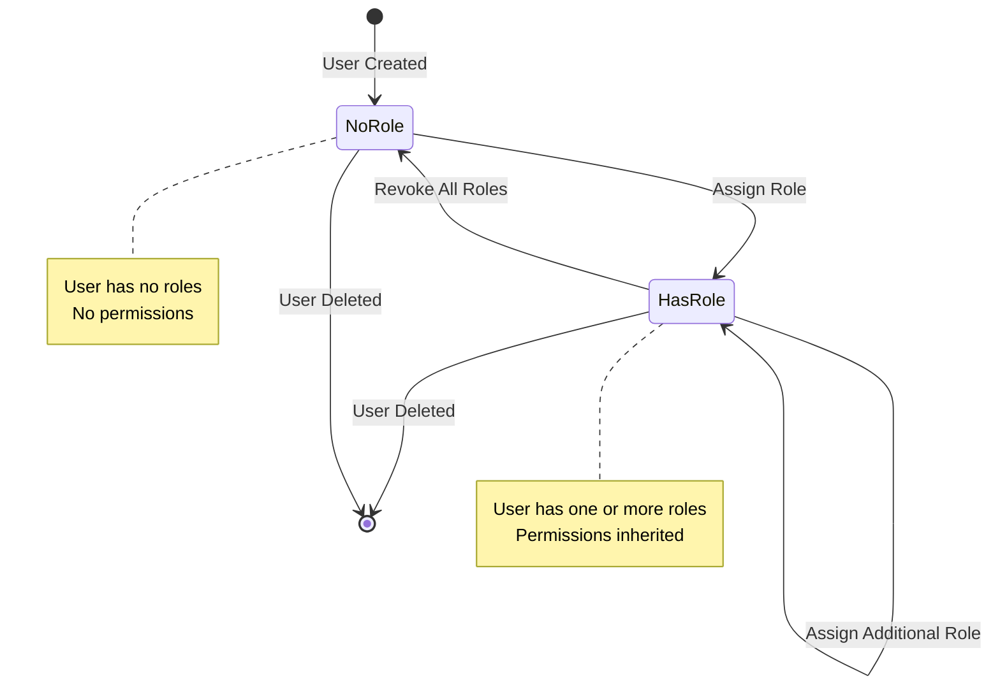
```mermaid
stateDiagram-v2
    [*] --> NoRole: User Created
    NoRole --> HasRole: Assign Role
    HasRole --> HasRole: Assign Additional Role
    HasRole --> NoRole: Revoke All Roles
    HasRole --> [*]: User Deleted
    NoRole --> [*]: User Deleted

    note right of NoRole
        User has no roles
        No permissions
    end note

    note right of HasRole
        User has one or more roles
        Permissions inherited
    end note
```

## Network Topology

**Purpose**: Shows network architecture and service communication within Docker.

**Network Design**:

- **Subnet**: 172.154.0.0/16 (65,536 addresses)
- **Network Type**: Bridge network (isolated from host)
- **Static IPs**: Each service has fixed IP for reliable DNS-free communication

**Tiers**:

1. **Presentation Tier**: Frontend (172.154.154.80)
2. **Application Tier**: Backend API (172.154.154.10)
3. **Messaging Tier**: NATS (172.154.154.35)
4. **Data Tier**: PostgreSQL (172.154.154.20), Redis (172.154.154.30), ClickHouse (172.154.154.40)

**Communication**:

- **External → Frontend**: Client connects via port 80 (mapped to host)
- **Frontend → Backend**: REST API calls on port 3000
- **Backend → PostgreSQL**: Internal communication on port 5432
- **Backend → Redis**: Internal communication on port 6379
- **Backend → NATS**: Internal communication on port 4222
- **Backend → ClickHouse**: Internal communication on port 8123

**Security**:

- Services isolated in Docker network
- Only Frontend and Backend ports exposed to host
- Database ports not exposed externally

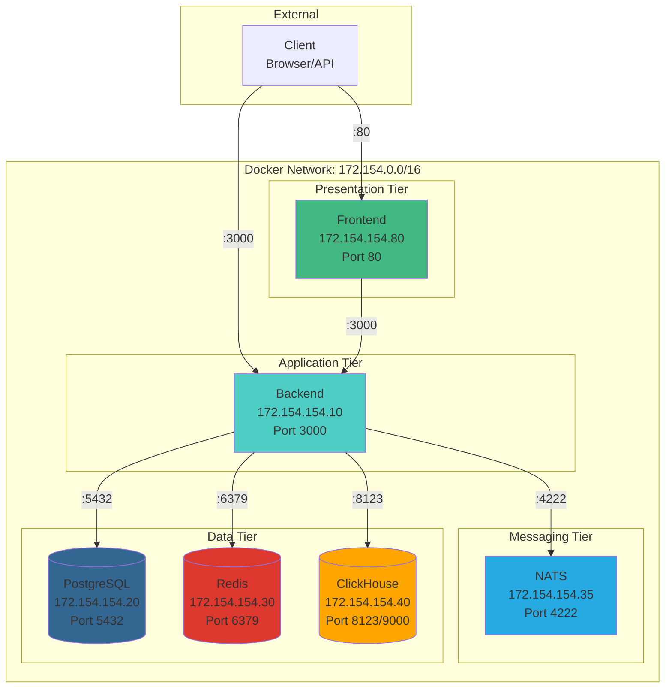
```mermaid
graph TB
    subgraph "External"
        Client[Client<br/>Browser/API]
    end

    subgraph "Docker Network: 172.154.0.0/16"
        subgraph "Presentation Tier"
            FE[Frontend<br/>172.154.154.80<br/>Port 80]
        end

        subgraph "Application Tier"
            BE[Backend<br/>172.154.154.10<br/>Port 3000]
        end

        subgraph "Messaging Tier"
            NATS[NATS<br/>172.154.154.35<br/>Port 4222]
        end

        subgraph "Data Tier"
            PG[(PostgreSQL<br/>172.154.154.20<br/>Port 5432)]
            REDIS[(Redis<br/>172.154.154.30<br/>Port 6379)]
            CH[(ClickHouse<br/>172.154.154.40<br/>Port 8123/9000)]
        end
    end

    Client -->|:80| FE
    Client -->|:3000| BE
    FE -->|:3000| BE
    BE -->|:5432| PG
    BE -->|:6379| REDIS
    BE -->|:4222| NATS
    BE -->|:8123| CH

    style FE fill:#42b883
    style BE fill:#4ecdc4
    style PG fill:#336791
    style REDIS fill:#dc382d
    style CH fill:#ffa500
    style NATS fill:#27aae1
```

## Technology Stack

**Purpose**: Complete technology stack and dependencies.

**Monorepo Structure**:

- **`@telemetryflow/backend`**: NestJS application
- **`@telemetryflow/viz`**: Vue 3 frontend application

**Frontend**:

- **Vue 3**: Progressive JavaScript framework
- **Vite**: Build tool and dev server
- **Swagger UI**: Interactive API documentation (OpenAPI 3.0 spec)

**Backend**:

- **NestJS 11**: Progressive Node.js framework
- **TypeScript 5.9**: Type-safe JavaScript
- **Node.js 18+**: JavaScript runtime

**Data Layer**:

- **PostgreSQL 16**: Relational database for IAM data
- **ClickHouse**: Columnar database for audit logs
- **Redis**: Cache and session store
- **NATS**: Lightweight messaging system

**Architecture Patterns**:

- **DDD**: Domain-Driven Design for business logic
- **CQRS**: Command Query Responsibility Segregation
- **Event-Driven**: Domain events via NATS for async processing

**Security**:

- **JWT Auth**: JSON Web Tokens for authentication
- **Argon2**: Password hashing algorithm
- **5-Tier RBAC**: Role-Based Access Control system

**Observability**:

- **Winston**: Structured logging
- **Health Checks**: Liveness and readiness probes

**Dependencies**:

- All components integrated through NestJS
- Modular architecture with 12 backend modules
- Production-ready with enterprise features

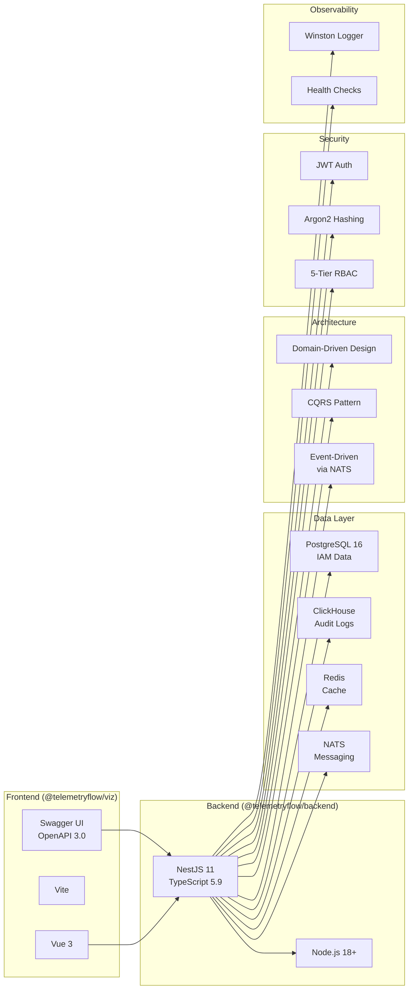
```mermaid
graph LR
    subgraph "Frontend (@telemetryflow/viz)"
        Vue[Vue 3]
        Vite[Vite]
        Swagger[Swagger UI<br/>OpenAPI 3.0]
    end

    subgraph "Backend (@telemetryflow/backend)"
        NestJS[NestJS 11<br/>TypeScript 5.9]
        Node[Node.js 18+]
    end

    subgraph "Data Layer"
        PG[PostgreSQL 16<br/>IAM Data]
        CH[ClickHouse<br/>Audit Logs]
        REDIS[Redis<br/>Cache]
        NATS[NATS<br/>Messaging]
    end

    subgraph "Architecture"
        DDD[Domain-Driven Design]
        CQRS[CQRS Pattern]
        Events[Event-Driven<br/>via NATS]
    end

    subgraph "Security"
        JWT[JWT Auth]
        Argon2[Argon2 Hashing]
        RBAC[5-Tier RBAC]
    end

    subgraph "Observability"
        Winston[Winston Logger]
        Health[Health Checks]
    end

    Vue --> NestJS
    Swagger --> NestJS
    NestJS --> Node
    NestJS --> PG
    NestJS --> CH
    NestJS --> REDIS
    NestJS --> NATS
    NestJS --> DDD
    NestJS --> CQRS
    NestJS --> Events
    NestJS --> JWT
    NestJS --> Argon2
    NestJS --> RBAC
    NestJS --> Winston
    NestJS --> Health
```

## Scaling Strategy

**Purpose**: Shows current deployment and future horizontal scaling plan.

**Current Architecture**:

- **Frontend**: Vue 3 single instance
- **Backend**: Single NestJS instance
- **PostgreSQL**: Single database instance
- **ClickHouse**: Single database instance
- **Redis**: Single instance for caching
- **NATS**: Single instance for messaging
- **Limitations**:
  - Backend single point of failure
  - Limited throughput
  - Vertical scaling only for backend

**Future Architecture** (Horizontal Scaling):

- **Load Balancer**: Distributes traffic across backend instances
- **Frontend CDN**: Static assets served via CDN
- **Backend Instances**: Multiple NestJS instances (N instances)
- **Redis Cluster**: High-availability caching
- **NATS Cluster**: High-availability messaging
- **PostgreSQL**: Primary-replica setup for read scaling
- **ClickHouse**: Cluster for distributed queries
- **Benefits**:
  - High availability
  - Horizontal scalability
  - Better performance
  - Fault tolerance

**Scaling Path**:

1. Add load balancer (enable multiple backends)
2. Scale backend horizontally (add more instances)
3. Deploy Frontend to CDN
4. Cluster Redis and NATS
5. Add PostgreSQL replicas (scale reads)
6. Cluster ClickHouse (scale audit logs)

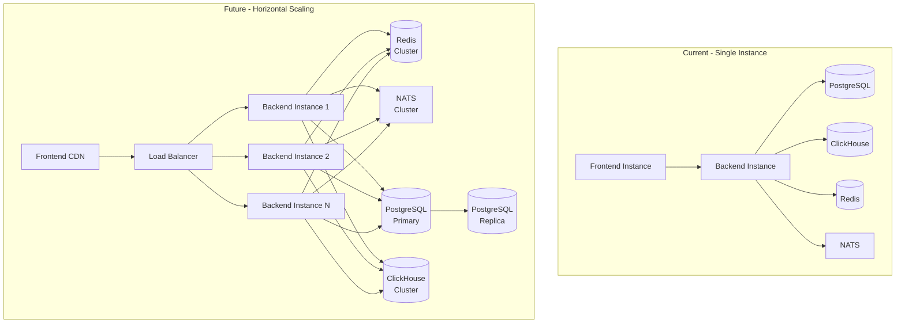
```mermaid
graph TB
    subgraph "Current - Single Instance"
        FE1[Frontend Instance]
        BE1[Backend Instance]
        PG1[(PostgreSQL)]
        CH1[(ClickHouse)]
        RD1[(Redis)]
        NT1[NATS]
    end

    subgraph "Future - Horizontal Scaling"
        CDN[Frontend CDN]
        LB[Load Balancer]
        BE2[Backend Instance 1]
        BE3[Backend Instance 2]
        BE4[Backend Instance N]
        PG2[(PostgreSQL<br/>Primary)]
        PG3[(PostgreSQL<br/>Replica)]
        CH2[(ClickHouse<br/>Cluster)]
        Redis[(Redis<br/>Cluster)]
        NATS_C[NATS<br/>Cluster]
    end

    FE1 --> BE1
    BE1 --> PG1
    BE1 --> CH1
    BE1 --> RD1
    BE1 --> NT1

    CDN --> LB
    LB --> BE2
    LB --> BE3
    LB --> BE4
    BE2 --> Redis
    BE3 --> Redis
    BE4 --> Redis
    BE2 --> NATS_C
    BE3 --> NATS_C
    BE4 --> NATS_C
    BE2 --> PG2
    BE3 --> PG2
    BE4 --> PG2
    PG2 --> PG3
    BE2 --> CH2
    BE3 --> CH2
    BE4 --> CH2
```

## Monitoring & Health

**Purpose**: Shows health check endpoints and logging architecture.

**Health Sources**:

- **Backend**: Health endpoint at `/health`
  - Application status
  - Database connectivity
  - Redis connectivity
  - NATS connectivity

**Logging**:

- **Winston**: Structured logging from all backend modules
- **NATS**: Event-driven audit log streaming to ClickHouse

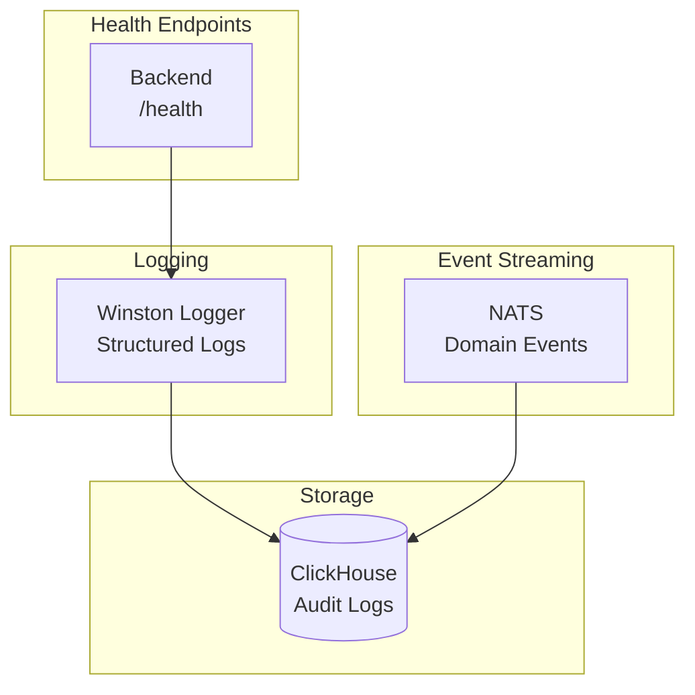
```mermaid
graph TB
    subgraph "Health Endpoints"
        BE[Backend<br/>/health]
    end

    subgraph "Logging"
        Winston[Winston Logger<br/>Structured Logs]
    end

    subgraph "Event Streaming"
        NATS[NATS<br/>Domain Events]
    end

    subgraph "Storage"
        CH[(ClickHouse<br/>Audit Logs)]
    end

    BE --> Winston
    Winston --> CH
    NATS --> CH
```

---

## Quick Reference

### Service Ports

| Service           | Port | Protocol | Purpose          |
| ----------------- | ---- | -------- | ---------------- |
| Frontend          | 80   | HTTP     | Vue 3 Web UI     |
| Backend           | 3000 | HTTP     | REST API         |
| PostgreSQL        | 5432 | TCP      | Database         |
| Redis             | 6379 | TCP      | Cache & Sessions |
| NATS              | 4222 | TCP      | Messaging        |
| ClickHouse HTTP   | 8123 | HTTP     | Queries          |
| ClickHouse Native | 9000 | TCP      | Native Protocol  |
| Portainer         | 9000 | HTTP     | Container Mgmt   |

### IP Addresses

| Service    | IP Address     |
| ---------- | -------------- |
| Portainer  | 172.154.154.5  |
| Backend    | 172.154.154.10 |
| PostgreSQL | 172.154.154.20 |
| Redis      | 172.154.154.30 |
| NATS       | 172.154.154.35 |
| ClickHouse | 172.154.154.40 |
| Frontend   | 172.154.154.80 |

### Key Metrics

| Metric             | Value |
| ------------------ | ----- |
| Backend Modules    | 12    |
| Aggregates         | 9     |
| Commands           | 33    |
| Queries            | 18    |
| Handlers           | 51    |
| Controllers        | 9     |
| Domain Events      | 25+   |
| Integration Points | 51    |
| Database Tables    | 14    |

---

## References

- [Core Modules Documentation](./CORE_MODULES.md)
- [IAM Module](../src/modules/iam/README.md)
- [Audit Module](../src/modules/audit/README.md)
- [Docker Setup](./DOCKER_SETUP.md)
