# TelemetryFlow Core - Modules Documentation

## Overview

TelemetryFlow Core consists of two primary modules: **IAM (Identity and Access Management)** and **Audit**. These modules work together to provide secure identity management with comprehensive audit logging.

## Architecture Overview

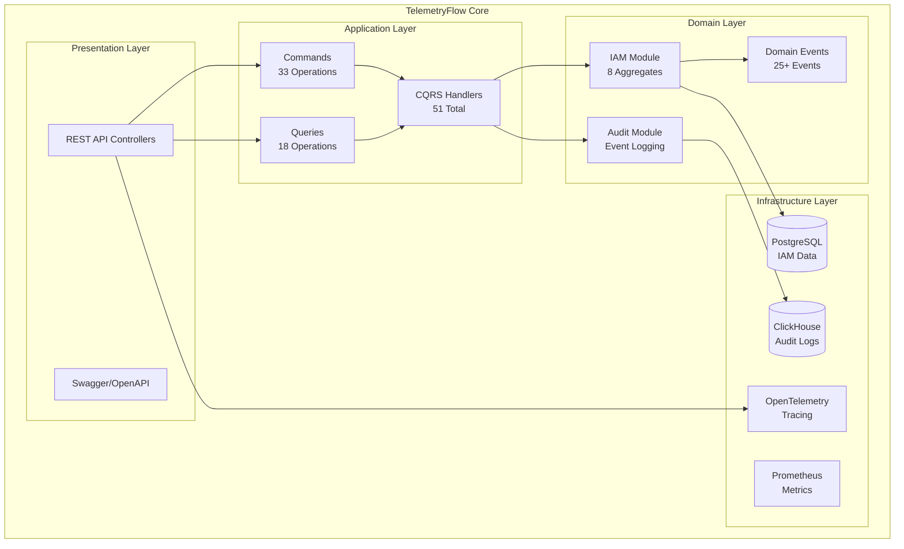

## Module Interaction Flow

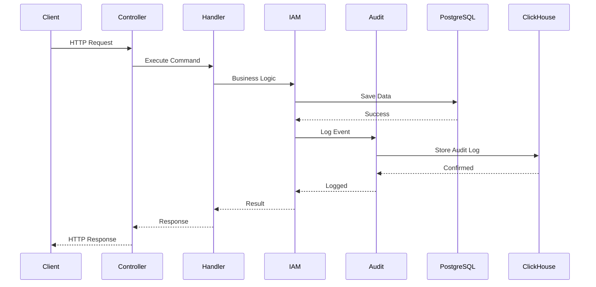

---

## IAM Module

### Overview

The IAM module provides complete identity and access management with a 5-tier RBAC system, multi-tenancy support, and hierarchical organization structure.

### Domain Model

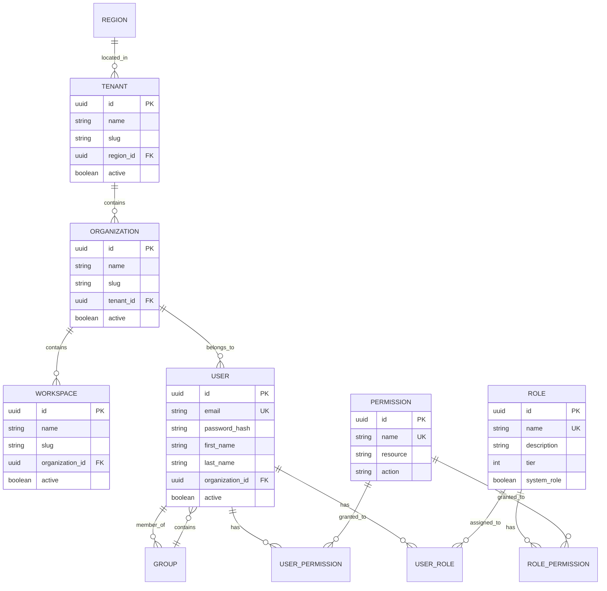

### 5-Tier RBAC System

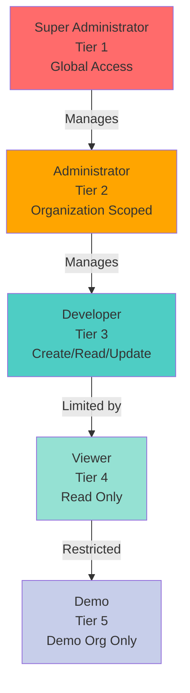

### CQRS Pattern

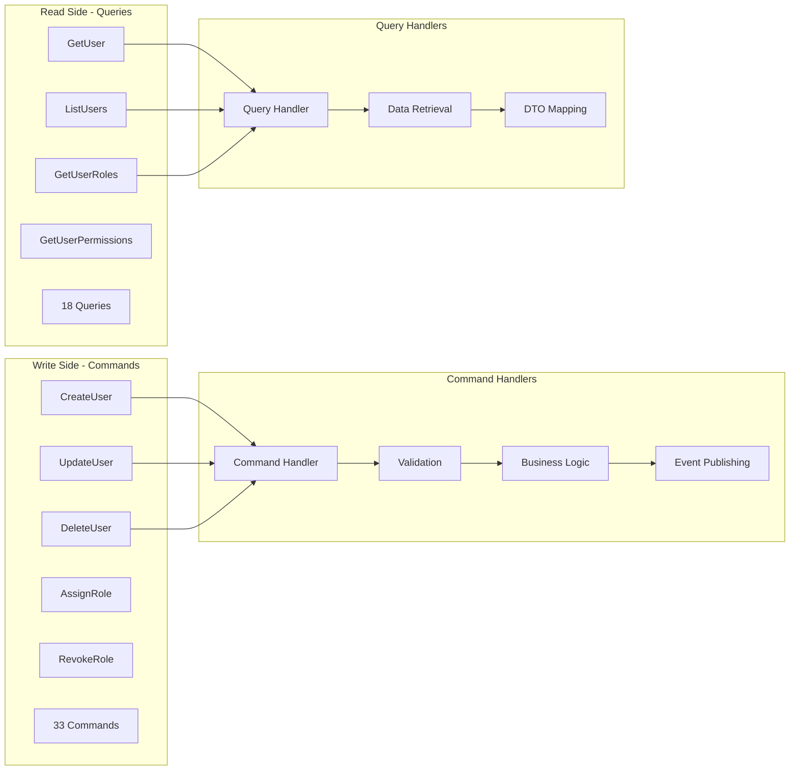

### Domain Events

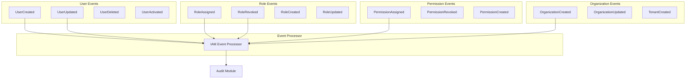

### IAM Operations

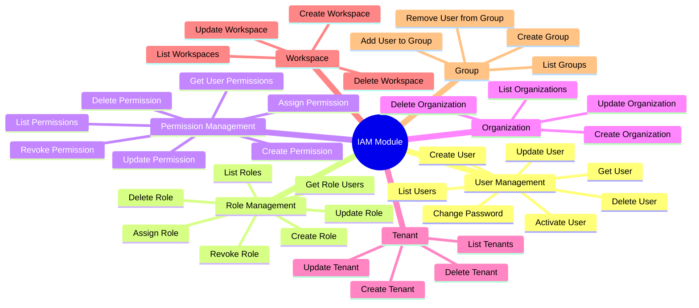

---

## Audit Module

### Overview

The Audit module provides comprehensive security and compliance logging using ClickHouse for high-volume data storage.

### Audit Flow

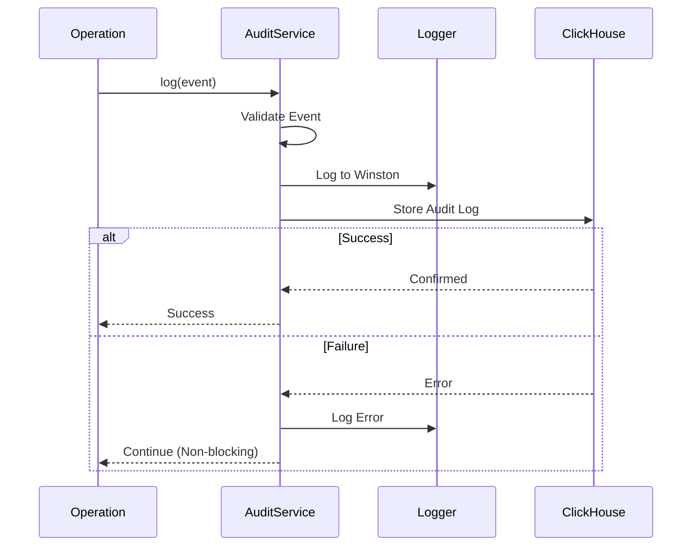

### Event Types

```mermaid
graph TD
    subgraph "Audit Event Types"
        AUTH[AUTH<br/>Authentication]
        AUTHZ[AUTHZ<br/>Authorization]
        DATA[DATA<br/>Data Operations]
        SYSTEM[SYSTEM<br/>System Events]
    end

    subgraph "AUTH Events"
        A1[Login]
        A2[Logout]
        A3[Password Change]
        A4[User Activation]
    end

    subgraph "AUTHZ Events"
        AZ1[Role Assignment]
        AZ2[Permission Grant]
        AZ3[Access Denied]
        AZ4[Permission Check]
    end

    subgraph "DATA Events"
        D1[Create]
        D2[Update]
        D3[Delete]
        D4[Read Sensitive]
    end

    subgraph "SYSTEM Events"
        S1[Startup]
        S2[Shutdown]
        S3[Config Change]
        S4[Error]
    end

    AUTH --> A1
    AUTH --> A2
    AUTH --> A3
    AUTH --> A4

    AUTHZ --> AZ1
    AUTHZ --> AZ2
    AUTHZ --> AZ3
    AUTHZ --> AZ4

    DATA --> D1
    DATA --> D2
    DATA --> D3
    DATA --> D4

    SYSTEM --> S1
    SYSTEM --> S2
    SYSTEM --> S3
    SYSTEM --> S4
```

### Event Results

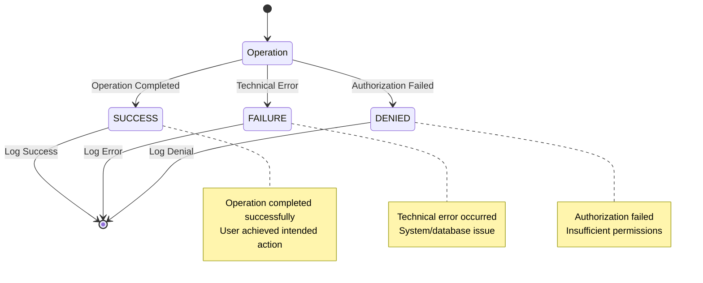

### ClickHouse Schema

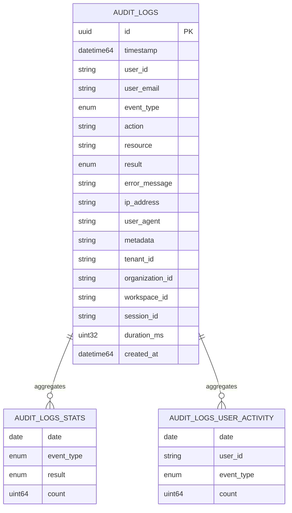

### Data Retention

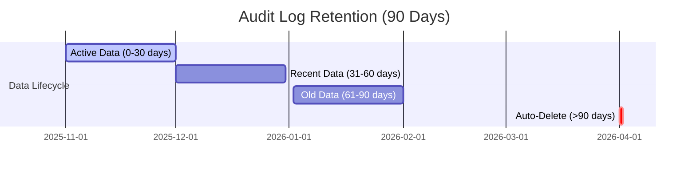

---

## IAM-Audit Integration

### Integration Points

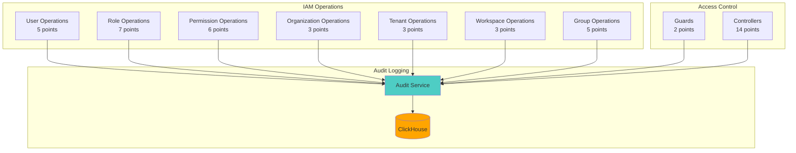

### Integration Flow

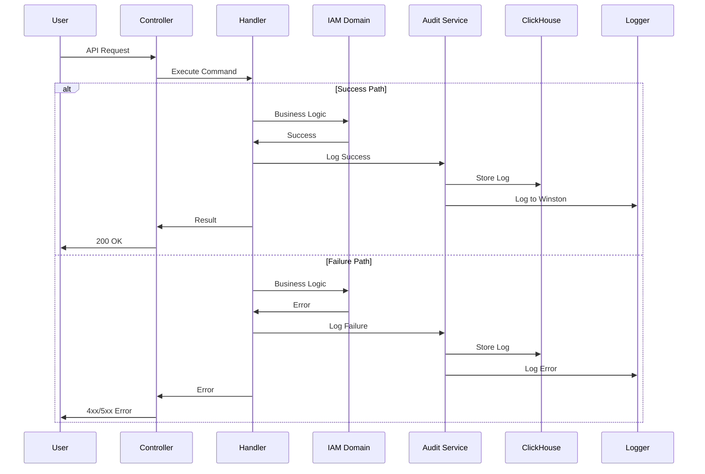

### Event Distribution

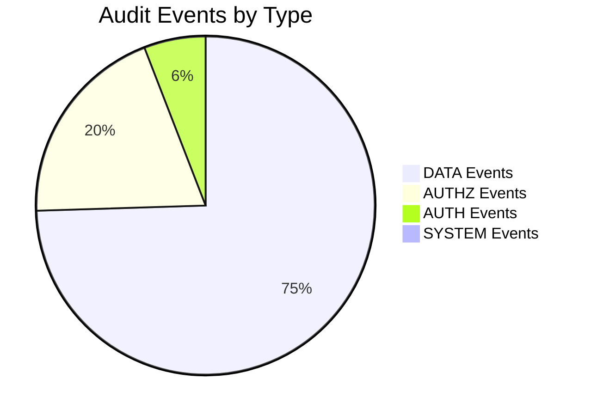

---

## Data Flow

### Write Operation Flow

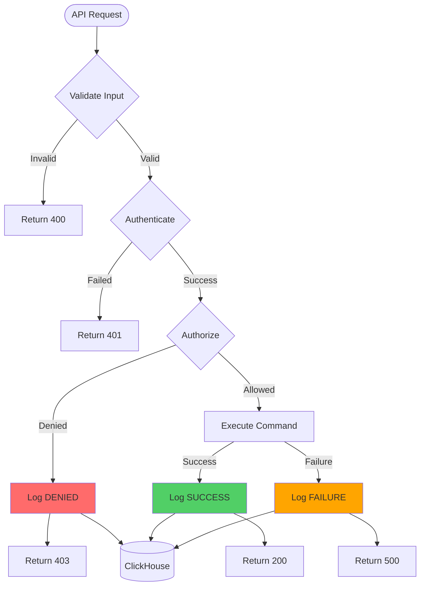

### Read Operation Flow

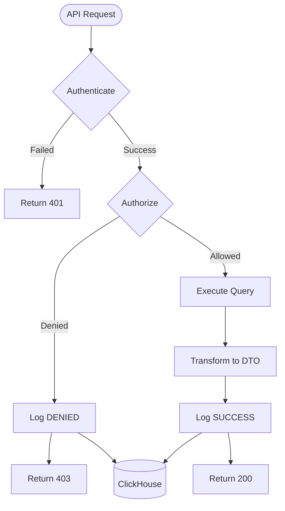

---

## Deployment Architecture

### Docker Compose Setup

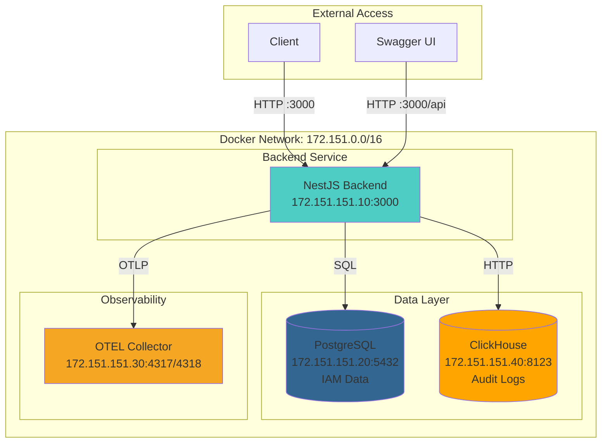

### Service Dependencies

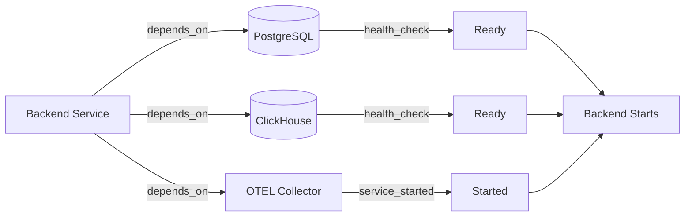

---

## Performance & Scalability

### ClickHouse Partitioning

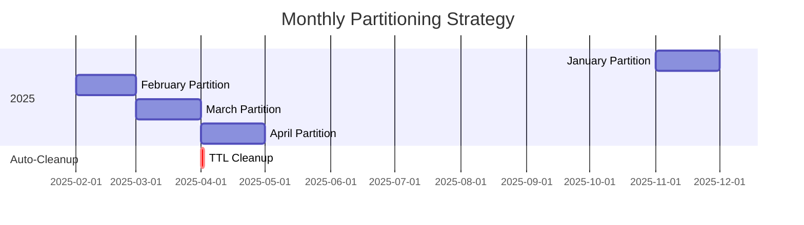

### Query Performance

```mermaid
graph LR
    subgraph "Query Optimization"
        Q[Query Request]
        I1[Index: user_id]
        I2[Index: event_type]
        I3[Index: result]
        I4[Index: tenant_id]
        MV1[Materialized View:<br/>Stats]
        MV2[Materialized View:<br/>User Activity]
    end

    Q --> I1
    Q --> I2
    Q --> I3
    Q --> I4
    Q --> MV1
    Q --> MV2

    I1 --> Fast[Fast Query<br/><10ms]
    I2 --> Fast
    MV1 --> Fast
    MV2 --> Fast
```

---

## Security Model

### Authentication Flow

```mermaid
sequenceDiagram
    participant Client
    participant API
    participant JWT Guard
    participant User Service
    participant Audit

    Client->>API: Login Request
    API->>User Service: Validate Credentials

    alt Valid Credentials
        User Service-->>API: User Data
        API->>JWT Guard: Generate Token
        JWT Guard-->>API: JWT Token
        API->>Audit: Log SUCCESS
        API-->>Client: 200 + Token
    else Invalid Credentials
        User Service-->>API: Invalid
        API->>Audit: Log FAILURE
        API-->>Client: 401 Unauthorized
    end
```

### Authorization Flow

```mermaid
sequenceDiagram
    participant Client
    participant API
    participant JWT Guard
    participant Role Guard
    participant Permission Service
    participant Audit

    Client->>API: Protected Request + Token
    API->>JWT Guard: Verify Token

    alt Valid Token
        JWT Guard-->>API: User Data
        API->>Role Guard: Check Permissions
        Role Guard->>Permission Service: Get User Permissions
        Permission Service-->>Role Guard: Permissions List

        alt Has Permission
            Role Guard-->>API: Authorized
            API->>Audit: Log SUCCESS
            API-->>Client: 200 + Data
        else No Permission
            Role Guard-->>API: Denied
            API->>Audit: Log DENIED
            API-->>Client: 403 Forbidden
        end
    else Invalid Token
        JWT Guard-->>API: Invalid
        API->>Audit: Log FAILURE
        API-->>Client: 401 Unauthorized
    end
```

---

## Monitoring & Observability

### Metrics Collection

```mermaid
graph TB
    subgraph "Application"
        BE[Backend Service]
    end

    subgraph "Metrics Sources"
        CH_M[ClickHouse Metrics<br/>:9363/metrics]
        OTEL_M[OTEL Metrics<br/>:8889/metrics]
        BE_M[Backend Health<br/>:3000/health]
    end

    subgraph "Monitoring Stack"
        Prom[Prometheus<br/>Scraper]
        Graf[Grafana<br/>Dashboards]
    end

    BE --> BE_M
    CH_M --> Prom
    OTEL_M --> Prom
    BE_M --> Prom
    Prom --> Graf
```

### Health Checks

```mermaid
stateDiagram-v2
    [*] --> Checking
    Checking --> Healthy: All Services Up
    Checking --> Degraded: Some Services Down
    Checking --> Unhealthy: Critical Services Down

    Healthy --> Checking: Periodic Check
    Degraded --> Checking: Periodic Check
    Unhealthy --> Checking: Periodic Check

    note right of Healthy
        PostgreSQL: ✓
        ClickHouse: ✓
        OTEL: ✓
        Prometheus: ✓
    end note

    note right of Degraded
        PostgreSQL: ✓
        ClickHouse: ✗
        OTEL: ✓
        Prometheus: ✓
    end note

    note right of Unhealthy
        PostgreSQL: ✗
        ClickHouse: ✗
        OTEL: ✗
        Prometheus: ✗
    end note
```

---

## Summary

### Module Statistics

| Metric | IAM Module | Audit Module | Total |
|--------|-----------|--------------|-------|
| **Aggregates** | 8 | 1 | 9 |
| **Commands** | 33 | 0 | 33 |
| **Queries** | 18 | 0 | 18 |
| **Handlers** | 51 | 0 | 51 |
| **Controllers** | 9 | 0 | 9 |
| **Domain Events** | 25+ | 0 | 25+ |
| **Integration Points** | 51 | - | 51 |
| **Database Tables** | 13 | 1 | 14 |

### Technology Stack

```mermaid
mindmap
  root((TelemetryFlow Core))
    Backend
      NestJS 11
      TypeScript 5.9
      Node.js 18+
    Databases
      PostgreSQL 16
      ClickHouse Latest
    Architecture
      DDD
      CQRS
      Event-Driven
    Observability
      OpenTelemetry
      Winston Logger
      Swagger/OpenAPI
    Security
      JWT
      Argon2
      5-Tier RBAC
```

---

## References

- [IAM Module Documentation](../src/modules/iam/README.md)
- [Audit Module Documentation](../src/modules/audit/README.md)
- [IAM-Audit Integration](./IAM_AUDIT_INTEGRATION.md)
- [Docker Setup](../DOCKER_SETUP.md)
- [5-Tier RBAC System](./5-TIER-RBAC.md)
