# TelemetryFlow Core v1.4.0 - Modules Documentation

## Overview

TelemetryFlow Core is a full-stack monorepo consisting of a **backend** (`@telemetryflow/backend`, NestJS) and **frontend** (`@telemetryflow/viz`, Vue 3). The backend comprises **13 modules** located in `backend/src/modules/`, working together to provide identity management, authentication, observability, alerting, retention, AI assistance, and more.

### Backend Modules

| #   | Module           | Description                                                                            |
| --- | ---------------- | -------------------------------------------------------------------------------------- |
| 1   | **IAM**          | Identity & Access Management — DDD, 8 aggregates, 33 commands, 18 queries, 5-tier RBAC |
| 2   | **Auth**         | JWT, MFA, Sessions, Refresh Tokens                                                     |
| 3   | **SSO**          | SAML and OAuth2 SSO providers                                                          |
| 4   | **API Keys**     | Scoped API key management                                                              |
| 5   | **Audit**        | ClickHouse-based audit logging                                                         |
| 6   | **Tenancy**      | Multi-tenancy (Tenant → Organization → Workspace hierarchy)                            |
| 7   | **Alerting**     | Alert rules engine (DDD, TFQL-based)                                                   |
| 8   | **Query**        | TFQL query engine (alerting dependency)                                                |
| 9   | **LLM**          | AI Assistant with multi-provider LLM support                                           |
| 10  | **Notification** | Notification service                                                                   |
| 11  | **Data Masking** | Data masking policies                                                                  |
| 12  | **Cache**        | Caching service (L1 in-memory + L2 Redis)                                              |
| 13  | **Retention**    | Data retention policies with automated enforcement                                     |

---

## Architecture Overview

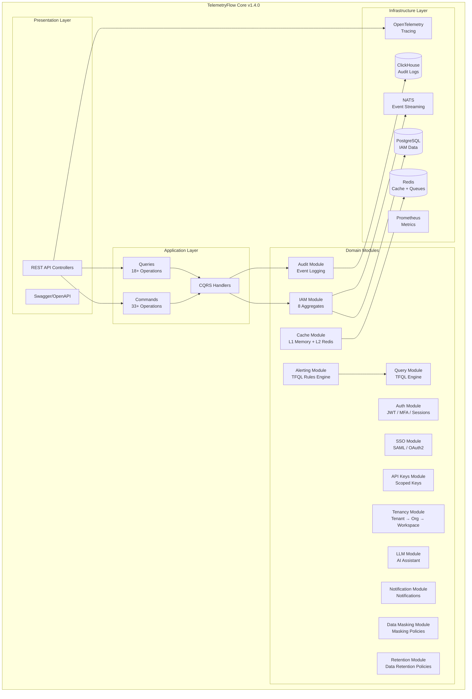
```mermaid
graph TB
    subgraph "TelemetryFlow Core v1.4.0"
        subgraph "Presentation Layer"
            API[REST API Controllers]
            Swagger[Swagger/OpenAPI]
        end

        subgraph "Application Layer"
            Commands[Commands<br/>33+ Operations]
            Queries[Queries<br/>18+ Operations]
            Handlers[CQRS Handlers]
        end

        subgraph "Domain Modules"
            IAM[IAM Module<br/>8 Aggregates]
            Auth[Auth Module<br/>JWT / MFA / Sessions]
            SSO[SSO Module<br/>SAML / OAuth2]
            APIKeys[API Keys Module<br/>Scoped Keys]
            Audit[Audit Module<br/>Event Logging]
            Tenancy[Tenancy Module<br/>Tenant → Org → Workspace]
            Alerting[Alerting Module<br/>TFQL Rules Engine]
            Query[Query Module<br/>TFQL Engine]
            LLM[LLM Module<br/>AI Assistant]
            Notification[Notification Module<br/>Notifications]
            DataMasking[Data Masking Module<br/>Masking Policies]
            Cache[Cache Module<br/>L1 Memory + L2 Redis]
            Retention[Retention Module<br/>Data Retention Policies]
        end

        subgraph "Infrastructure Layer"
            PG[(PostgreSQL<br/>IAM Data)]
            CH[(ClickHouse<br/>Audit Logs)]
            Redis[(Redis<br/>Cache + Queues)]
            NATS[NATS<br/>Event Streaming]
            OTEL[OpenTelemetry<br/>Tracing]
            PROM[Prometheus<br/>Metrics]
        end
    end

    API --> Commands
    API --> Queries
    Commands --> Handlers
    Queries --> Handlers
    Handlers --> IAM
    Handlers --> Audit
    IAM --> PG
    Audit --> CH
    Cache --> Redis
    Alerting --> Query
    IAM --> NATS
    API --> OTEL
```

## Module Interaction Flow

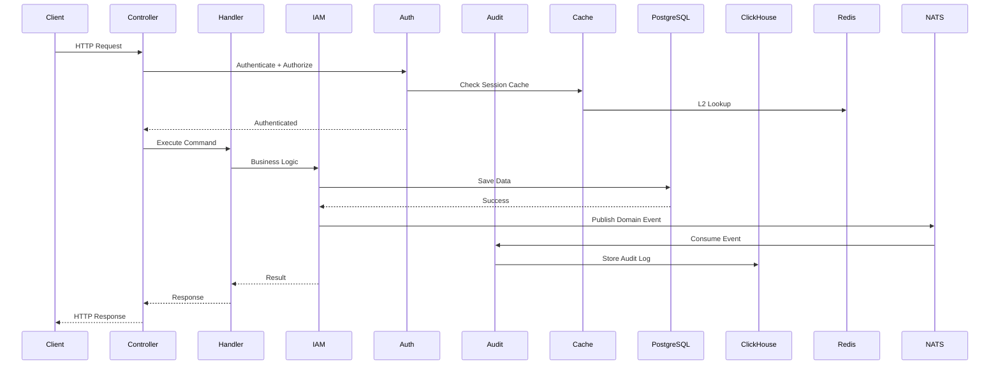
```mermaid
sequenceDiagram
    participant Client
    participant Controller
    participant Handler
    participant IAM
    participant Auth
    participant Audit
    participant Cache
    participant PostgreSQL
    participant ClickHouse
    participant Redis
    participant NATS

    Client->>Controller: HTTP Request
    Controller->>Auth: Authenticate + Authorize
    Auth->>Cache: Check Session Cache
    Cache->>Redis: L2 Lookup
    Auth-->>Controller: Authenticated
    Controller->>Handler: Execute Command
    Handler->>IAM: Business Logic
    IAM->>PostgreSQL: Save Data
    PostgreSQL-->>IAM: Success
    IAM->>NATS: Publish Domain Event
    NATS->>Audit: Consume Event
    Audit->>ClickHouse: Store Audit Log
    IAM-->>Handler: Result
    Handler-->>Controller: Response
    Controller-->>Client: HTTP Response
```

---

## IAM Module

### Overview

The IAM module provides complete identity and access management with a 5-tier RBAC system, multi-tenancy support, and hierarchical organization structure.

### Domain Model

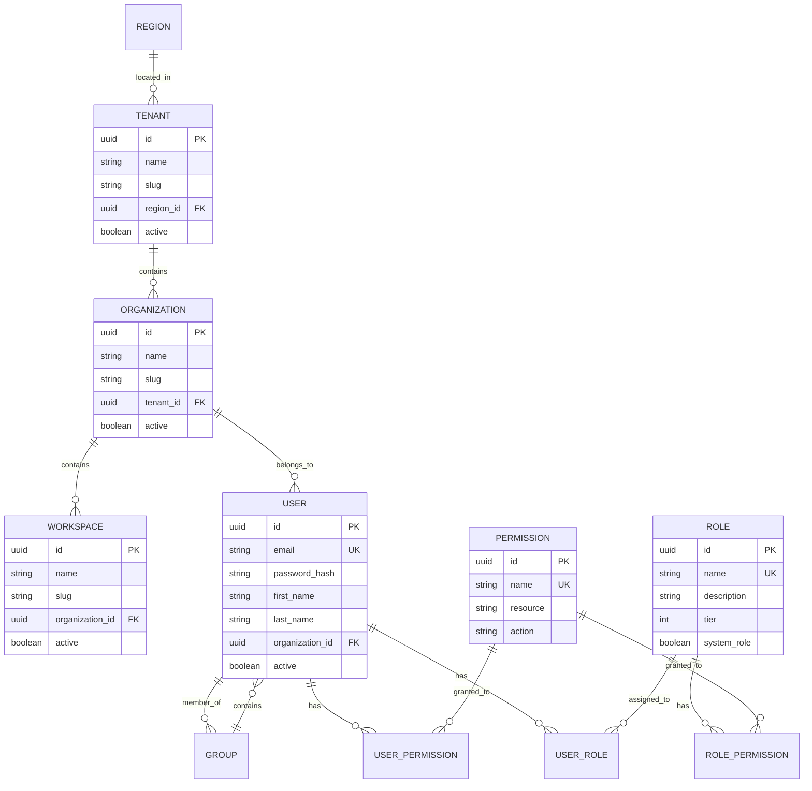
```mermaid
erDiagram
    TENANT ||--o{ ORGANIZATION : contains
    ORGANIZATION ||--o{ WORKSPACE : contains
    ORGANIZATION ||--o{ USER : belongs_to
    USER ||--o{ USER_ROLE : has
    USER ||--o{ USER_PERMISSION : has
    USER ||--o{ GROUP : member_of
    ROLE ||--o{ USER_ROLE : assigned_to
    ROLE ||--o{ ROLE_PERMISSION : has
    PERMISSION ||--o{ ROLE_PERMISSION : granted_to
    PERMISSION ||--o{ USER_PERMISSION : granted_to
    GROUP ||--o{ USER : contains
    REGION ||--o{ TENANT : located_in

    TENANT {
        uuid id PK
        string name
        string slug
        uuid region_id FK
        boolean active
    }

    ORGANIZATION {
        uuid id PK
        string name
        string slug
        uuid tenant_id FK
        boolean active
    }

    WORKSPACE {
        uuid id PK
        string name
        string slug
        uuid organization_id FK
        boolean active
    }

    USER {
        uuid id PK
        string email UK
        string password_hash
        string first_name
        string last_name
        uuid organization_id FK
        boolean active
    }

    ROLE {
        uuid id PK
        string name UK
        string description
        int tier
        boolean system_role
    }

    PERMISSION {
        uuid id PK
        string name UK
        string resource
        string action
    }
```

### 5-Tier RBAC System

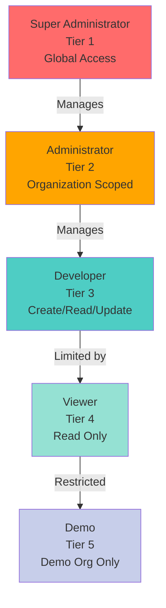
```mermaid
graph TD
    SA[Super Administrator<br/>Tier 1<br/>Global Access]
    A[Administrator<br/>Tier 2<br/>Organization Scoped]
    D[Developer<br/>Tier 3<br/>Create/Read/Update]
    V[Viewer<br/>Tier 4<br/>Read Only]
    DM[Demo<br/>Tier 5<br/>Demo Org Only]

    SA -->|Manages| A
    A -->|Manages| D
    D -->|Limited by| V
    V -->|Restricted| DM

    style SA fill:#ff6b6b
    style A fill:#ffa500
    style D fill:#4ecdc4
    style V fill:#95e1d3
    style DM fill:#c7ceea
```

### CQRS Pattern

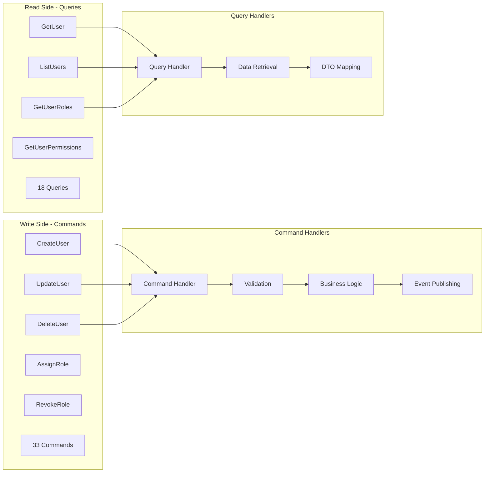
```mermaid
graph LR
    subgraph "Write Side - Commands"
        C1[CreateUser]
        C2[UpdateUser]
        C3[DeleteUser]
        C4[AssignRole]
        C5[RevokeRole]
        C6[33 Commands]
    end

    subgraph "Command Handlers"
        H1[Command Handler]
        H2[Validation]
        H3[Business Logic]
        H4[Event Publishing]
    end

    subgraph "Read Side - Queries"
        Q1[GetUser]
        Q2[ListUsers]
        Q3[GetUserRoles]
        Q4[GetUserPermissions]
        Q5[18 Queries]
    end

    subgraph "Query Handlers"
        QH1[Query Handler]
        QH2[Data Retrieval]
        QH3[DTO Mapping]
    end

    C1 --> H1
    C2 --> H1
    C3 --> H1
    H1 --> H2
    H2 --> H3
    H3 --> H4

    Q1 --> QH1
    Q2 --> QH1
    Q3 --> QH1
    QH1 --> QH2
    QH2 --> QH3
```

### Domain Events

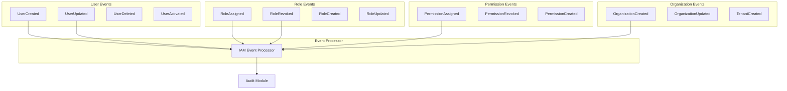
```mermaid
graph TB
    subgraph "User Events"
        UE1[UserCreated]
        UE2[UserUpdated]
        UE3[UserDeleted]
        UE4[UserActivated]
    end

    subgraph "Role Events"
        RE1[RoleAssigned]
        RE2[RoleRevoked]
        RE3[RoleCreated]
        RE4[RoleUpdated]
    end

    subgraph "Permission Events"
        PE1[PermissionAssigned]
        PE2[PermissionRevoked]
        PE3[PermissionCreated]
    end

    subgraph "Organization Events"
        OE1[OrganizationCreated]
        OE2[OrganizationUpdated]
        OE3[TenantCreated]
    end

    subgraph "Event Processor"
        EP[IAM Event Processor]
    end

    UE1 --> EP
    UE2 --> EP
    RE1 --> EP
    RE2 --> EP
    PE1 --> EP
    OE1 --> EP

    EP --> Audit[Audit Module]
```

### IAM Operations

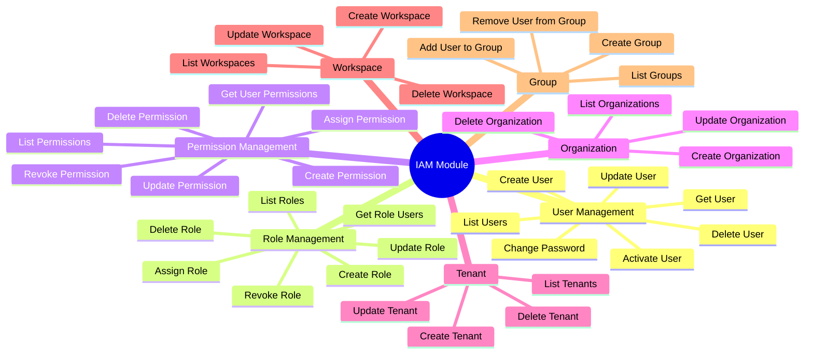
```mermaid
mindmap
  root((IAM Module))
    User Management
      Create User
      Update User
      Delete User
      Activate User
      Change Password
      List Users
      Get User
    Role Management
      Create Role
      Update Role
      Delete Role
      Assign Role
      Revoke Role
      List Roles
      Get Role Users
    Permission Management
      Create Permission
      Update Permission
      Delete Permission
      Assign Permission
      Revoke Permission
      List Permissions
      Get User Permissions
    Organization
      Create Organization
      Update Organization
      Delete Organization
      List Organizations
    Tenant
      Create Tenant
      Update Tenant
      Delete Tenant
      List Tenants
    Workspace
      Create Workspace
      Update Workspace
      Delete Workspace
      List Workspaces
    Group
      Create Group
      Add User to Group
      Remove User from Group
      List Groups
```

---

## Auth Module

### Overview

The Auth module handles authentication security layers including JWT token issuance/validation, multi-factor authentication (MFA), session management, and refresh token rotation.

### Key Capabilities

- **JWT Authentication** — Access and refresh token pair issuance with configurable expiry
- **MFA** — TOTP-based multi-factor authentication with recovery codes
- **Sessions** — Concurrent session tracking and remote session revocation
- **Refresh Tokens** — Secure token rotation with reuse detection

### Auth Flow

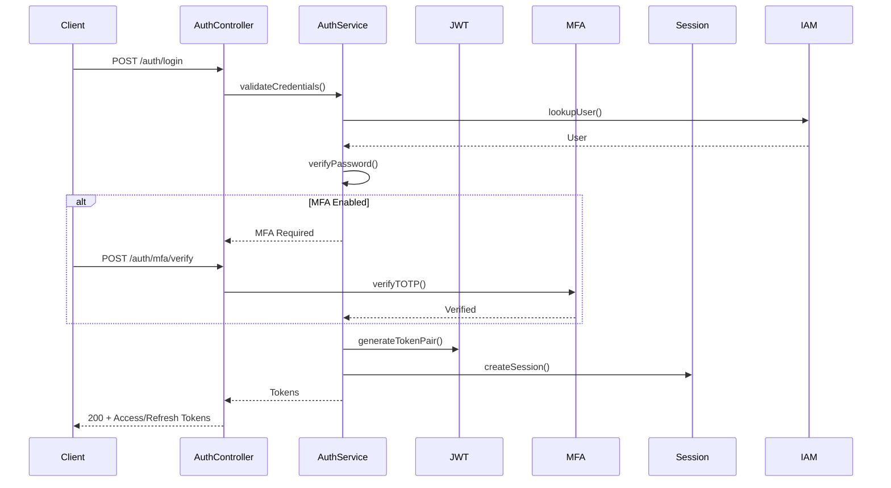
```mermaid
sequenceDiagram
    participant Client
    participant AuthController
    participant AuthService
    participant JWT
    participant MFA
    participant Session
    participant IAM

    Client->>AuthController: POST /auth/login
    AuthController->>AuthService: validateCredentials()
    AuthService->>IAM: lookupUser()
    IAM-->>AuthService: User
    AuthService->>AuthService: verifyPassword()

    alt MFA Enabled
        AuthService-->>AuthController: MFA Required
        Client->>AuthController: POST /auth/mfa/verify
        AuthController->>MFA: verifyTOTP()
        MFA-->>AuthService: Verified
    end

    AuthService->>JWT: generateTokenPair()
    AuthService->>Session: createSession()
    AuthService-->>AuthController: Tokens
    AuthController-->>Client: 200 + Access/Refresh Tokens
```

---

## SSO Module

### Overview

The SSO module integrates with enterprise identity providers via **SAML 2.0** and **OAuth 2.0** protocols, enabling federated authentication for organizational users.

### Key Capabilities

- **SAML 2.0** — SP-initiated and IdP-initiated SSO flows
- **OAuth 2.0** — Authorization Code flow with PKCE support
- **Provider Management** — Configure multiple SSO providers per tenant
- **User Provisioning** — Just-in-time user creation on first SSO login

---

## API Keys Module

### Overview

The API Keys module provides scoped, long-lived API key management for programmatic access to the TelemetryFlow API.

### Key Capabilities

- **Scoped Keys** — Assign fine-grained permission scopes to each key
- **Key Rotation** — Create replacement keys before revoking old ones
- **Usage Tracking** — Per-key request counts and last-used timestamps
- **Expiry** — Configurable expiration dates for keys

---

## Audit Module

### Overview

The Audit module provides comprehensive security and compliance logging using ClickHouse for high-volume data storage.

### Audit Flow

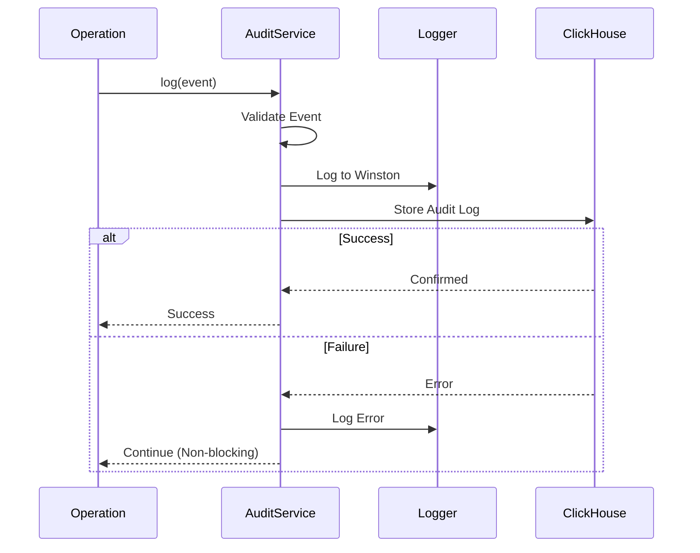
```mermaid
sequenceDiagram
    participant Operation
    participant AuditService
    participant Logger
    participant ClickHouse

    Operation->>AuditService: log(event)
    AuditService->>AuditService: Validate Event
    AuditService->>Logger: Log to Winston
    AuditService->>ClickHouse: Store Audit Log

    alt Success
        ClickHouse-->>AuditService: Confirmed
        AuditService-->>Operation: Success
    else Failure
        ClickHouse-->>AuditService: Error
        AuditService->>Logger: Log Error
        AuditService-->>Operation: Continue (Non-blocking)
    end
```

### Event Types

```mermaid
graph TD
    subgraph "Audit Event Types"
        AUTH[AUTH<br/>Authentication]
        AUTHZ[AUTHZ<br/>Authorization]
        DATA[DATA<br/>Data Operations]
        SYSTEM[SYSTEM<br/>System Events]
    end

    subgraph "AUTH Events"
        A1[Login]
        A2[Logout]
        A3[Password Change]
        A4[User Activation]
    end

    subgraph "AUTHZ Events"
        AZ1[Role Assignment]
        AZ2[Permission Grant]
        AZ3[Access Denied]
        AZ4[Permission Check]
    end

    subgraph "DATA Events"
        D1[Create]
        D2[Update]
        D3[Delete]
        D4[Read Sensitive]
    end

    subgraph "SYSTEM Events"
        S1[Startup]
        S2[Shutdown]
        S3[Config Change]
        S4[Error]
    end

    AUTH --> A1
    AUTH --> A2
    AUTH --> A3
    AUTH --> A4

    AUTHZ --> AZ1
    AUTHZ --> AZ2
    AUTHZ --> AZ3
    AUTHZ --> AZ4

    DATA --> D1
    DATA --> D2
    DATA --> D3
    DATA --> D4

    SYSTEM --> S1
    SYSTEM --> S2
    SYSTEM --> S3
    SYSTEM --> S4
```

### Event Results

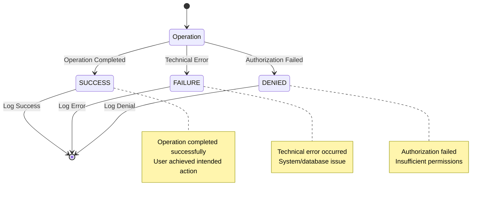
```mermaid
stateDiagram-v2
    [*] --> Operation
    Operation --> SUCCESS: Operation Completed
    Operation --> FAILURE: Technical Error
    Operation --> DENIED: Authorization Failed

    SUCCESS --> [*]: Log Success
    FAILURE --> [*]: Log Error
    DENIED --> [*]: Log Denial

    note right of SUCCESS
        Operation completed successfully
        User achieved intended action
    end note

    note right of FAILURE
        Technical error occurred
        System/database issue
    end note

    note right of DENIED
        Authorization failed
        Insufficient permissions
    end note
```

### ClickHouse Schema

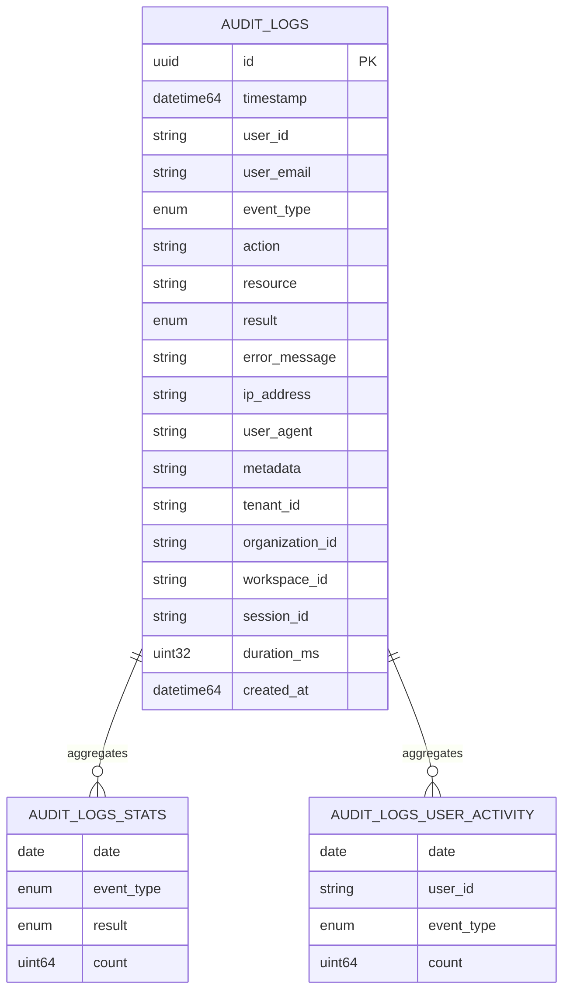
```mermaid
erDiagram
    AUDIT_LOGS {
        uuid id PK
        datetime64 timestamp
        string user_id
        string user_email
        enum event_type
        string action
        string resource
        enum result
        string error_message
        string ip_address
        string user_agent
        string metadata
        string tenant_id
        string organization_id
        string workspace_id
        string session_id
        uint32 duration_ms
        datetime64 created_at
    }

    AUDIT_LOGS_STATS {
        date date
        enum event_type
        enum result
        uint64 count
    }

    AUDIT_LOGS_USER_ACTIVITY {
        date date
        string user_id
        enum event_type
        uint64 count
    }

    AUDIT_LOGS ||--o{ AUDIT_LOGS_STATS : aggregates
    AUDIT_LOGS ||--o{ AUDIT_LOGS_USER_ACTIVITY : aggregates
```

### Data Retention

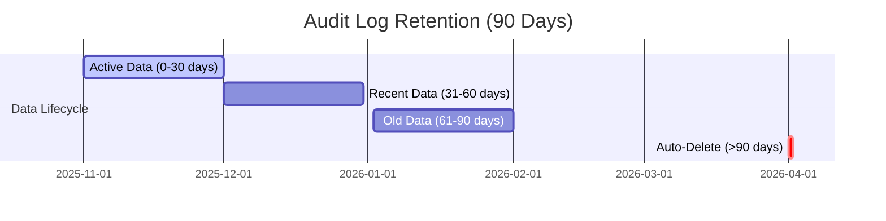
```mermaid
gantt
    title Audit Log Retention (90 Days)
    dateFormat YYYY-MM-DD
    section Data Lifecycle
    Active Data (0-30 days)     :active, 2025-11-01, 30d
    Recent Data (31-60 days)    :2025-11-31, 30d
    Old Data (61-90 days)       :2026-01-02, 30d
    Auto-Delete (>90 days)      :crit, 2026-04-01, 1d
```

---

## Tenancy Module

### Overview

The Tenancy module manages the multi-tenancy hierarchy: **Tenant → Organization → Workspace**. It provides isolation boundaries ensuring data and configuration are scoped correctly across the platform.

### Hierarchy

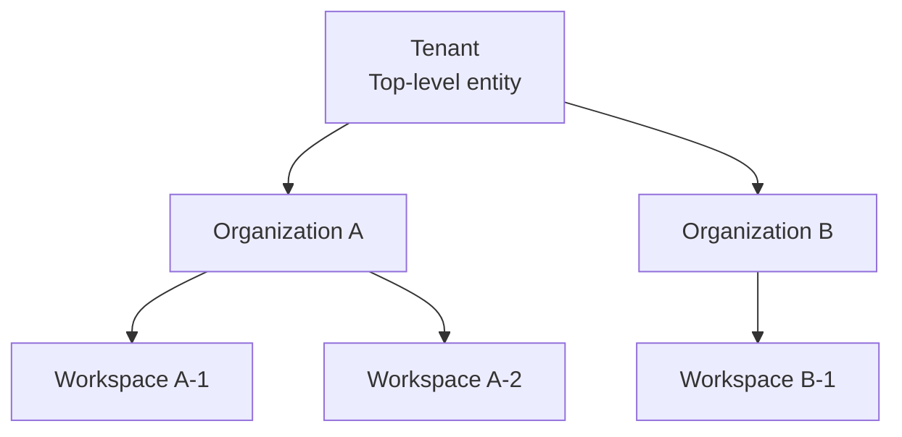
```mermaid
graph TD
    T[Tenant<br/>Top-level entity] --> O1[Organization A]
    T --> O2[Organization B]
    O1 --> W1[Workspace A-1]
    O1 --> W2[Workspace A-2]
    O2 --> W3[Workspace B-1]
```

---

## Alerting Module

### Overview

The Alerting module provides a DDD-based alert rules engine powered by **TFQL** (TelemetryFlow Query Language). Users define alert conditions as TFQL queries that are continuously evaluated against incoming telemetry data.

### Key Capabilities

- **Alert Rules** — Create, update, enable/disable, and delete alert rules
- **TFQL-based Conditions** — Express alert thresholds and patterns via TFQL
- **Severity Levels** — Categorize alerts by severity (critical, warning, info)
- **Notification Routing** — Route triggered alerts to the Notification module

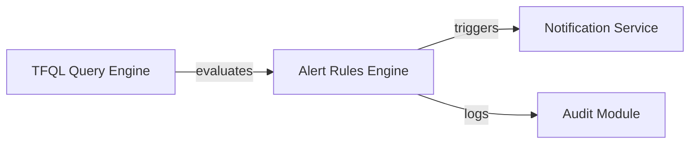
```mermaid
graph LR
    TFQL[TFQL Query Engine] -->|evaluates| Alerting[Alert Rules Engine]
    Alerting -->|triggers| Notification[Notification Service]
    Alerting -->|logs| Audit[Audit Module]
```

---

## Query Module

### Overview

The Query module implements the **TFQL (TelemetryFlow Query Language)** engine. It serves as the foundation for the Alerting module, providing parsing, validation, and execution of TFQL queries against telemetry data stores.

### Key Capabilities

- **TFQL Parser** — Parse and validate query syntax
- **Query Execution** — Execute queries against configured data sources
- **Result Transformation** — Map results into structured DTOs

---

## LLM Module

### Overview

The LLM module powers the TelemetryFlow **AI Assistant** with multi-provider LLM support. It abstracts over multiple large language model providers to deliver intelligent query assistance, anomaly explanation, and natural-language interaction.

### Key Capabilities

- **Multi-Provider** — Pluggable support for OpenAI, Anthropic, and other LLM providers
- **Context Enrichment** — Injects tenant/organization context into prompts
- **Conversation History** — Maintains per-user conversation threads
- **Streaming Responses** — Server-sent events for real-time token streaming

---

## Notification Module

### Overview

The Notification module is a centralized service for delivering notifications across multiple channels (email, webhook, in-app). It consumes events from Alerting, IAM, and other modules.

### Key Capabilities

- **Multi-Channel** — Email, webhook, and in-app notification delivery
- **Template Engine** — Configurable notification templates per event type
- **User Preferences** — Per-user notification preference management
- **Delivery Tracking** — Notification delivery status and retry logic

---

## Data Masking Module

### Overview

The Data Masking module provides policy-based data masking to protect sensitive fields in API responses and query results. Administrators define masking policies that are applied transparently based on user roles and context.

### Key Capabilities

- **Masking Policies** — Define field-level masking rules per resource type
- **Role-Based Application** — Apply different masks depending on the caller's RBAC tier
- **Masking Strategies** — Redaction, partial reveal, hashing, and tokenization

---

## Cache Module

### Overview

The Cache module provides a two-level caching service: **L1** (in-memory, process-local) and **L2** (Redis, shared across instances). It is consumed by Auth (sessions), IAM (permission lookups), and other modules for high-throughput read paths.

### Architecture

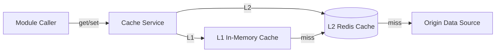
```mermaid
graph LR
    Caller[Module Caller] -->|get/set| CacheService[Cache Service]
    CacheService -->|L1| InMem[L1 In-Memory Cache]
    CacheService -->|L2| Redis[(L2 Redis Cache)]
    InMem -->|miss| Redis
    Redis -->|miss| Origin[Origin Data Source]
```

### Key Capabilities

- **L1 / L2 Tiering** — Fast in-memory lookups with Redis fallback
- **TTL Management** — Per-key configurable expiry
- **Cache Invalidation** — Event-driven invalidation via NATS pub/sub
- **Cache-Aside Pattern** — Transparent integration for consuming modules

---

## IAM-Audit Integration

### Integration Points

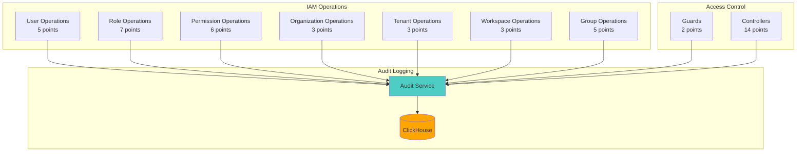
```mermaid
graph TB
    subgraph "IAM Operations"
        U[User Operations<br/>5 points]
        R[Role Operations<br/>7 points]
        P[Permission Operations<br/>6 points]
        O[Organization Operations<br/>3 points]
        T[Tenant Operations<br/>3 points]
        W[Workspace Operations<br/>3 points]
        G[Group Operations<br/>5 points]
    end

    subgraph "Audit Logging"
        AS[Audit Service]
        CH[(ClickHouse)]
    end

    subgraph "Access Control"
        Guards[Guards<br/>2 points]
        Controllers[Controllers<br/>14 points]
    end

    U --> AS
    R --> AS
    P --> AS
    O --> AS
    T --> AS
    W --> AS
    G --> AS
    Guards --> AS
    Controllers --> AS
    AS --> CH

    style AS fill:#4ecdc4
    style CH fill:#ffa500
```

### Integration Flow

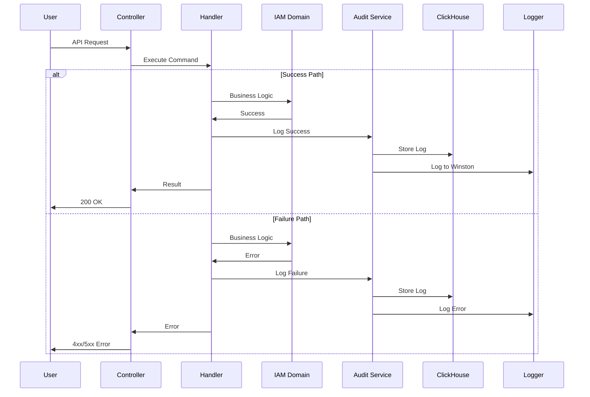
```mermaid
sequenceDiagram
    participant User
    participant Controller
    participant Handler
    participant IAM Domain
    participant Audit Service
    participant ClickHouse
    participant Logger

    User->>Controller: API Request
    Controller->>Handler: Execute Command

    alt Success Path
        Handler->>IAM Domain: Business Logic
        IAM Domain->>Handler: Success
        Handler->>Audit Service: Log Success
        Audit Service->>ClickHouse: Store Log
        Audit Service->>Logger: Log to Winston
        Handler->>Controller: Result
        Controller->>User: 200 OK
    else Failure Path
        Handler->>IAM Domain: Business Logic
        IAM Domain->>Handler: Error
        Handler->>Audit Service: Log Failure
        Audit Service->>ClickHouse: Store Log
        Audit Service->>Logger: Log Error
        Handler->>Controller: Error
        Controller->>User: 4xx/5xx Error
    end
```

### Event Distribution

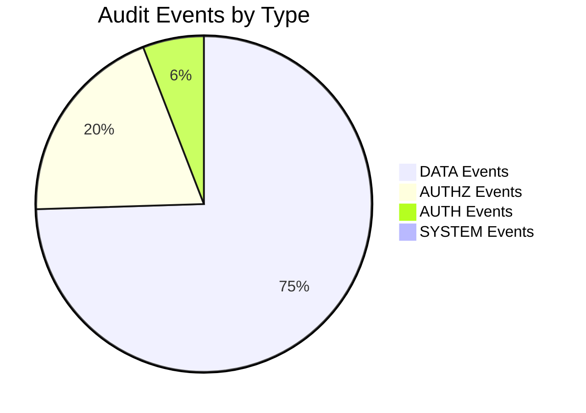
```mermaid
pie title Audit Events by Type
    "DATA Events" : 38
    "AUTHZ Events" : 10
    "AUTH Events" : 3
    "SYSTEM Events" : 0
```

---

## Data Flow

### Write Operation Flow

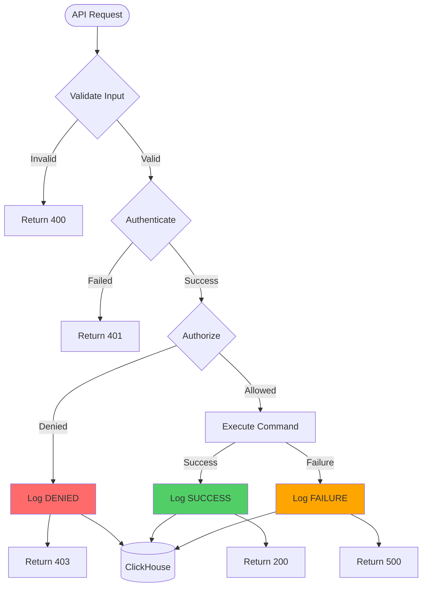
```mermaid
flowchart TD
    Start([API Request]) --> Validate{Validate Input}
    Validate -->|Invalid| Error1[Return 400]
    Validate -->|Valid| Auth{Authenticate}
    Auth -->|Failed| Error2[Return 401]
    Auth -->|Success| Authz{Authorize}
    Authz -->|Denied| Audit1[Log DENIED]
    Authz -->|Allowed| Execute[Execute Command]
    Execute -->|Success| Audit2[Log SUCCESS]
    Execute -->|Failure| Audit3[Log FAILURE]
    Audit1 --> Error3[Return 403]
    Audit2 --> Success[Return 200]
    Audit3 --> Error4[Return 500]

    Audit1 --> CH[(ClickHouse)]
    Audit2 --> CH
    Audit3 --> CH

    style Audit1 fill:#ff6b6b
    style Audit2 fill:#51cf66
    style Audit3 fill:#ffa500
```

### Read Operation Flow

```mermaid
flowchart TD
    Start([API Request]) --> Auth{Authenticate}
    Auth -->|Failed| Error1[Return 401]
    Auth -->|Success| Authz{Authorize}
    Authz -->|Denied| Audit1[Log DENIED]
    Authz -->|Allowed| Query[Execute Query]
    Query --> Transform[Transform to DTO]
    Transform --> Audit2[Log SUCCESS]
    Audit1 --> Error2[Return 403]
    Audit2 --> Success[Return 200]

    Audit1 --> CH[(ClickHouse)]
    Audit2 --> CH
```

---

## Deployment Architecture

### Docker Compose Setup

```mermaid
graph TB
    subgraph "Docker Network: 172.154.0.0/16"
        subgraph "Frontend"
            FE[Vue 3 Frontend<br/>@telemetryflow/viz<br/>172.154.154.80:80]
        end

        subgraph "Backend Service"
            BE[NestJS Backend<br/>@telemetryflow/backend<br/>172.154.154.10:3000]
        end

        subgraph "Data Layer"
            PG[(PostgreSQL<br/>172.154.154.20:5432<br/>IAM Data)]
            CH[(ClickHouse<br/>172.154.154.40:8123<br/>Audit Logs)]
            Redis[(Redis<br/>172.154.154.30:6379<br/>Cache + Queues)]
            NATS[NATS<br/>172.154.154.35:4222<br/>Event Streaming]
        end
    end

    subgraph "External Access"
        Client[Client]
        Swagger[Swagger UI]
    end

    Client -->|HTTP :80| FE
    Client -->|HTTP :3000| BE
    Swagger -->|HTTP :3000/api| BE
    FE -->|API Calls| BE
    BE -->|SQL| PG
    BE -->|HTTP| CH
    BE -->|Redis Protocol| Redis
    BE -->|NATS Protocol| NATS

    style BE fill:#4ecdc4
    style FE fill:#42b883
    style PG fill:#336791
    style CH fill:#ffa500
    style Redis fill:#dc382d
    style NATS fill:#27aae1
```

### Service Endpoints

| Service                            | IP Address     | Port(s)     | Purpose             |
| ---------------------------------- | -------------- | ----------- | ------------------- |
| Backend (`@telemetryflow/backend`) | 172.154.154.10 | 3000        | NestJS API server   |
| Frontend (`@telemetryflow/viz`)    | 172.154.154.80 | 80          | Vue 3 SPA           |
| PostgreSQL                         | 172.154.154.20 | 5432        | IAM relational data |
| Redis                              | 172.154.154.30 | 6379        | L2 cache + queues   |
| NATS                               | 172.154.154.35 | 4222        | Event streaming     |
| ClickHouse                         | 172.154.154.40 | 8123 / 9000 | Audit log storage   |

### Service Dependencies

```mermaid
graph LR
    Backend[Backend Service]
    FE[Frontend]
    PG[(PostgreSQL)]
    CH[(ClickHouse)]
    Redis[(Redis)]
    NATS[NATS]

    Backend -->|depends_on| PG
    Backend -->|depends_on| CH
    Backend -->|depends_on| Redis
    Backend -->|depends_on| NATS
    FE -->|depends_on| Backend

    PG -->|health_check| Ready1[Ready]
    CH -->|health_check| Ready2[Ready]
    Redis -->|health_check| Ready3[Ready]
    NATS -->|health_check| Ready4[Ready]

    Ready1 --> Start[Backend Starts]
    Ready2 --> Start
    Ready3 --> Start
    Ready4 --> Start
```

---

## Performance & Scalability

### ClickHouse Partitioning

```mermaid
gantt
    title Monthly Partitioning Strategy
    dateFormat YYYY-MM
    section 2025
    January Partition   :2025-11, 30d
    February Partition  :2025-02, 28d
    March Partition     :2025-03, 31d
    April Partition     :2025-04, 30d
    section Auto-Cleanup
    TTL Cleanup         :crit, 2025-04, 1d
```

### Query Performance

```mermaid
graph LR
    subgraph "Query Optimization"
        Q[Query Request]
        I1[Index: user_id]
        I2[Index: event_type]
        I3[Index: result]
        I4[Index: tenant_id]
        MV1[Materialized View:<br/>Stats]
        MV2[Materialized View:<br/>User Activity]
    end

    Q --> I1
    Q --> I2
    Q --> I3
    Q --> I4
    Q --> MV1
    Q --> MV2

    I1 --> Fast[Fast Query<br/><10ms]
    I2 --> Fast
    MV1 --> Fast
    MV2 --> Fast
```

---

## Security Model

### Authentication Flow

```mermaid
sequenceDiagram
    participant Client
    participant API
    participant JWT Guard
    participant User Service
    participant Audit

    Client->>API: Login Request
    API->>User Service: Validate Credentials

    alt Valid Credentials
        User Service-->>API: User Data
        API->>JWT Guard: Generate Token
        JWT Guard-->>API: JWT Token
        API->>Audit: Log SUCCESS
        API-->>Client: 200 + Token
    else Invalid Credentials
        User Service-->>API: Invalid
        API->>Audit: Log FAILURE
        API-->>Client: 401 Unauthorized
    end
```

### Authorization Flow

```mermaid
sequenceDiagram
    participant Client
    participant API
    participant JWT Guard
    participant Role Guard
    participant Permission Service
    participant Audit

    Client->>API: Protected Request + Token
    API->>JWT Guard: Verify Token

    alt Valid Token
        JWT Guard-->>API: User Data
        API->>Role Guard: Check Permissions
        Role Guard->>Permission Service: Get User Permissions
        Permission Service-->>Role Guard: Permissions List

        alt Has Permission
            Role Guard-->>API: Authorized
            API->>Audit: Log SUCCESS
            API-->>Client: 200 + Data
        else No Permission
            Role Guard-->>API: Denied
            API->>Audit: Log DENIED
            API-->>Client: 403 Forbidden
        end
    else Invalid Token
        JWT Guard-->>API: Invalid
        API->>Audit: Log FAILURE
        API-->>Client: 401 Unauthorized
    end
```

---

## Monitoring & Observability

### Metrics Collection

```mermaid
graph TB
    subgraph "Application"
        BE[Backend Service]
    end

    subgraph "Metrics Sources"
        CH_M[ClickHouse Metrics<br/>:9363/metrics]
        OTEL_M[OTEL Metrics<br/>:8889/metrics]
        BE_M[Backend Health<br/>:3000/health]
    end

    subgraph "Monitoring Stack"
        Prom[Prometheus<br/>Scraper]
        Graf[Grafana<br/>Dashboards]
    end

    BE --> BE_M
    CH_M --> Prom
    OTEL_M --> Prom
    BE_M --> Prom
    Prom --> Graf
```

### Health Checks

```mermaid
stateDiagram-v2
    [*] --> Checking
    Checking --> Healthy: All Services Up
    Checking --> Degraded: Some Services Down
    Checking --> Unhealthy: Critical Services Down

    Healthy --> Checking: Periodic Check
    Degraded --> Checking: Periodic Check
    Unhealthy --> Checking: Periodic Check

    note right of Healthy
        PostgreSQL: ✓
        ClickHouse: ✓
        Redis: ✓
        NATS: ✓
    end note

    note right of Degraded
        PostgreSQL: ✓
        ClickHouse: ✗
        Redis: ✓
        NATS: ✓
    end note

    note right of Unhealthy
        PostgreSQL: ✗
        ClickHouse: ✗
        Redis: ✗
        NATS: ✗
    end note
```

---

## Summary

### Module Statistics

| Metric                 | IAM | Auth | SSO | API Keys | Audit | Tenancy | Alerting | Query | LLM | Notification | Data Masking | Cache | Total |
| ---------------------- | --- | ---- | --- | -------- | ----- | ------- | -------- | ----- | --- | ------------ | ------------ | ----- | ----- |
| **Aggregates**         | 8   | —    | —   | —        | 1     | —       | —        | —     | —   | —            | —            | —     | 9     |
| **Commands**           | 33  | —    | —   | —        | 0     | —       | —        | —     | —   | —            | —            | —     | 33    |
| **Queries**            | 18  | —    | —   | —        | 0     | —       | —        | —     | —   | —            | —            | —     | 18    |
| **Handlers**           | 51  | —    | —   | —        | 0     | —       | —        | —     | —   | —            | —            | —     | 51    |
| **Controllers**        | 9   | —    | —   | —        | 0     | —       | —        | —     | —   | —            | —            | —     | 9     |
| **Domain Events**      | 25+ | —    | —   | —        | 0     | —       | —        | —     | —   | —            | —            | —     | 25+   |
| **Integration Points** | 51  | —    | —   | —        | —     | —       | —        | —     | —   | —            | —            | —     | 51    |
| **Database Tables**    | 13  | —    | —   | —        | 1     | —       | —        | —     | —   | —            | —            | —     | 14    |

### Technology Stack

```mermaid
mindmap
  root((TelemetryFlow Core v1.4.0))
    Frontend
      Vue 3
      @telemetryflow/viz
    Backend
      NestJS 11
      TypeScript 5.9
      Node.js 18+
      @telemetryflow/backend
    Databases
      PostgreSQL 16
      ClickHouse Latest
    Infrastructure
      Redis Cache + Queues
      NATS Event Streaming
    Architecture
      DDD
      CQRS
      Event-Driven
      12 Backend Modules
    Observability
      OpenTelemetry
      Winston Logger
      Swagger/OpenAPI
    Security
      JWT
      MFA
      SAML / OAuth2 SSO
      Argon2
      5-Tier RBAC
```

---

## References

- [IAM Module Documentation](../src/modules/iam/README.md)
- [Audit Module Documentation](../src/modules/audit/README.md)
- [IAM-Audit Integration](./IAM_AUDIT_INTEGRATION.md)
- [Docker Setup](../DOCKER_SETUP.md)
- [5-Tier RBAC System](./5-TIER-RBAC.md)
