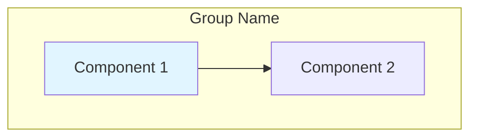

# Mermaid Diagrams Index

Complete index of all Mermaid diagrams in TelemetryFlow Core documentation.

## Main Documentation

### README.md
- **System Architecture** - Complete system overview with all components
- **DDD Layer Structure** - Domain-Driven Design layers and relationships

### docs/OBSERVABILITY.md
- **Observability Architecture** - Telemetry collection and visualization flow

### docs/OTEL_METRICS.md
- **Metrics Architecture** - End-to-end metrics pipeline
- **Metrics Flow Sequence** - Step-by-step data collection
- **Metrics Hierarchy** - Organization of metric types
- **Multi-Backend Export** - All export destinations
- **Alert Pipeline** - Monitoring and notifications
- **Troubleshooting Flowchart** - Debugging decision tree

### docs/OTEL_METRICS_QUICK_START.md
- Quick reference diagrams for common scenarios

## Configuration Documentation

### config/otel/README.md
- **OTEL Collector Architecture** - Receivers, processors, exporters flow

### config/otel/examples/README.md
- Export backend options and configurations

## Diagram Types

### Architecture Diagrams
Show high-level system design and component relationships:
- System Architecture (README.md)
- Observability Architecture (OBSERVABILITY.md)
- Metrics Architecture (OTEL_METRICS.md)
- OTEL Collector Architecture (config/otel/README.md)

### Flow Diagrams
Show data flow and processing steps:
- Metrics Flow Sequence (OTEL_METRICS.md)
- Alert Pipeline (OTEL_METRICS.md)

### Hierarchy Diagrams
Show organizational structure:
- DDD Layer Structure (README.md)
- Metrics Hierarchy (OTEL_METRICS.md)

### Network Diagrams
Show multi-backend connections:
- Multi-Backend Export (OTEL_METRICS.md)

### Flowcharts
Show decision trees and troubleshooting:
- Troubleshooting Flowchart (OTEL_METRICS.md)

## Viewing Mermaid Diagrams

### GitHub
Mermaid diagrams render automatically on GitHub.

### VS Code
Install extensions:
- **Markdown Preview Enhanced**
- **Markdown Preview Mermaid Support**

### Other Tools
- **Typora** - Native Mermaid support
- **Obsidian** - Native Mermaid support
- **Mermaid Live Editor** - https://mermaid.live
- **Draw.io** - Import Mermaid syntax

## Diagram Style Guide

### Colors Used
- **Blue (#e1f5ff)** - Application/Domain layer
- **Pink (#ffe1f5)** - Application/Command layer
- **Yellow (#fff4e1)** - Infrastructure/Processor layer
- **Light Green (#e1ffe1)** - Presentation/Controller layer
- **Green (#90EE90)** - Databases/Storage
- **Gold (#FFD700)** - Critical components/Alerts

### Node Shapes
- **Rectangle** - Services/Components
- **Rounded Rectangle** - Processes
- **Cylinder** - Databases
- **Diamond** - Decision points
- **Circle** - Start/End points

### Line Styles
- **Solid arrow (-->)** - Primary data flow
- **Dotted arrow (-.->)** - Optional/Secondary flow
- **Thick arrow (==>)** - Important/Critical path

## Adding New Diagrams

### Template


### Best Practices
1. Use descriptive node labels
2. Group related components in subgraphs
3. Apply consistent colors
4. Keep diagrams focused (max 15-20 nodes)
5. Add legends for complex diagrams
6. Use meaningful arrow labels

## Exporting Diagrams

### As PNG/SVG
```bash
# Using Mermaid CLI
npm install -g @mermaid-js/mermaid-cli
mmdc -i diagram.mmd -o diagram.png
```

### As PDF
Use Markdown to PDF converters that support Mermaid:
- Pandoc with Mermaid filter
- Typora export
- VS Code Markdown PDF extension

## Related Documentation

- [OTEL_METRICS.md](./OTEL_METRICS.md) - Metrics documentation with diagrams
- [OBSERVABILITY.md](./OBSERVABILITY.md) - Observability overview
- [README.md](../README.md) - Main documentation
- [config/otel/README.md](../config/otel/README.md) - OTEL configuration
