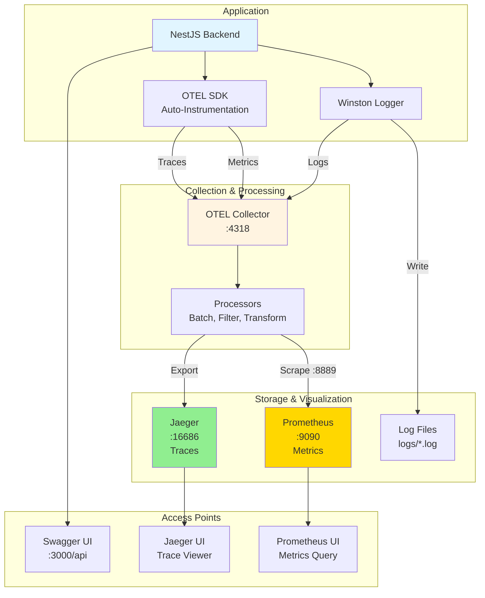

# Observability

TelemetryFlow Core includes built-in observability features with OpenTelemetry, Prometheus, and comprehensive logging.

## Architecture Overview



## Features

### ✅ Swagger/OpenAPI
- **URL**: http://localhost:3000/api
- **Features**: Interactive API documentation, request testing
- **Tags**: IAM, Users, Roles, Permissions, Tenants, Organizations, Workspaces, Groups, Regions
- **Export**: Use `scripts/export-swagger-docs.sh` to export OpenAPI spec

### ✅ Postman Collection
- **Location**: `docs/postman/`
- **Files**: Collection and environment with default credentials
- **Requests**: 30+ API requests covering all IAM endpoints
- **Documentation**: See `docs/postman/README.md`

### ✅ OpenTelemetry (OTEL)
- **Tracing**: Distributed tracing for all HTTP requests
- **Auto-instrumentation**: HTTP, Express, NestJS, PostgreSQL
- **Export**: OTLP HTTP protocol
- **Endpoints**:
  - OTLP gRPC: `http://localhost:4317`
  - OTLP HTTP: `http://localhost:4318`
  - Health Check: `http://localhost:13133`
  - zPages: `http://localhost:55679/debug/tracez`

### ✅ Prometheus Metrics
- **URL**: http://localhost:9090
- **Metrics Endpoint**: http://localhost:8889/metrics (OTEL Collector)
- **Scrape Targets**: OTEL Collector, OTEL internal metrics
- **Features**: Time-series metrics, PromQL queries, alerting

### ✅ Winston Logging
- **Structured logs**: JSON format for production
- **Pretty logs**: Colored output for development
- **Log levels**: error, warn, info, debug, verbose
- **Documentation**: See `docs/WINSTON_LOGGER.md`

## Configuration

### Enable OpenTelemetry

```env
# .env
OTEL_ENABLED=true
OTEL_SERVICE_NAME=telemetryflow-core
OTEL_EXPORTER_OTLP_ENDPOINT=http://localhost:4318
```

### Disable OpenTelemetry (Default)

```env
OTEL_ENABLED=false
```

## OpenTelemetry Setup

### Option 1: OTEL Collector (Recommended)

1. **Start OTEL Collector**:
```yaml
# docker-compose.yml
otel-collector:
  image: otel/opentelemetry-collector:latest
  command: ["--config=/etc/otel-collector-config.yaml"]
  volumes:
    - ./otel-collector-config.yaml:/etc/otel-collector-config.yaml
  ports:
    - "4318:4318"  # OTLP HTTP
```

2. **Configure Core**:
```env
OTEL_ENABLED=true
OTEL_EXPORTER_OTLP_ENDPOINT=http://localhost:4318
```

3. **Start Application**:
```bash
pnpm run dev
```

### Option 2: Direct to Backend

Export traces directly to observability backend:

```env
OTEL_ENABLED=true
OTEL_EXPORTER_OTLP_ENDPOINT=https://your-backend.com
```

Supported backends:
- Jaeger
- Zipkin
- Grafana Tempo
- Honeycomb
- New Relic
- Datadog

## Prometheus Metrics

### Access Prometheus UI
```
http://localhost:9090
```

### Metrics Endpoints
- **OTEL Collector Metrics**: http://localhost:8889/metrics
- **OTEL Internal Metrics**: http://localhost:8888/metrics

### Available Metrics
- `otelcol_receiver_accepted_spans` - Accepted trace spans
- `otelcol_receiver_refused_spans` - Refused trace spans
- `otelcol_exporter_sent_spans` - Exported trace spans
- `otelcol_processor_batch_batch_send_size` - Batch sizes
- `process_runtime_go_mem_heap_alloc_bytes` - Memory usage

### Example Queries

**Request Rate (5m average)**:
```promql
rate(telemetryflow_core_requests_total[5m])
```

**Memory Usage**:
```promql
process_resident_memory_bytes{job="otel-collector"}
```

**Error Rate**:
```promql
rate(telemetryflow_core_errors_total[5m])
```

### Configuration
See `config/prometheus/prometheus.yml` for scrape configuration.

## Swagger/OpenAPI

### Access
```
http://localhost:3000/api
```

### Features
- **Interactive UI**: Test APIs directly from browser
- **Authentication**: Bearer token support
- **Request/Response**: See examples and schemas
- **Tags**: Organized by module

### API Tags
- `IAM` - Identity and Access Management
- `Users` - User management endpoints
- `Roles` - Role management endpoints
- `Permissions` - Permission management endpoints
- `Tenants` - Tenant management endpoints
- `Organizations` - Organization management endpoints
- `Workspaces` - Workspace management endpoints
- `Groups` - Group management endpoints
- `Regions` - Region management endpoints

### Export OpenAPI Spec
```bash
curl http://localhost:3000/api-json > openapi.json
```

## Tracing

### What's Traced
- ✅ HTTP requests (incoming/outgoing)
- ✅ Database queries (PostgreSQL)
- ✅ NestJS controllers
- ✅ Express middleware
- ✅ Custom spans (if added)

### Trace Attributes
- `service.name`: telemetryflow-core
- `service.version`: 1.0.0
- `http.method`: GET, POST, etc.
- `http.url`: Request URL
- `http.status_code`: Response status
- `db.system`: postgresql
- `db.statement`: SQL query

### Example Trace
```
telemetryflow-core
  └─ GET /api/users
      ├─ PostgreSQL: SELECT * FROM users
      └─ Response: 200 OK
```

## Logging

### Log Levels
```env
LOG_LEVEL=info  # error, warn, info, debug, verbose
```

### Development
```env
LOG_PRETTY_PRINT=true
```

Output:
```
[2025-12-02T08:38:06.886Z] INFO [Bootstrap]: Application running on: http://localhost:3000
[2025-12-02T08:38:06.887Z] INFO [Bootstrap]: Swagger UI: http://localhost:3000/api
[2025-12-02T08:38:06.888Z] INFO [Bootstrap]: OpenTelemetry: Disabled
```

### Production
```env
LOG_PRETTY_PRINT=false
```

Output (JSON):
```json
{"level":"info","message":"Application running on: http://localhost:3000","context":"Bootstrap","timestamp":"2025-12-02T08:38:06.886Z"}
```

## Monitoring Stack

### Minimal Setup (Core Only)
```
TelemetryFlow Core
  └─ Swagger UI (built-in)
```

### With OTEL Collector
```
TelemetryFlow Core
  └─ OTEL Collector
      └─ Jaeger/Tempo (traces)
```

### Full Stack (Platform)
```
TelemetryFlow Core
  └─ OTEL Collector
      ├─ Jaeger/Tempo (traces)
      ├─ Prometheus (metrics)
      └─ Loki (logs)
```

## Example: Enable Full Observability

### 1. Create OTEL Collector Config
```yaml
# otel-collector-config.yaml
receivers:
  otlp:
    protocols:
      http:
        endpoint: 0.0.0.0:4318

exporters:
  logging:
    loglevel: debug
  jaeger:
    endpoint: jaeger:14250
    tls:
      insecure: true

service:
  pipelines:
    traces:
      receivers: [otlp]
      exporters: [logging, jaeger]
```

### 2. Update docker-compose.yml
```yaml
services:
  postgres:
    # ... existing config

  otel-collector:
    image: otel/opentelemetry-collector:latest
    command: ["--config=/etc/otel-collector-config.yaml"]
    volumes:
      - ./otel-collector-config.yaml:/etc/otel-collector-config.yaml
    ports:
      - "4318:4318"

  jaeger:
    image: jaegertracing/all-in-one:latest
    ports:
      - "16686:16686"  # UI
      - "14250:14250"  # gRPC
```

### 3. Enable OTEL
```env
OTEL_ENABLED=true
OTEL_EXPORTER_OTLP_ENDPOINT=http://localhost:4318
```

### 4. Start Everything
```bash
docker-compose up -d
pnpm run dev
```

### 5. Access UIs
- **Swagger**: http://localhost:3000/api
- **Jaeger**: http://localhost:16686

## Best Practices

1. **Development**: Disable OTEL for faster startup
   ```env
   OTEL_ENABLED=false
   ```

2. **Production**: Enable OTEL with collector
   ```env
   OTEL_ENABLED=true
   OTEL_EXPORTER_OTLP_ENDPOINT=http://otel-collector:4318
   ```

3. **Logging**: Use structured logs in production
   ```env
   LOG_PRETTY_PRINT=false
   ```

4. **Swagger**: Disable in production (optional)
   - Remove Swagger setup from main.ts
   - Or add authentication guard

## Troubleshooting

### OTEL Not Working
```bash
# Check OTEL is enabled
echo $OTEL_ENABLED

# Check endpoint is reachable
curl http://localhost:4318/v1/traces

# Check logs
pnpm run dev
# Should see: "OpenTelemetry tracing started"
```

### Swagger Not Loading
```bash
# Check application is running
curl http://localhost:3000/health

# Access Swagger
open http://localhost:3000/api
```

### No Traces in Jaeger
1. Check OTEL Collector is running
2. Check endpoint configuration
3. Check Jaeger is receiving data
4. Make some API requests to generate traces

## Summary

- ✅ **Swagger/OpenAPI** - Built-in, always available at `/api`
- ✅ **OpenTelemetry** - Optional, enable with `OTEL_ENABLED=true`
- ✅ **Winston Logging** - Always enabled, configurable levels
- ✅ **Production Ready** - All features production-tested
- ✅ **Easy Setup** - Minimal configuration required

The observability stack is **complete** and **ready to use**! 🎉
