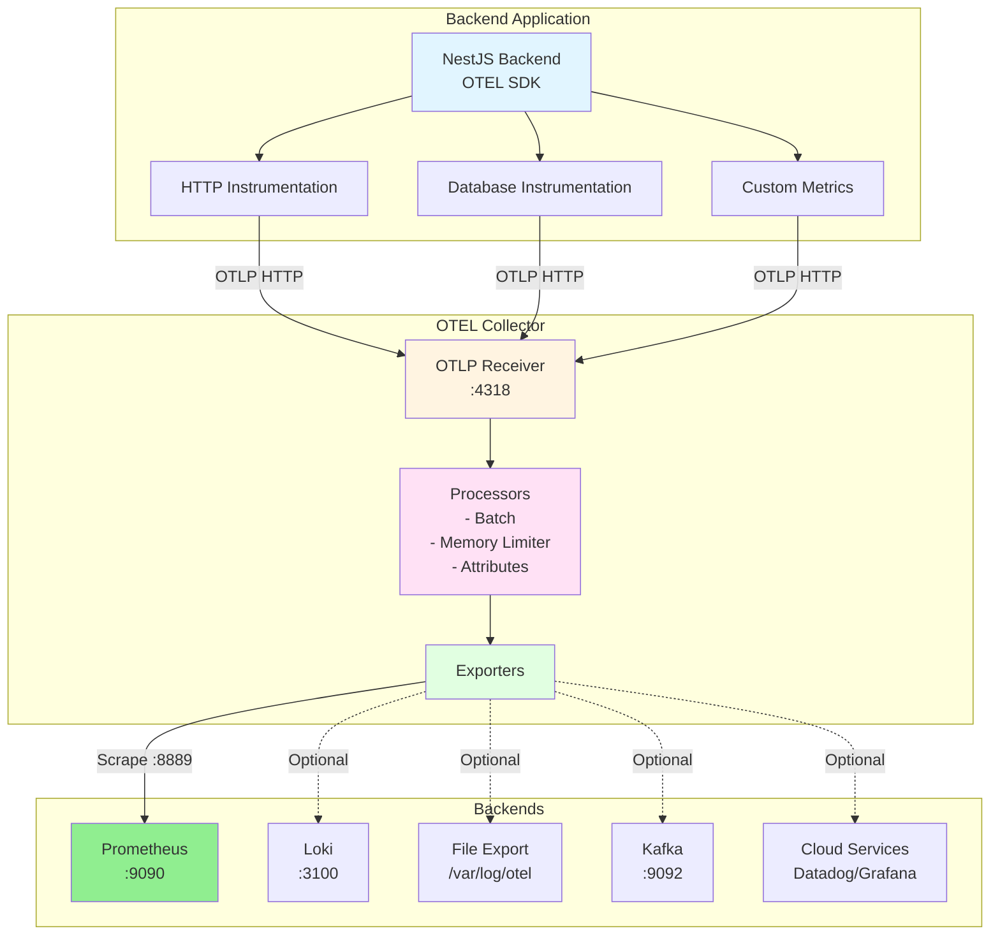
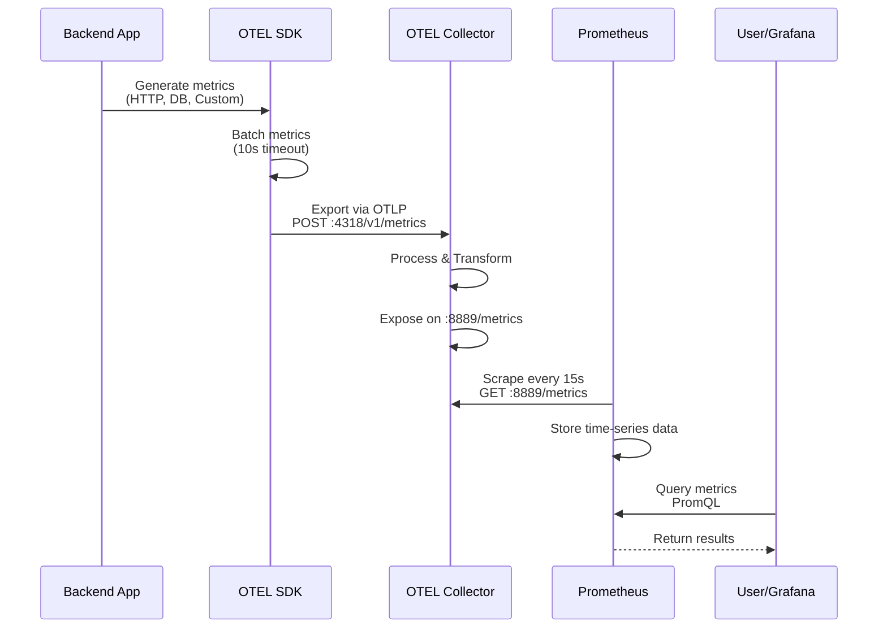
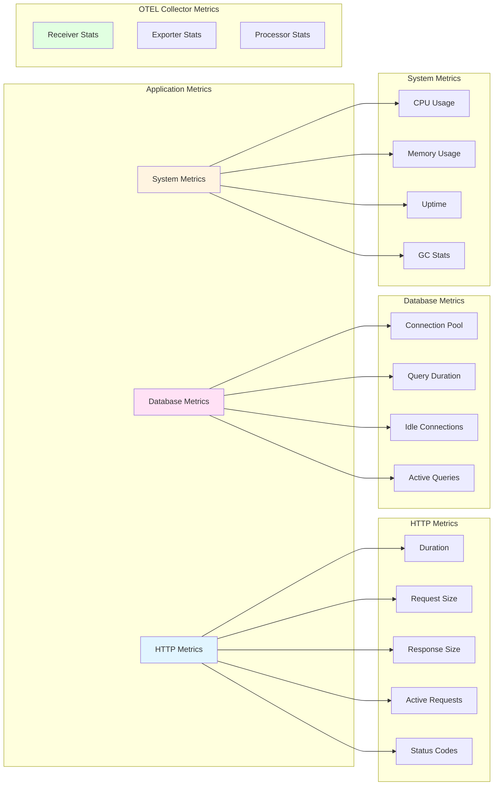
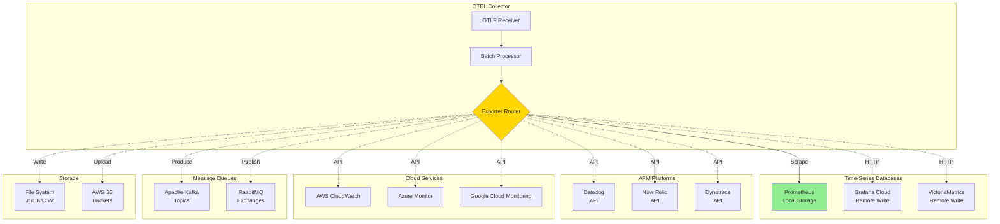
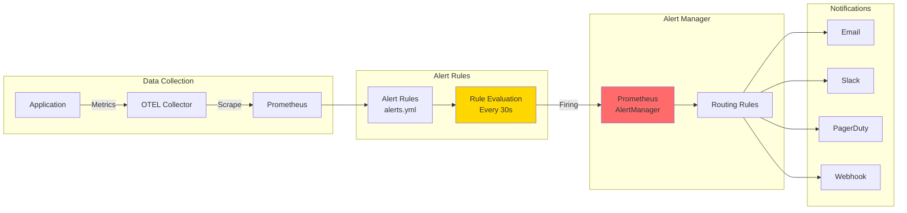
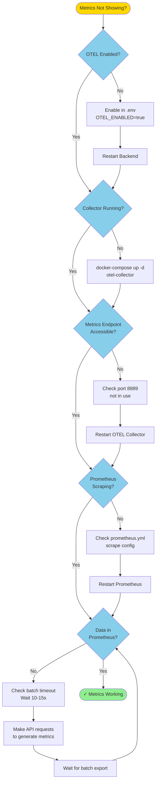

# OpenTelemetry Metrics Guide

Complete guide for metrics collection, export, and visualization in TelemetryFlow Core.

## Overview

TelemetryFlow Core uses OpenTelemetry (OTEL) for comprehensive metrics collection:

- ✅ **Auto-instrumentation** - HTTP requests, database queries, system metrics
- ✅ **Custom metrics** - Application-specific counters, gauges, histograms
- ✅ **OTEL Collector** - Central metrics aggregation and export
- ✅ **Prometheus** - Metrics storage and querying
- ✅ **Multiple exporters** - Send metrics to various backends

## Architecture



## Current Setup

### Metrics Flow Diagram



### 1. **Backend Application**
- OTEL SDK initialized in `src/otel/tracing.ts`
- Auto-instrumentation enabled for HTTP, database, etc.
- Metrics exported to OTEL Collector on `http://otel-collector:4318`

### 2. **OTEL Collector**
- Receives metrics via OTLP (port 4318)
- Exposes Prometheus metrics on port 8889
- Configuration: `config/otel/otel-collector-config.yaml`

### 3. **Prometheus**
- Scrapes OTEL Collector metrics every 15s
- Stores time-series data
- Query UI: `http://localhost:9090`

## Available Metrics

### Metrics Hierarchy



### Application Metrics

**HTTP Requests:**
```
http_server_duration_milliseconds - Request duration
http_server_request_body_size_bytes - Request size
http_server_response_body_size_bytes - Response size
http_server_active_requests - Active requests count
```

**Database:**
```
db_client_connections_usage - Connection pool usage
db_client_connections_idle - Idle connections
db_client_operation_duration - Query duration
```

**System:**
```
process_cpu_usage - CPU usage
process_memory_usage - Memory usage
process_uptime - Application uptime
```

### OTEL Collector Metrics

**Receivers:**
```
otelcol_receiver_accepted_spans - Traces received
otelcol_receiver_accepted_log_records - Logs received
otelcol_receiver_accepted_metric_points - Metrics received
otelcol_receiver_refused_spans - Rejected traces
```

**Exporters:**
```
otelcol_exporter_sent_spans - Traces exported
otelcol_exporter_sent_log_records - Logs exported
otelcol_exporter_sent_metric_points - Metrics exported
otelcol_exporter_send_failed_spans - Failed exports
```

**Processors:**
```
otelcol_processor_batch_batch_send_size - Batch sizes
otelcol_processor_batch_timeout_trigger_send - Batch timeouts
```

## Accessing Metrics

### 1. **OTEL Collector Metrics Endpoint**
```bash
# View all metrics
curl http://localhost:8889/metrics

# Filter specific metrics
curl http://localhost:8889/metrics | grep http_server

# Count total metrics
curl -s http://localhost:8889/metrics | grep "^# TYPE" | wc -l
```

### 2. **Prometheus UI**
Open `http://localhost:9090` and query:

```promql
# Request rate
rate(http_server_duration_milliseconds_count[5m])

# Average response time
rate(http_server_duration_milliseconds_sum[5m]) / rate(http_server_duration_milliseconds_count[5m])

# Error rate
rate(http_server_duration_milliseconds_count{http_response_status_code=~"5.."}[5m])

# Active requests
http_server_active_requests

# Memory usage
process_memory_usage
```

### 3. **Grafana Dashboards**
Import pre-built dashboards:
- OTEL Collector Dashboard
- NestJS Application Dashboard
- HTTP Request Dashboard

## Configuration

### Enable/Disable Metrics

**In `.env`:**
```env
# Enable OTEL metrics
OTEL_ENABLED=true
OTEL_SERVICE_NAME=telemetryflow-core
OTEL_EXPORTER_OTLP_ENDPOINT=http://otel-collector:4318
```

**In `docker-compose.yml`:**
```yaml
backend:
  environment:
    - OTEL_ENABLED=true
    - OTEL_EXPORTER_OTLP_ENDPOINT=http://otel-collector:4318
```

### Adjust Collection Interval

**Prometheus scrape interval** (`config/prometheus/prometheus.yml`):
```yaml
scrape_configs:
  - job_name: 'otel-collector'
    scrape_interval: 15s  # Change to 5s, 30s, 60s, etc.
    static_configs:
      - targets: ['otel-collector:8889']
```

### Batch Processing

**OTEL Collector** (`config/otel/otel-collector-config.yaml`):
```yaml
processors:
  batch:
    timeout: 10s          # How long to wait before sending
    send_batch_size: 1024 # Send when batch reaches this size
```

## Custom Metrics

### Add Custom Metrics to Your Application

**1. Counter - Count events:**
```typescript
import { metrics } from '@opentelemetry/api';

const meter = metrics.getMeter('telemetryflow-core');
const requestCounter = meter.createCounter('custom_requests_total', {
  description: 'Total number of custom requests',
});

// Increment counter
requestCounter.add(1, { endpoint: '/api/users', method: 'GET' });
```

**2. Gauge - Current value:**
```typescript
const activeUsers = meter.createObservableGauge('active_users', {
  description: 'Number of active users',
});

activeUsers.addCallback((result) => {
  result.observe(getUserCount());
});
```

**3. Histogram - Distribution:**
```typescript
const responseTime = meter.createHistogram('response_time_ms', {
  description: 'Response time in milliseconds',
});

responseTime.record(duration, { endpoint: '/api/users' });
```

## Export to Additional Backends

### Multi-Backend Export Architecture



### Grafana Cloud

**Add to `otel-collector-config.yaml`:**
```yaml
exporters:
  prometheusremotewrite:
    endpoint: https://prometheus-prod-01-eu-west-0.grafana.net/api/prom/push
    headers:
      authorization: "Bearer YOUR_API_KEY"

service:
  pipelines:
    metrics:
      exporters: [prometheus, prometheusremotewrite]
```

### Datadog

```yaml
exporters:
  datadog:
    api:
      key: YOUR_DATADOG_API_KEY
      site: datadoghq.com

service:
  pipelines:
    metrics:
      exporters: [prometheus, datadog]
```

### AWS CloudWatch

```yaml
exporters:
  awscloudwatch:
    region: us-east-1
    namespace: TelemetryFlow

service:
  pipelines:
    metrics:
      exporters: [prometheus, awscloudwatch]
```

## Monitoring & Alerts

### Alert Pipeline



### Prometheus Alerts

Create `config/prometheus/alerts.yml`:
```yaml
groups:
  - name: telemetryflow_alerts
    interval: 30s
    rules:
      # High error rate
      - alert: HighErrorRate
        expr: rate(http_server_duration_milliseconds_count{http_response_status_code=~"5.."}[5m]) > 0.05
        for: 5m
        labels:
          severity: critical
        annotations:
          summary: "High error rate detected"
          
      # High response time
      - alert: HighResponseTime
        expr: rate(http_server_duration_milliseconds_sum[5m]) / rate(http_server_duration_milliseconds_count[5m]) > 1000
        for: 5m
        labels:
          severity: warning
        annotations:
          summary: "Response time above 1 second"
          
      # OTEL Collector down
      - alert: OTELCollectorDown
        expr: up{job="otel-collector"} == 0
        for: 1m
        labels:
          severity: critical
        annotations:
          summary: "OTEL Collector is down"
```

## Troubleshooting

### Metrics Troubleshooting Flowchart



### Metrics Not Appearing

**1. Check OTEL is enabled:**
```bash
docker-compose logs backend | grep "OTEL"
# Should see: [OTEL] ✓ OpenTelemetry SDK started
```

**2. Verify OTEL Collector is receiving metrics:**
```bash
curl -s http://localhost:8889/metrics | grep otelcol_receiver_accepted_metric_points
```

**3. Check Prometheus is scraping:**
```bash
# Open Prometheus UI
http://localhost:9090/targets
# otel-collector target should be UP
```

### High Memory Usage

**Reduce batch size:**
```yaml
processors:
  batch:
    send_batch_size: 512  # Reduce from 1024
    timeout: 5s           # Send more frequently
```

**Add memory limiter:**
```yaml
processors:
  memory_limiter:
    check_interval: 1s
    limit_mib: 256      # Reduce if needed
```

### Missing Custom Metrics

**Ensure meter is initialized:**
```typescript
import { metrics } from '@opentelemetry/api';
const meter = metrics.getMeter('telemetryflow-core');
```

**Check metric name format:**
- Use lowercase with underscores: `custom_metric_name`
- Avoid special characters
- Add units: `_bytes`, `_seconds`, `_total`

## Best Practices

### 1. **Metric Naming**
- Use descriptive names: `http_request_duration_seconds`
- Include units: `_bytes`, `_seconds`, `_total`
- Use consistent prefixes: `http_`, `db_`, `cache_`

### 2. **Labels/Attributes**
- Keep cardinality low (< 100 unique values per label)
- Avoid high-cardinality labels (user IDs, timestamps)
- Use meaningful labels: `method`, `status_code`, `endpoint`

### 3. **Metric Types**
- **Counter**: Monotonically increasing (requests, errors)
- **Gauge**: Current value (memory, active connections)
- **Histogram**: Distribution (response times, request sizes)

### 4. **Performance**
- Batch metrics before export
- Use sampling for high-volume metrics
- Set appropriate retention periods

## Useful Queries

### Request Rate
```promql
rate(http_server_duration_milliseconds_count[5m])
```

### Error Rate
```promql
rate(http_server_duration_milliseconds_count{http_response_status_code=~"5.."}[5m])
```

### P95 Response Time
```promql
histogram_quantile(0.95, rate(http_server_duration_milliseconds_bucket[5m]))
```

### Throughput by Endpoint
```promql
sum by (http_route) (rate(http_server_duration_milliseconds_count[5m]))
```

### Memory Usage Trend
```promql
process_memory_usage
```

## References

- [OpenTelemetry Metrics](https://opentelemetry.io/docs/concepts/signals/metrics/)
- [Prometheus Query Language](https://prometheus.io/docs/prometheus/latest/querying/basics/)
- [OTEL Collector Configuration](https://opentelemetry.io/docs/collector/configuration/)
- [Grafana Dashboards](https://grafana.com/grafana/dashboards/)

## Related Documentation

- [OBSERVABILITY.md](./OBSERVABILITY.md) - Complete observability overview
- [OTEL_TRACES.md](./OTEL_TRACES.md) - Distributed tracing guide
- [OTEL_LOGS.md](./OTEL_LOGS.md) - Log collection guide
- [config/otel/examples/](../config/otel/examples/) - Exporter examples
