# TelemetryFlow Core - Architecture Diagrams

Comprehensive Mermaid diagrams for TelemetryFlow Core architecture, RBAC system, and data flows.

## Table of Contents

1. [5-Tier RBAC System](#5-tier-rbac-system)
2. [System Architecture](#system-architecture)
3. [IAM Module Structure](#iam-module-structure)
4. [Database Schema](#database-schema)
5. [Docker Architecture](#docker-architecture)
6. [Data Flow](#data-flow)
7. [Authentication Flow](#authentication-flow)
8. [Audit Logging Flow](#audit-logging-flow)

---

## 5-Tier RBAC System

### Role Hierarchy

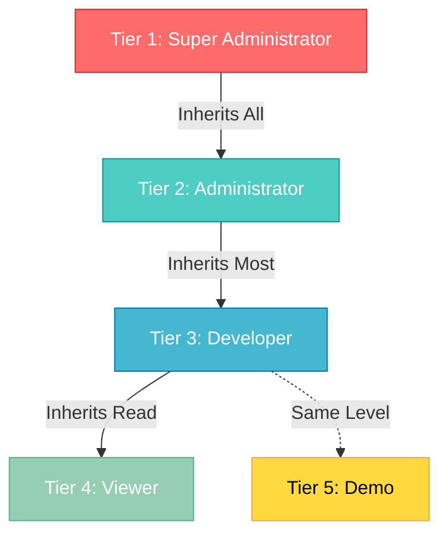
```mermaid
graph TD
    T1[Tier 1: Super Administrator]
    T2[Tier 2: Administrator]
    T3[Tier 3: Developer]
    T4[Tier 4: Viewer]
    T5[Tier 5: Demo]

    T1 -->|Inherits All| T2
    T2 -->|Inherits Most| T3
    T3 -->|Inherits Read| T4
    T3 -.->|Same Level| T5

    T1:::tier1
    T2:::tier2
    T3:::tier3
    T4:::tier4
    T5:::tier5

    classDef tier1 fill:#ff6b6b,stroke:#c92a2a,color:#fff
    classDef tier2 fill:#4ecdc4,stroke:#0a9396,color:#fff
    classDef tier3 fill:#45b7d1,stroke:#0077b6,color:#fff
    classDef tier4 fill:#96ceb4,stroke:#52b788,color:#fff
    classDef tier5 fill:#ffd93d,stroke:#f4a261,color:#000
```

### Permission Distribution

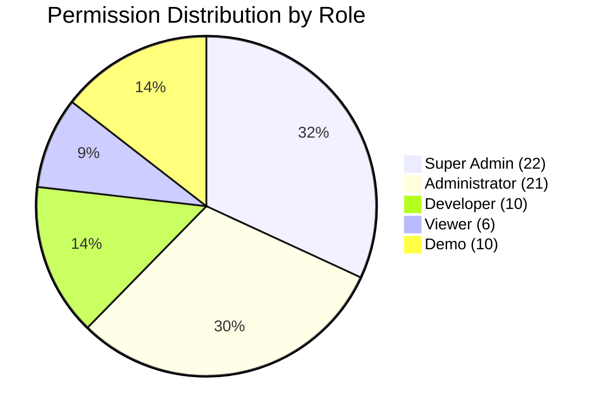
```mermaid
pie title Permission Distribution by Role
    "Super Admin (22)" : 22
    "Administrator (21)" : 21
    "Developer (10)" : 10
    "Viewer (6)" : 6
    "Demo (10)" : 10
```

### Role Scope

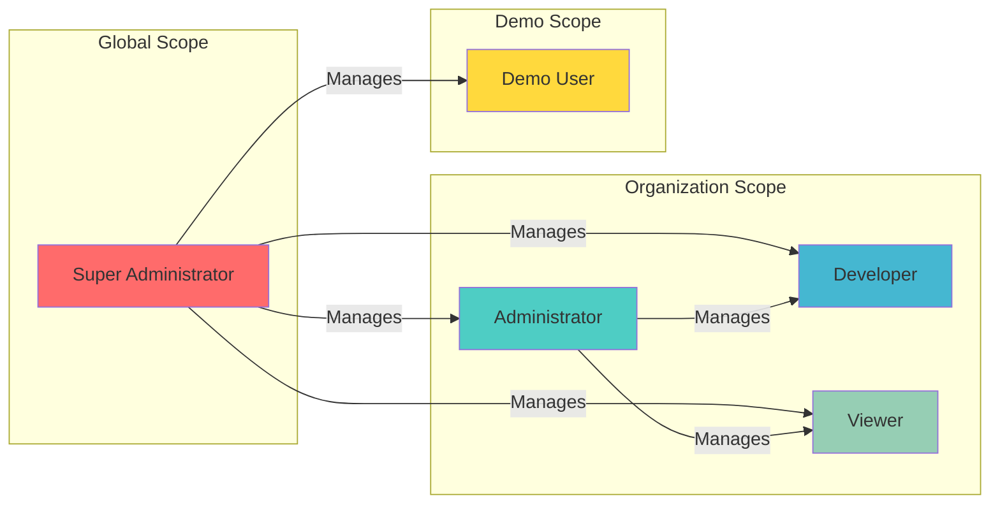
```mermaid
graph LR
    subgraph "Global Scope"
        SA[Super Administrator]
    end

    subgraph "Organization Scope"
        ADMIN[Administrator]
        DEV[Developer]
        VIEW[Viewer]
    end

    subgraph "Demo Scope"
        DEMO[Demo User]
    end

    SA -->|Manages| ADMIN
    SA -->|Manages| DEV
    SA -->|Manages| VIEW
    SA -->|Manages| DEMO

    ADMIN -->|Manages| DEV
    ADMIN -->|Manages| VIEW

    style SA fill:#ff6b6b
    style ADMIN fill:#4ecdc4
    style DEV fill:#45b7d1
    style VIEW fill:#96ceb4
    style DEMO fill:#ffd93d
```

---

## System Architecture

### High-Level Architecture

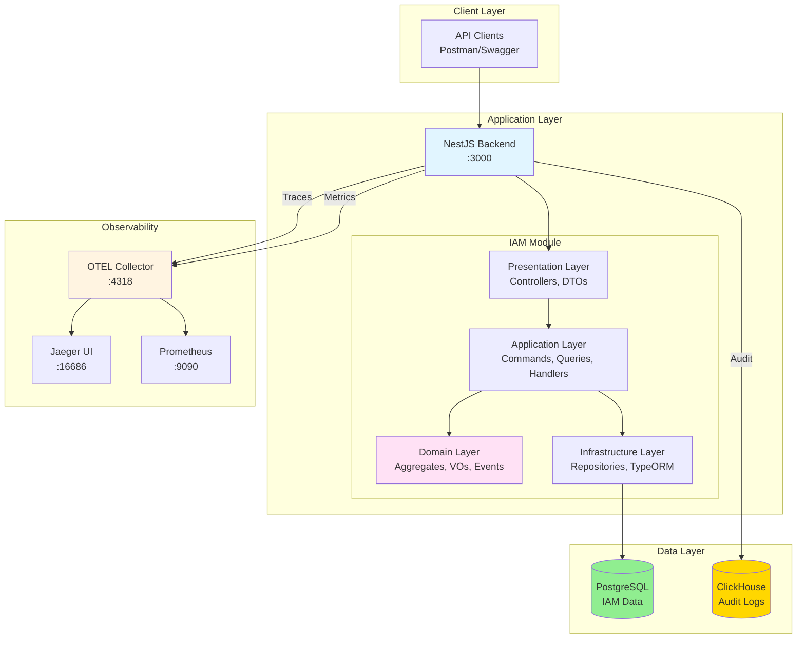
```mermaid
graph TB
    subgraph "Client Layer"
        CLIENT[API Clients<br/>Postman/Swagger]
    end

    subgraph "Application Layer"
        API[NestJS Backend<br/>:3000]

        subgraph "IAM Module"
            DOMAIN[Domain Layer<br/>Aggregates, VOs, Events]
            APP[Application Layer<br/>Commands, Queries, Handlers]
            INFRA[Infrastructure Layer<br/>Repositories, TypeORM]
            PRES[Presentation Layer<br/>Controllers, DTOs]
        end
    end

    subgraph "Observability"
        OTEL[OTEL Collector<br/>:4318]
        JAEGER[Jaeger UI<br/>:16686]
        PROM[Prometheus<br/>:9090]
    end

    subgraph "Data Layer"
        PG[(PostgreSQL<br/>IAM Data)]
        CH[(ClickHouse<br/>Audit Logs)]
    end

    CLIENT --> API
    API --> PRES
    PRES --> APP
    APP --> DOMAIN
    APP --> INFRA
    INFRA --> PG

    API -->|Traces| OTEL
    API -->|Metrics| OTEL
    API -->|Audit| CH

    OTEL --> JAEGER
    OTEL --> PROM

    style API fill:#e1f5ff
    style DOMAIN fill:#ffe1f5
    style OTEL fill:#fff4e1
    style PG fill:#90EE90
    style CH fill:#FFD700
```

### DDD Layer Structure

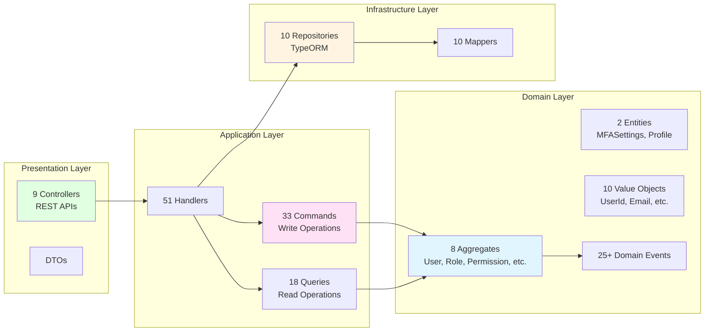
```mermaid
graph LR
    subgraph "Domain Layer"
        AGG[8 Aggregates<br/>User, Role, Permission, etc.]
        ENT[2 Entities<br/>MFASettings, Profile]
        VO[10 Value Objects<br/>UserId, Email, etc.]
        EVT[25+ Domain Events]
    end

    subgraph "Application Layer"
        CMD[33 Commands<br/>Write Operations]
        QRY[18 Queries<br/>Read Operations]
        HDL[51 Handlers]
    end

    subgraph "Infrastructure Layer"
        REPO[10 Repositories<br/>TypeORM]
        MAP[10 Mappers]
    end

    subgraph "Presentation Layer"
        CTRL[9 Controllers<br/>REST APIs]
        DTO[DTOs]
    end

    CTRL --> HDL
    HDL --> CMD
    HDL --> QRY
    CMD --> AGG
    QRY --> AGG
    AGG --> EVT
    HDL --> REPO
    REPO --> MAP

    style AGG fill:#e1f5ff
    style CMD fill:#ffe1f5
    style REPO fill:#fff4e1
    style CTRL fill:#e1ffe1
```

---

## IAM Module Structure

### Aggregate Relationships

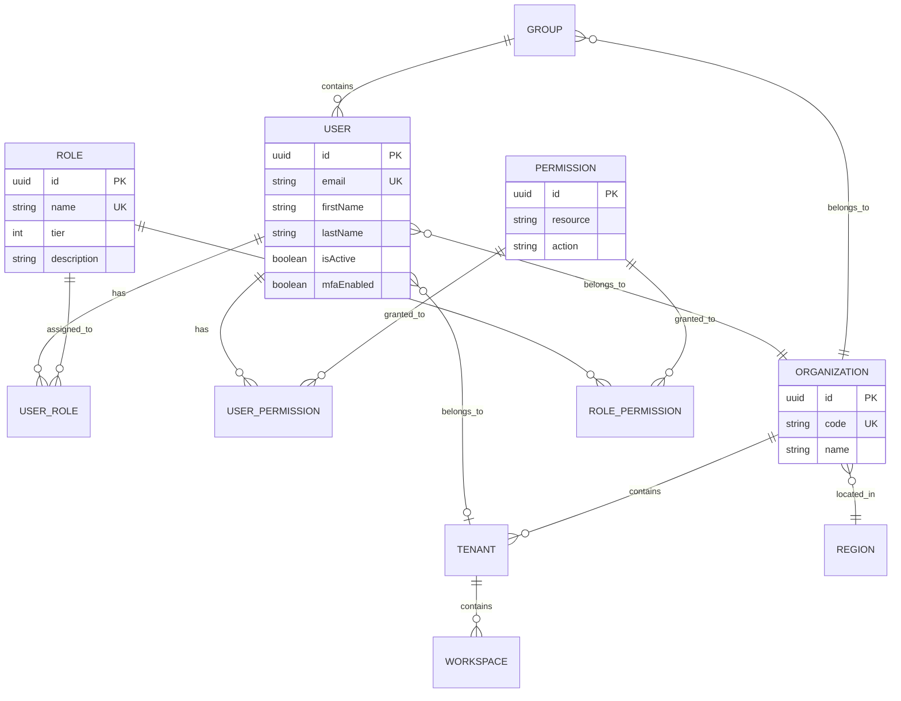
```mermaid
erDiagram
    USER ||--o{ USER_ROLE : has
    USER ||--o{ USER_PERMISSION : has
    USER }o--|| ORGANIZATION : belongs_to
    USER }o--o| TENANT : belongs_to

    ROLE ||--o{ ROLE_PERMISSION : has
    ROLE ||--o{ USER_ROLE : assigned_to

    PERMISSION ||--o{ ROLE_PERMISSION : granted_to
    PERMISSION ||--o{ USER_PERMISSION : granted_to

    ORGANIZATION ||--o{ TENANT : contains
    ORGANIZATION }o--|| REGION : located_in

    TENANT ||--o{ WORKSPACE : contains

    GROUP ||--o{ USER : contains
    GROUP }o--|| ORGANIZATION : belongs_to

    USER {
        uuid id PK
        string email UK
        string firstName
        string lastName
        boolean isActive
        boolean mfaEnabled
    }

    ROLE {
        uuid id PK
        string name UK
        int tier
        string description
    }

    PERMISSION {
        uuid id PK
        string resource
        string action
    }

    ORGANIZATION {
        uuid id PK
        string code UK
        string name
    }
```

### CQRS Pattern

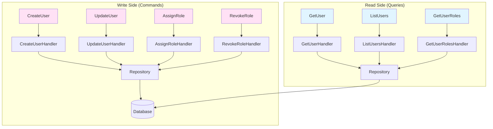
```mermaid
graph TB
    subgraph "Write Side (Commands)"
        CMD1[CreateUser]
        CMD2[UpdateUser]
        CMD3[AssignRole]
        CMD4[RevokeRole]

        CMD1 --> CH1[CreateUserHandler]
        CMD2 --> CH2[UpdateUserHandler]
        CMD3 --> CH3[AssignRoleHandler]
        CMD4 --> CH4[RevokeRoleHandler]

        CH1 --> REPO[Repository]
        CH2 --> REPO
        CH3 --> REPO
        CH4 --> REPO

        REPO --> DB[(Database)]
    end

    subgraph "Read Side (Queries)"
        QRY1[GetUser]
        QRY2[ListUsers]
        QRY3[GetUserRoles]

        QRY1 --> QH1[GetUserHandler]
        QRY2 --> QH2[ListUsersHandler]
        QRY3 --> QH3[GetUserRolesHandler]

        QH1 --> REPO2[Repository]
        QH2 --> REPO2
        QH3 --> REPO2

        REPO2 --> DB
    end

    style CMD1 fill:#ffe1f5
    style CMD2 fill:#ffe1f5
    style CMD3 fill:#ffe1f5
    style CMD4 fill:#ffe1f5
    style QRY1 fill:#e1f5ff
    style QRY2 fill:#e1f5ff
    style QRY3 fill:#e1f5ff
```

---

## Database Schema

### PostgreSQL Schema

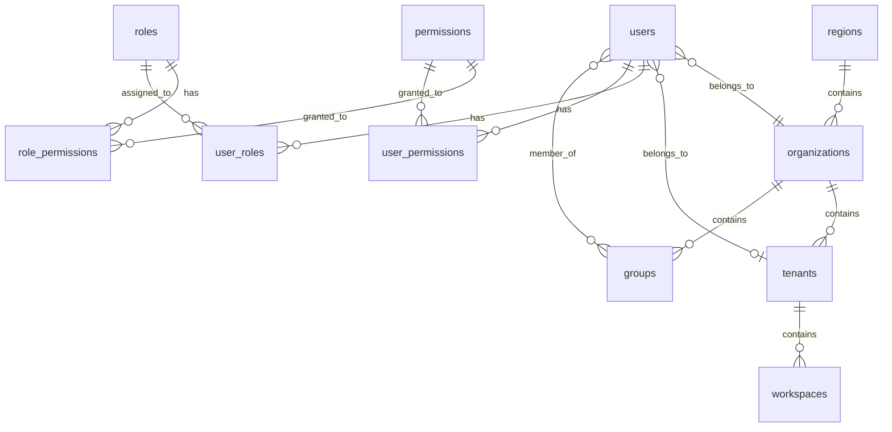
```mermaid
erDiagram
    regions ||--o{ organizations : contains
    organizations ||--o{ tenants : contains
    organizations ||--o{ groups : contains
    tenants ||--o{ workspaces : contains

    users }o--|| organizations : belongs_to
    users }o--o| tenants : belongs_to
    users ||--o{ user_roles : has
    users ||--o{ user_permissions : has
    users }o--o{ groups : member_of

    roles ||--o{ role_permissions : has
    roles ||--o{ user_roles : assigned_to

    permissions ||--o{ role_permissions : granted_to
    permissions ||--o{ user_permissions : granted_to
```

### ClickHouse Schema

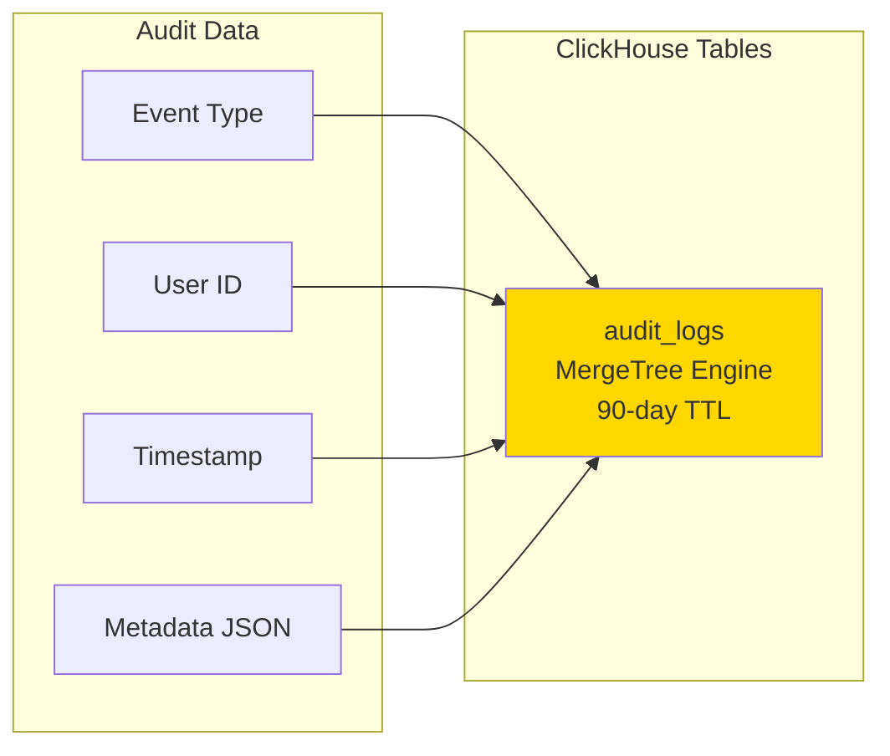
```mermaid
graph LR
    subgraph "ClickHouse Tables"
        AUDIT[audit_logs<br/>MergeTree Engine<br/>90-day TTL]
    end

    subgraph "Audit Data"
        EVENT[Event Type]
        USER[User ID]
        TIME[Timestamp]
        META[Metadata JSON]
    end

    EVENT --> AUDIT
    USER --> AUDIT
    TIME --> AUDIT
    META --> AUDIT

    style AUDIT fill:#FFD700
```

---

## Docker Architecture

### Container Network

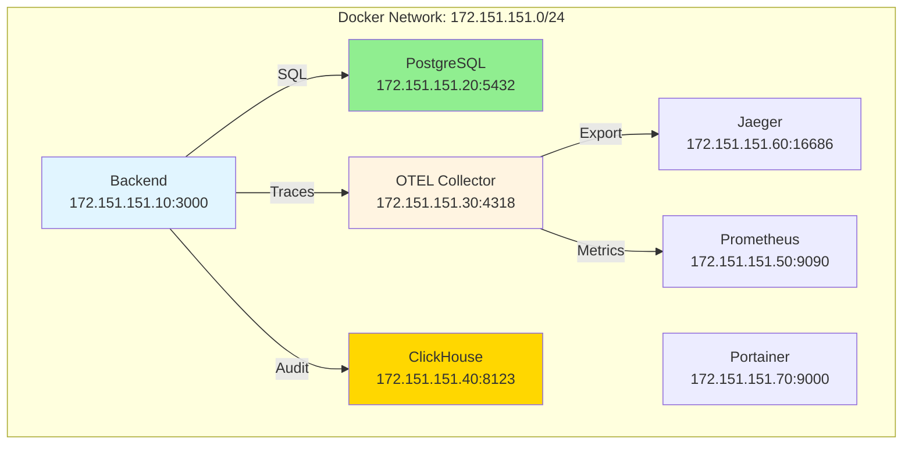
```mermaid
graph TB
    subgraph "Docker Network: 172.151.151.0/24"
        BACKEND[Backend<br/>172.151.151.10:3000]
        PG[PostgreSQL<br/>172.151.151.20:5432]
        OTEL[OTEL Collector<br/>172.151.151.30:4318]
        CH[ClickHouse<br/>172.151.151.40:8123]
        PROM[Prometheus<br/>172.151.151.50:9090]
        JAEGER[Jaeger<br/>172.151.151.60:16686]
        PORT[Portainer<br/>172.151.151.70:9000]
    end

    BACKEND -->|SQL| PG
    BACKEND -->|Traces| OTEL
    BACKEND -->|Audit| CH
    OTEL -->|Export| JAEGER
    OTEL -->|Metrics| PROM

    style BACKEND fill:#e1f5ff
    style PG fill:#90EE90
    style CH fill:#FFD700
    style OTEL fill:#fff4e1
```

### Service Dependencies

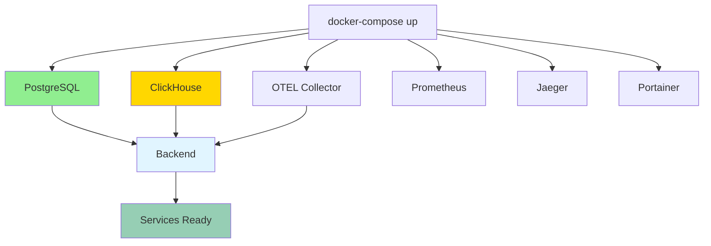
```mermaid
graph TD
    START[docker-compose up]

    START --> PG[PostgreSQL]
    START --> CH[ClickHouse]
    START --> OTEL[OTEL Collector]
    START --> PROM[Prometheus]
    START --> JAEGER[Jaeger]
    START --> PORT[Portainer]

    PG --> BACKEND[Backend]
    CH --> BACKEND
    OTEL --> BACKEND

    BACKEND --> READY[Services Ready]

    style PG fill:#90EE90
    style CH fill:#FFD700
    style BACKEND fill:#e1f5ff
    style READY fill:#96ceb4
```

---

## Data Flow

### User Creation Flow

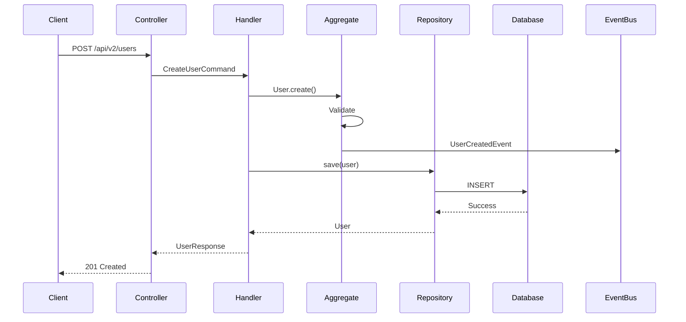
```mermaid
sequenceDiagram
    participant Client
    participant Controller
    participant Handler
    participant Aggregate
    participant Repository
    participant Database
    participant EventBus

    Client->>Controller: POST /api/v2/users
    Controller->>Handler: CreateUserCommand
    Handler->>Aggregate: User.create()
    Aggregate->>Aggregate: Validate
    Aggregate->>EventBus: UserCreatedEvent
    Handler->>Repository: save(user)
    Repository->>Database: INSERT
    Database-->>Repository: Success
    Repository-->>Handler: User
    Handler-->>Controller: UserResponse
    Controller-->>Client: 201 Created
```

### Role Assignment Flow

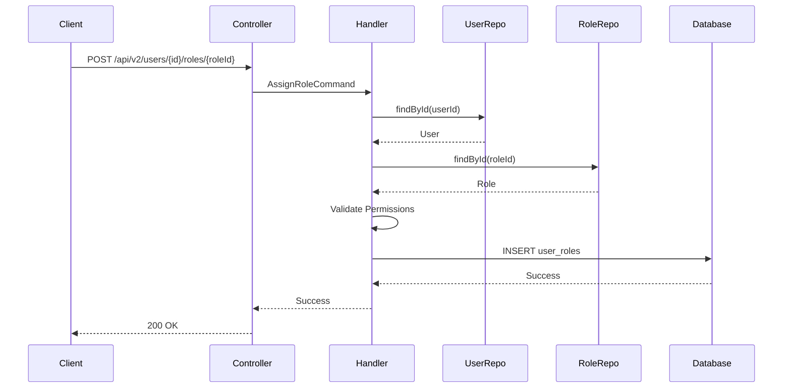
```mermaid
sequenceDiagram
    participant Client
    participant Controller
    participant Handler
    participant UserRepo
    participant RoleRepo
    participant Database

    Client->>Controller: POST /api/v2/users/{id}/roles/{roleId}
    Controller->>Handler: AssignRoleCommand
    Handler->>UserRepo: findById(userId)
    UserRepo-->>Handler: User
    Handler->>RoleRepo: findById(roleId)
    RoleRepo-->>Handler: Role
    Handler->>Handler: Validate Permissions
    Handler->>Database: INSERT user_roles
    Database-->>Handler: Success
    Handler-->>Controller: Success
    Controller-->>Client: 200 OK
```

---

## Authentication Flow

### JWT Authentication

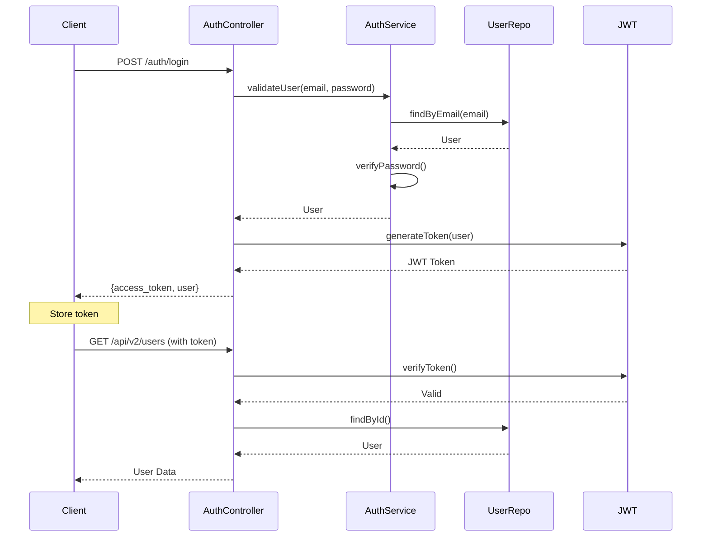
```mermaid
sequenceDiagram
    participant Client
    participant AuthController
    participant AuthService
    participant UserRepo
    participant JWT

    Client->>AuthController: POST /auth/login
    AuthController->>AuthService: validateUser(email, password)
    AuthService->>UserRepo: findByEmail(email)
    UserRepo-->>AuthService: User
    AuthService->>AuthService: verifyPassword()
    AuthService-->>AuthController: User
    AuthController->>JWT: generateToken(user)
    JWT-->>AuthController: JWT Token
    AuthController-->>Client: {access_token, user}

    Note over Client: Store token

    Client->>AuthController: GET /api/v2/users (with token)
    AuthController->>JWT: verifyToken()
    JWT-->>AuthController: Valid
    AuthController->>UserRepo: findById()
    UserRepo-->>AuthController: User
    AuthController-->>Client: User Data
```

---

## Audit Logging Flow

### Audit Event Flow

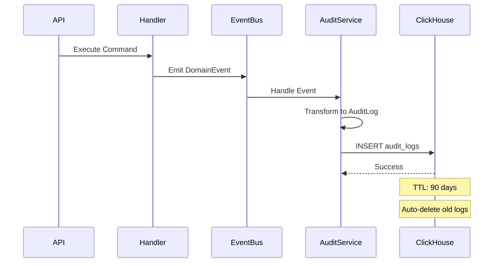
```mermaid
sequenceDiagram
    participant API
    participant Handler
    participant EventBus
    participant AuditService
    participant ClickHouse

    API->>Handler: Execute Command
    Handler->>EventBus: Emit DomainEvent
    EventBus->>AuditService: Handle Event
    AuditService->>AuditService: Transform to AuditLog
    AuditService->>ClickHouse: INSERT audit_logs
    ClickHouse-->>AuditService: Success

    Note over ClickHouse: TTL: 90 days
    Note over ClickHouse: Auto-delete old logs
```

### Audit Query Flow

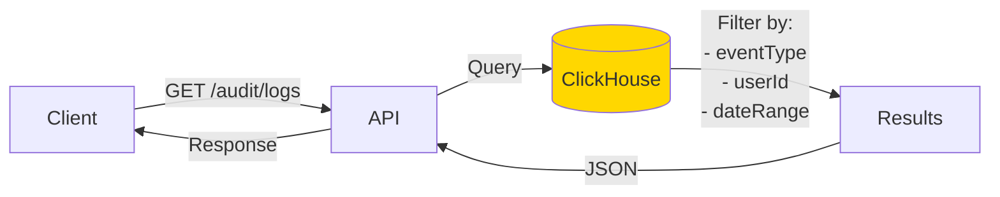
```mermaid
graph LR
    CLIENT[Client] -->|GET /audit/logs| API[API]
    API -->|Query| CH[(ClickHouse)]
    CH -->|Filter by:<br/>- eventType<br/>- userId<br/>- dateRange| RESULT[Results]
    RESULT -->|JSON| API
    API -->|Response| CLIENT

    style CH fill:#FFD700
```

---

## Bootstrap Flow

### Bootstrap Process

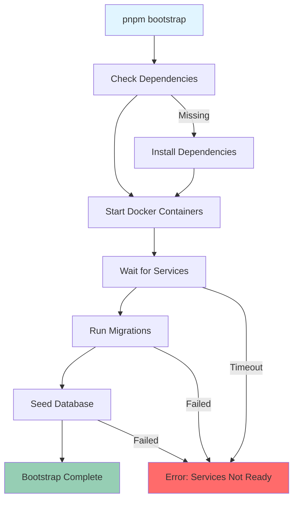
```mermaid
graph TD
    START[pnpm bootstrap]

    START --> CHECK[Check Dependencies]
    CHECK --> DOCKER[Start Docker Containers]
    DOCKER --> WAIT[Wait for Services]
    WAIT --> MIGRATE[Run Migrations]
    MIGRATE --> SEED[Seed Database]
    SEED --> COMPLETE[Bootstrap Complete]

    CHECK -->|Missing| INSTALL[Install Dependencies]
    INSTALL --> DOCKER

    WAIT -->|Timeout| ERROR[Error: Services Not Ready]
    MIGRATE -->|Failed| ERROR
    SEED -->|Failed| ERROR

    style START fill:#e1f5ff
    style COMPLETE fill:#96ceb4
    style ERROR fill:#ff6b6b
```

---

## Testing Architecture

### Test Coverage

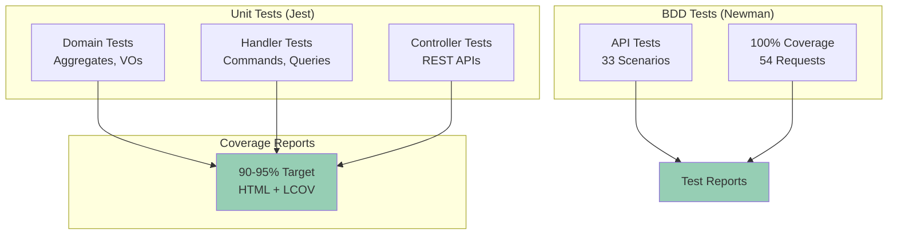
```mermaid
graph TB
    subgraph "Unit Tests (Jest)"
        UT1[Domain Tests<br/>Aggregates, VOs]
        UT2[Handler Tests<br/>Commands, Queries]
        UT3[Controller Tests<br/>REST APIs]
    end

    subgraph "BDD Tests (Newman)"
        BDD1[API Tests<br/>33 Scenarios]
        BDD2[100% Coverage<br/>54 Requests]
    end

    subgraph "Coverage Reports"
        COV[90-95% Target<br/>HTML + LCOV]
    end

    UT1 --> COV
    UT2 --> COV
    UT3 --> COV
    BDD1 --> REPORT[Test Reports]
    BDD2 --> REPORT

    style COV fill:#96ceb4
    style REPORT fill:#96ceb4
```

---

## Summary

### Component Count

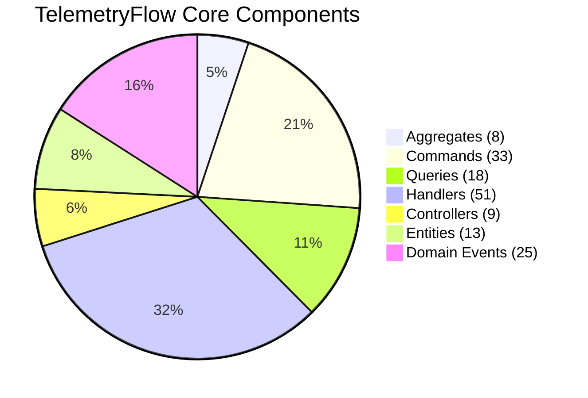
```mermaid
pie title TelemetryFlow Core Components
    "Aggregates (8)" : 8
    "Commands (33)" : 33
    "Queries (18)" : 18
    "Handlers (51)" : 51
    "Controllers (9)" : 9
    "Entities (13)" : 13
    "Domain Events (25)" : 25
```

### Technology Stack

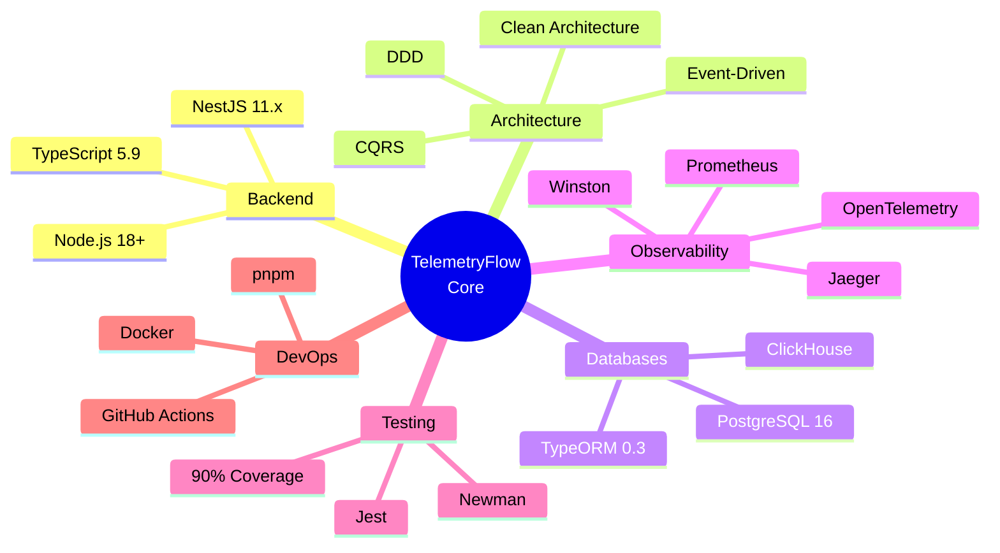
```mermaid
mindmap
  root((TelemetryFlow<br/>Core))
    Backend
      NestJS 11.x
      TypeScript 5.9
      Node.js 18+
    Architecture
      DDD
      CQRS
      Clean Architecture
      Event-Driven
    Databases
      PostgreSQL 16
      ClickHouse
      TypeORM 0.3
    Observability
      OpenTelemetry
      Prometheus
      Jaeger
      Winston
    Testing
      Jest
      Newman
      90% Coverage
    DevOps
      Docker
      pnpm
      GitHub Actions
```

---

- **Last Updated**: 2025-12-03
- **Total Diagrams**: 20+
- **Format**: Mermaid
