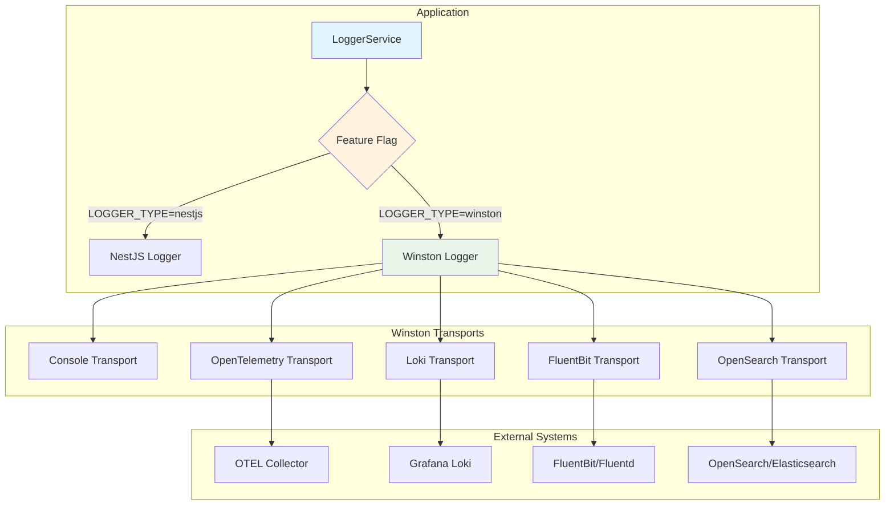

# P25: Winston Logging Standardization

This module provides a standardized logging solution for TelemetryFlow with feature flag support to switch between NestJS native logger and Winston with multiple transport backends.

## Architecture



## Features

- **Feature Flag Support**: Toggle between NestJS native logger and Winston via `LOGGER_TYPE` environment variable
- **Multiple Transports**: Console, OpenTelemetry, Loki, FluentBit, OpenSearch
- **OpenTelemetry Integration**: Automatic trace context propagation (traceId, spanId, traceFlags)
- **Structured Logging**: Support for metadata, context, and custom fields
- **Dynamic Transport Loading**: Optional dependencies loaded only when enabled
- **Child Loggers**: Create scoped loggers with persistent context

## Quick Start

### Basic Usage (NestJS Logger - Default)

```typescript
// No configuration needed - uses NestJS logger by default
import { LoggerModule } from './logger/logger.module';

@Module({
  imports: [LoggerModule.forRoot()],
})
export class AppModule {}
```

### Enable Winston Logger

Set environment variable:
```bash
LOGGER_TYPE=winston
```

Or configure programmatically:
```typescript
@Module({
  imports: [
    LoggerModule.forRoot({
      type: 'winston',
      level: 'debug',
    }),
  ],
})
export class AppModule {}
```

### Using the Logger

```typescript
import { LoggerService } from './logger/logger.service';

@Injectable()
export class MyService {
  constructor(private readonly logger: LoggerService) {}

  doSomething() {
    // Basic logging
    this.logger.log('Operation started', 'MyService');
    this.logger.debug('Debug info', 'MyService');
    this.logger.warn('Warning message', 'MyService');
    this.logger.error('Error occurred', 'stack trace', 'MyService');

    // Structured logging with metadata
    this.logger.logStructured('info', 'User action', {
      context: 'MyService',
      userId: 'user-123',
      action: 'login',
      metadata: { ip: '192.168.1.1' },
    });
  }
}
```

## Configuration

### Environment Variables

| Variable | Default | Description |
|----------|---------|-------------|
| `LOGGER_TYPE` | `nestjs` | Logger type: `nestjs` or `winston` |
| `LOG_LEVEL` | `info` | Log level: `error`, `warn`, `info`, `debug`, `verbose` |
| `LOG_DEFAULT_CONTEXT` | `TelemetryFlow` | Default context for logs |
| `LOG_PRETTY_PRINT` | `true` (dev) | Enable pretty print for console |
| `LOG_COLORIZE` | `true` (dev) | Enable colors for console |

### OpenTelemetry Transport

| Variable | Default | Description |
|----------|---------|-------------|
| `OTEL_LOGS_ENABLED` | auto | Enable OTEL logs transport |
| `OTEL_EXPORTER_OTLP_ENDPOINT` | - | OTEL collector endpoint |

### Loki Transport

| Variable | Default | Description |
|----------|---------|-------------|
| `LOKI_ENABLED` | `false` | Enable Loki transport |
| `LOKI_HOST` | `http://loki:3100` | Loki server URL |
| `LOKI_LABELS_APP` | `telemetryflow` | Application label |
| `LOKI_LABELS_ENV` | `$NODE_ENV` | Environment label |
| `LOKI_BATCH_INTERVAL` | `5` | Batch interval in seconds |
| `LOKI_TIMEOUT` | `30000` | Request timeout in ms |
| `LOKI_USERNAME` | - | Basic auth username |
| `LOKI_PASSWORD` | - | Basic auth password |

### FluentBit Transport

| Variable | Default | Description |
|----------|---------|-------------|
| `FLUENTBIT_ENABLED` | `false` | Enable FluentBit transport |
| `FLUENTBIT_HOST` | `fluentbit` | FluentBit host |
| `FLUENTBIT_PORT` | `24224` | FluentBit forward port |
| `FLUENTBIT_TAG` | `telemetryflow.logs` | Log tag |
| `FLUENTBIT_TIMEOUT` | `3000` | Connection timeout |
| `FLUENTBIT_REQUIRE_ACK` | `false` | Require acknowledgment |
| `FLUENTBIT_RECONNECT_INTERVAL` | `1000` | Reconnect interval in ms |

### OpenSearch Transport

| Variable | Default | Description |
|----------|---------|-------------|
| `OPENSEARCH_ENABLED` | `false` | Enable OpenSearch transport |
| `OPENSEARCH_NODE` | `http://opensearch:9200` | OpenSearch node URL |
| `OPENSEARCH_USERNAME` | - | Auth username |
| `OPENSEARCH_PASSWORD` | - | Auth password |
| `OPENSEARCH_INDEX` | `telemetryflow-logs` | Index prefix |
| `OPENSEARCH_INDEX_SUFFIX` | `YYYY.MM.DD` | Index suffix pattern |
| `OPENSEARCH_FLUSH_INTERVAL` | `2000` | Flush interval in ms |
| `OPENSEARCH_BUFFER_LIMIT` | `100` | Buffer size limit |
| `OPENSEARCH_SSL_VERIFY` | `false` | Verify SSL certificates |

## Advanced Usage

### Child Loggers

Create scoped loggers with persistent context:

```typescript
const userLogger = this.logger.createChildLogger({
  context: 'UserService',
  userId: 'user-123',
  tenantId: 'tenant-456',
});

userLogger.log('User logged in'); // Includes userId and tenantId automatically
```

### Logging with Metadata

```typescript
this.logger.logWithMetadata('info', 'API request processed', {
  method: 'POST',
  path: '/api/users',
  statusCode: 201,
  duration: 45,
});
```

### Structured Logging

```typescript
this.logger.logStructured('info', 'Order completed', {
  context: 'OrderService',
  requestId: 'req-abc-123',
  userId: 'user-456',
  tenantId: 'tenant-789',
  metadata: {
    orderId: 'order-xyz',
    total: 99.99,
    items: 3,
  },
});
```

## Installation

The base Winston dependencies are included. For optional transports, install as needed:

```bash
# For Loki transport
npm install winston-loki

# For FluentBit transport
npm install fluent-logger

# For OpenSearch transport
npm install winston-elasticsearch @opensearch-project/opensearch
```

## Transport Selection Guide

| Use Case | Recommended Transport |
|----------|----------------------|
| Development | Console (pretty print) |
| Kubernetes/Cloud Native | OpenTelemetry + OTEL Collector |
| Grafana Stack | Loki |
| ELK/OpenSearch Stack | OpenSearch |
| Centralized Log Aggregation | FluentBit |
| High-volume Production | FluentBit or OpenTelemetry |

## OpenTelemetry Integration

When using Winston logger, trace context is automatically propagated:

```json
{
  "timestamp": "2024-01-15T10:30:00.000Z",
  "level": "info",
  "message": "Request processed",
  "context": "ApiController",
  "traceId": "abc123def456...",
  "spanId": "789xyz...",
  "traceFlags": "01"
}
```

This enables log correlation with distributed traces in your observability platform.

## Module Structure

```
backend/src/logger/
├── config/
│   └── logger.config.ts       # Configuration loader
├── interfaces/
│   └── logger-config.interface.ts  # TypeScript interfaces
├── transports/
│   └── transport.factory.ts   # Transport factory
├── logger.module.ts           # NestJS module
├── logger.service.ts          # Logger service
├── index.ts                   # Public exports
└── README.md                  # This file
```

## Migration Guide

### From Native NestJS Logger

1. Import `LoggerModule` in your app module
2. Inject `LoggerService` instead of NestJS `Logger`
3. No code changes needed - API is compatible

### Enabling Winston

1. Set `LOGGER_TYPE=winston` in environment
2. Configure desired transports via environment variables
3. Install optional transport dependencies as needed

## Troubleshooting

### Transport Not Working

1. Check if transport is enabled: `*_ENABLED=true`
2. Verify connection settings (host, port)
3. Check for missing dependencies
4. Review console warnings for dynamic import failures

### Missing Trace Context

1. Ensure OpenTelemetry SDK is initialized before logger
2. Verify `OTEL_LOGS_ENABLED=true` or OTEL endpoint is set
3. Check that requests are properly instrumented

### High Memory Usage

1. Reduce buffer limits for OpenSearch transport
2. Decrease batch intervals for Loki transport
3. Enable acknowledgment for FluentBit to apply backpressure
