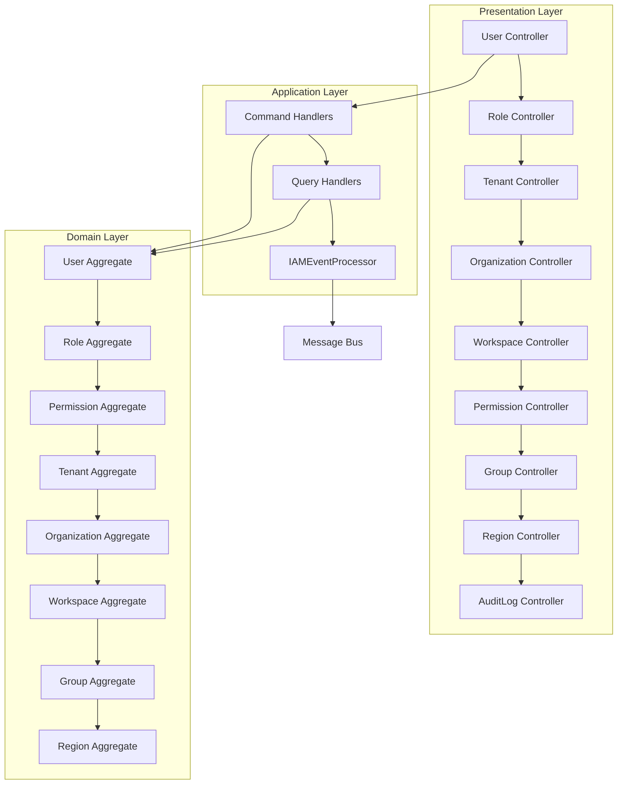

# IAM (Identity and Access Management) Module

## Overview

The IAM module is the central authentication, authorization, and identity management system for the TelemetryFlow SaaS platform. It implements a comprehensive multi-tenant identity management solution following Domain-Driven Design (DDD) and CQRS principles.

**Business Purpose**: Manages users, organizations, tenants, workspaces, roles, permissions, and groups in a hierarchical multi-tenant architecture. Provides fine-grained access control with support for RBAC (Role-Based Access Control) and direct permission assignment.

**Location**: `/backend/src/modules/iam`

---

## Architecture

### DDD/CQRS Structure

```
iam/
├── domain/               # Core business logic
│   ├── aggregates/      # User, Role, Permission, Tenant, Organization, Workspace, Group, Region
│   ├── entities/        # MFASettings, UserProfile
│   ├── value-objects/   # UserId, Email, RoleId, TenantId, OrganizationId, etc.
│   ├── events/          # Domain events (UserCreated, RoleAssigned, etc.)
│   ├── repositories/    # Repository interfaces
│   └── services/        # Domain services (PermissionService)
├── application/         # Use cases
│   ├── commands/        # Write operations (33 commands)
│   ├── queries/         # Read operations (18 queries)
│   ├── handlers/        # Command/Query handlers with tests
│   ├── dto/             # Application DTOs
│   └── services/        # Application services
├── infrastructure/      # Technical implementation
│   ├── persistence/     # TypeORM repositories, entities, migrations, seeds
│   ├── messaging/       # IAMEventProcessor for domain events
│   └── processors/      # Background processors
└── presentation/        # API layer
    ├── controllers/     # REST controllers (12 controllers)
    ├── dto/             # Request/Response DTOs
    ├── decorators/      # Custom decorators
    └── guards/          # Authorization guards
```

### Architecture Diagram



---

## Domain Model

### Aggregates

#### 1. **User** (`domain/aggregates/User.ts`)
The central user entity with authentication and profile information.

**Key Properties**:
- `id: UserId` - Unique identifier
- `email: Email` - Value object ensuring valid email
- `passwordHash: string` - Hashed password
- `firstName, lastName: string` - User profile
- `mfaEnabled: boolean` - Multi-factor authentication status
- `mfaSecret: string | null` - MFA secret key
- `forcePasswordChange: boolean` - Password reset flag
- `tenantId, organizationId: string | null` - Multi-tenant hierarchy
- `isActive: boolean` - Account status
- `emailVerified: boolean` - Email verification status

**Domain Methods**:
```typescript
static create(email: Email, passwordHash: string, firstName: string, lastName: string, ...): User
changePassword(newPasswordHash: string): void
enableMFA(secret: string): void
disableMFA(): void
activate(): void
deactivate(): void
verifyEmail(): void
requirePasswordChange(): void
```

**Domain Events Raised**:
- `UserCreatedEvent` - When user is created

---

#### 2. **Role** (`domain/aggregates/Role.ts`)
Represents a role that can be assigned to users with associated permissions.

**Key Responsibilities**:
- Groups permissions for easier management
- Can be assigned to multiple users
- Hierarchical permission model

**Associated Events**:
- `RoleCreatedEvent`
- `RoleUpdatedEvent`
- `RoleAssignedEvent`
- `RoleRevokedEvent`

---

#### 3. **Permission** (`domain/aggregates/Permission.ts`)
Granular access control permissions.

**Key Features**:
- Resource-based permissions (e.g., `alerts:read`, `dashboards:write`)
- Can be assigned directly to users or through roles
- Supports permission inheritance

**Associated Events**:
- `PermissionCreatedEvent`
- `PermissionUpdatedEvent`
- `PermissionAssignedEvent` (to Role)
- `PermissionRemovedEvent` (from Role)
- `PermissionDirectlyAssignedEvent` (to User)
- `PermissionDirectlyRevokedEvent` (from User)

---

#### 4. **Tenant** (`domain/aggregates/Tenant.ts`)
Top-level isolation boundary for multi-tenancy.

**Purpose**: Provides complete data isolation between different customer organizations.

**Associated Events**:
- `TenantCreatedEvent`
- `TenantUpdatedEvent`
- `TenantDeletedEvent`

---

#### 5. **Organization** (`domain/aggregates/Organization.ts`)
Sub-division within a tenant.

**Purpose**: Allows tenants to organize users into departments or teams.

**Associated Events**:
- `OrganizationCreatedEvent`
- `OrganizationUpdatedEvent`
- `OrganizationDeletedEvent`

---

#### 6. **Workspace** (`domain/aggregates/Workspace.ts`)
Project or environment-level isolation.

**Purpose**: Provides workspace-based data segmentation within organizations.

**Associated Events**:
- `WorkspaceCreatedEvent`
- `WorkspaceUpdatedEvent`
- `WorkspaceDeletedEvent`

---

#### 7. **Group** (`domain/aggregates/Group.ts`)
Collection of users for simplified management.

**Purpose**: Enables batch permission and role assignments.

**Associated Events**:
- `GroupCreatedEvent`
- `GroupUpdatedEvent`
- `UserAddedToGroupEvent`
- `UserRemovedFromGroupEvent`

---

#### 8. **Region** (`domain/aggregates/Region.ts`)
Geographic or logical region for data residency.

**Purpose**: Supports multi-region deployments and compliance requirements.

**Associated Events**:
- `RegionCreatedEvent`
- `RegionUpdatedEvent`

---

### Entities

#### 1. **MFASettings** (`domain/entities/MFASettings.ts`)
Multi-factor authentication configuration entity (part of User aggregate).

#### 2. **UserProfile** (`domain/entities/UserProfile.ts`)
Extended user profile information entity.

---

### Value Objects

All value objects ensure immutability and validation:

| Value Object | Purpose | Validation |
|--------------|---------|------------|
| `UserId` | Type-safe user identifier | UUID format |
| `Email` | Email address | RFC 5322 email validation |
| `RoleId` | Role identifier | UUID format |
| `PermissionId` | Permission identifier | UUID format |
| `TenantId` | Tenant identifier | UUID format |
| `OrganizationId` | Organization identifier | UUID format |
| `WorkspaceId` | Workspace identifier | UUID format |
| `GroupId` | Group identifier | UUID format |
| `RegionId` | Region identifier | UUID format |
| `UserRole` | User role enum | Predefined roles |

---

### Domain Services

#### **PermissionService** (`domain/services/PermissionService.ts`)
Handles complex permission calculation logic:
- Computes effective permissions from roles and direct assignments
- Resolves permission hierarchies
- Evaluates access control decisions

---

## Application Layer

### Commands (Write Operations)

Located in: `application/commands/`

#### User Commands
- `CreateUserCommand` - Create new user
- `UpdateUserCommand` - Update user profile
- `DeleteUserCommand` - Soft delete user
- `ActivateUserCommand` - Activate user account
- `ChangePasswordCommand` - Change user password
- `AssignRoleToUserCommand` - Assign role to user
- `RevokeRoleFromUserCommand` - Remove role from user
- `AssignPermissionToUserCommand` - Directly assign permission
- `RevokePermissionFromUserCommand` - Remove direct permission

#### Role Commands
- `CreateRoleCommand` - Create new role
- `UpdateRoleCommand` - Update role details
- `DeleteRoleCommand` - Delete role
- `AssignPermissionCommand` - Assign permission to role
- `RemovePermissionCommand` - Remove permission from role

#### Permission Commands
- `CreatePermissionCommand` - Create new permission
- `UpdatePermissionCommand` - Update permission
- `DeletePermissionCommand` - Delete permission

#### Tenant Commands
- `CreateTenantCommand` - Create new tenant
- `UpdateTenantCommand` - Update tenant
- `DeleteTenantCommand` - Delete tenant

#### Organization Commands
- `CreateOrganizationCommand` - Create organization
- `UpdateOrganizationCommand` - Update organization
- `DeleteOrganizationCommand` - Delete organization

#### Workspace Commands
- `CreateWorkspaceCommand` - Create workspace
- `UpdateWorkspaceCommand` - Update workspace
- `DeleteWorkspaceCommand` - Delete workspace

#### Group Commands
- `CreateGroupCommand` - Create group
- `UpdateGroupCommand` - Update group
- `DeleteGroupCommand` - Delete group
- `AddUserToGroupCommand` - Add user to group
- `RemoveUserFromGroupCommand` - Remove user from group

#### Region Commands
- `CreateRegionCommand` - Create region
- `UpdateRegionCommand` - Update region
- `DeleteRegionCommand` - Delete region

**Total Commands**: 33

---

### Queries (Read Operations)

Located in: `application/queries/`

#### User Queries
- `GetUserQuery` - Get user by ID
- `ListUsersQuery` - List users with filters
- `GetUserRolesQuery` - Get all roles for a user
- `GetUserPermissionsQuery` - Get effective permissions for user

#### Role Queries
- `GetRoleQuery` - Get role by ID
- `ListRolesQuery` - List all roles
- `GetRoleUsersQuery` - Get users with a specific role

#### Permission Queries
- `GetPermissionQuery` - Get permission by ID
- `ListPermissionsQuery` - List all permissions

#### Tenant Queries
- `GetTenantQuery` - Get tenant by ID
- `ListTenantsQuery` - List all tenants

#### Organization Queries
- `GetOrganizationQuery` - Get organization by ID
- `ListOrganizationsQuery` - List organizations

#### Workspace Queries
- `GetWorkspaceQuery` - Get workspace by ID
- `ListWorkspacesQuery` - List workspaces

#### Group Queries
- `GetGroupQuery` - Get group by ID
- `ListGroupsQuery` - List groups

#### Region Queries
- `GetRegionQuery` - Get region by ID
- `ListRegionsQuery` - List regions

**Total Queries**: 18

---

### Event Handlers

Located in: `application/handlers/`

Currently registered event handlers are minimal. Domain events are primarily processed by:
- `IAMEventProcessor` (`infrastructure/messaging/IAMEventProcessor.ts`)

This processor publishes IAM events to the message bus for consumption by other modules (Audit, Notifications, etc.).

---

## Infrastructure

### Repositories

All repositories follow the interface-implementation pattern:

**Interfaces** (in `domain/repositories/`):
- `IUserRepository`
- `IRoleRepository`
- `IPermissionRepository`
- `ITenantRepository`
- `IOrganizationRepository`
- `IWorkspaceRepository`
- `IGroupRepository`
- `IRegionRepository`
- `IUserRoleRepository` (junction table)
- `IUserPermissionRepository` (junction table)

**Implementations** (in `infrastructure/persistence/`):
- `UserRepository` - TypeORM-based user persistence
- Similar implementations for other aggregates

---

### Database Entities

Located in: `infrastructure/persistence/entities/`

TypeORM entities:
- `UserEntity` - Maps User aggregate to database
- `RoleEntity` - Maps Role aggregate
- `TenantEntity` - Maps Tenant aggregate
- Additional entities for other aggregates

---

### Migrations

Located in: `infrastructure/persistence/migrations/`

Database schema migrations managed by TypeORM CLI.

---

### Seeds

Located in: `infrastructure/persistence/seeds/`

Initial data seeding for:
- Default roles (Admin, User, Viewer)
- System permissions
- Default tenant

---

### External Services

#### IAMEventProcessor (`infrastructure/messaging/IAMEventProcessor.ts`)

Processes domain events and publishes them to the messaging system:
- Listens for all IAM domain events
- Transforms domain events to integration events
- Publishes to message bus (RabbitMQ/Redis)
- Enables event-driven communication with other modules

---

## API Endpoints

### User Controller (`api/v2/users`)

| Method | Endpoint | Description | Handler |
|--------|----------|-------------|---------|
| POST | `/api/v2/users` | Create user | CreateUserCommand |
| GET | `/api/v2/users` | List users (filtered by email, org) | ListUsersQuery |
| GET | `/api/v2/users/:id` | Get user by ID | GetUserQuery |
| PUT | `/api/v2/users/:id` | Update user | UpdateUserCommand |
| DELETE | `/api/v2/users/:id` | Delete user | DeleteUserCommand |
| POST | `/api/v2/users/:id/activate` | Activate user | ActivateUserCommand |
| POST | `/api/v2/users/:id/deactivate` | Deactivate user | (To be implemented) |
| PUT | `/api/v2/users/:id/password` | Change password | ChangePasswordCommand |
| POST | `/api/v2/users/:id/roles` | Assign role | AssignRoleToUserCommand |
| DELETE | `/api/v2/users/:id/roles/:roleId` | Revoke role | RevokeRoleFromUserCommand |
| GET | `/api/v2/users/:id/roles` | Get user roles | GetUserRolesQuery |
| POST | `/api/v2/users/:id/permissions` | Assign permission | AssignPermissionToUserCommand |
| DELETE | `/api/v2/users/:id/permissions/:permissionId` | Revoke permission | RevokePermissionFromUserCommand |
| GET | `/api/v2/users/:id/permissions` | Get user permissions | GetUserPermissionsQuery |

---

### Role Controller (`api/v2/roles`)
- CRUD operations for roles
- Assign/remove permissions to roles
- Get users for a role

---

### Permission Controller (`api/v2/permissions`)
- CRUD operations for permissions
- List all available permissions

---

### Tenant Controller (`api/v2/tenants`)
- CRUD operations for tenants
- Multi-tenant isolation management

---

### Organization Controller (`api/v2/organizations`)
- CRUD operations for organizations
- Organization hierarchy management

---

### Workspace Controller (`api/v2/workspaces`)
- CRUD operations for workspaces
- Workspace-level data isolation

---

### Group Controller (`api/v2/groups`)
- CRUD operations for groups
- Add/remove users to groups

---

### Region Controller (`api/v2/regions`)
- CRUD operations for regions
- Multi-region management

---

### AuditLog Controller (`api/v2/audit-logs`)
- Query audit logs for IAM operations
- Compliance and security monitoring

---

## Domain Events

### User Events
- `UserCreatedEvent` - New user created
- `UserAddedToGroupEvent` - User added to group
- `UserRemovedFromGroupEvent` - User removed from group

### Role Events
- `RoleCreatedEvent` - New role created
- `RoleUpdatedEvent` - Role modified
- `RoleAssignedEvent` - Role assigned to user
- `RoleRevokedEvent` - Role removed from user

### Permission Events
- `PermissionCreatedEvent` - New permission created
- `PermissionUpdatedEvent` - Permission modified
- `PermissionAssignedEvent` - Permission added to role
- `PermissionRemovedEvent` - Permission removed from role
- `PermissionDirectlyAssignedEvent` - Permission directly assigned to user
- `PermissionDirectlyRevokedEvent` - Permission directly revoked from user

### Tenant Events
- `TenantCreatedEvent` - New tenant created
- `TenantUpdatedEvent` - Tenant updated
- `TenantDeletedEvent` - Tenant deleted

### Organization Events
- `OrganizationCreatedEvent` - Organization created
- `OrganizationUpdatedEvent` - Organization updated
- `OrganizationDeletedEvent` - Organization deleted

### Workspace Events
- `WorkspaceCreatedEvent` - Workspace created
- `WorkspaceUpdatedEvent` - Workspace updated
- `WorkspaceDeletedEvent` - Workspace deleted

### Group Events
- `GroupCreatedEvent` - Group created
- `GroupUpdatedEvent` - Group updated

### Region Events
- `RegionCreatedEvent` - Region created
- `RegionUpdatedEvent` - Region updated

**Total Domain Events**: 28

---

## Dependencies

### Internal Module Dependencies
- `QueueModule` - Background job processing
- `MessagingModule` - Event bus and message publishing
- `AuditModule` (indirect) - Audit log consumers listen to IAM events
- `NotificationModule` (indirect) - Notification triggers based on IAM events

### External Package Dependencies
```json
{
  "@nestjs/common": "^10.x",
  "@nestjs/cqrs": "^10.x",
  "@nestjs/typeorm": "^10.x",
  "typeorm": "^0.3.x",
  "bcrypt": "^5.x",
  "class-validator": "^0.14.x",
  "class-transformer": "^0.5.x",
  "uuid": "^9.x"
}
```

---

## Testing

### Unit Tests
- Domain aggregate tests: `domain/aggregates/*.spec.ts`
- Handler tests: `application/handlers/__tests__/*.spec.ts`
- Controller tests: `presentation/controllers/*.spec.ts`

### Integration Tests
- End-to-end controller tests: `presentation/controllers/*.e2e.spec.ts`

### Running Tests

```bash
# Run all IAM module tests
npm test -- iam

# Run specific test file
npm test -- User.spec.ts

# Run with coverage
npm test -- --coverage iam
```

---

## Configuration

### Environment Variables

```env
# Database
DB_HOST=localhost
DB_PORT=5432
DB_USERNAME=telemetryflow
DB_PASSWORD=secure_password
DB_DATABASE=telemetryflow_iam

# JWT Configuration
JWT_SECRET=your_jwt_secret
JWT_EXPIRES_IN=1h
JWT_REFRESH_EXPIRES_IN=7d

# MFA Configuration
MFA_ISSUER=TelemetryFlow
MFA_WINDOW=2

# Password Policy
PASSWORD_MIN_LENGTH=8
PASSWORD_REQUIRE_UPPERCASE=true
PASSWORD_REQUIRE_LOWERCASE=true
PASSWORD_REQUIRE_NUMBERS=true
PASSWORD_REQUIRE_SPECIAL=true

# Session
SESSION_TIMEOUT=30m
MAX_LOGIN_ATTEMPTS=5
LOCKOUT_DURATION=15m
```

---

## Examples

### Creating a User

```typescript
// Command
const command = new CreateUserCommand(
  'john.doe@example.com',
  'SecurePassword123!',
  'John',
  'Doe'
);

const userId = await commandBus.execute(command);
```

### Assigning a Role

```typescript
// Command
const command = new AssignRoleToUserCommand(
  userId,
  roleId
);

await commandBus.execute(command);
```

### Querying User Permissions

```typescript
// Query
const query = new GetUserPermissionsQuery(userId);
const permissions = await queryBus.execute(query);

// Returns: ['alerts:read', 'alerts:write', 'dashboards:read', ...]
```

### Multi-Tenant User Creation

```typescript
// Create tenant-scoped user
const command = new CreateUserCommand(
  'jane@acme.com',
  'Password456!',
  'Jane',
  'Smith',
  tenantId,      // Tenant isolation
  organizationId // Organization within tenant
);

const userId = await commandBus.execute(command);
```

---

## Migration Guide

### From Legacy to DDD IAM

The IAM module has been fully migrated to DDD architecture. Legacy endpoints have been deprecated.

**Old Endpoint** → **New Endpoint**:
- `POST /api/auth/register` → `POST /api/v2/users`
- `GET /api/users/:id` → `GET /api/v2/users/:id`
- `PUT /api/users/:id/role` → `POST /api/v2/users/:id/roles`

See: `/docs-saas-ddd/05-API-V2-MIGRATION-GUIDE.md`

---

## Security Considerations

1. **Password Security**:
   - Passwords are hashed using bcrypt
   - Force password change on first login
   - Password strength validation

2. **MFA Support**:
   - TOTP-based multi-factor authentication
   - Integration with MFA module

3. **Audit Logging**:
   - All IAM operations are audited
   - Events published for audit trail

4. **Role-Based Access Control**:
   - Fine-grained permissions
   - Role hierarchy support
   - Direct permission assignment

5. **Multi-Tenant Isolation**:
   - Tenant-level data isolation
   - Organization-level segmentation
   - Workspace-level boundaries

---

## Architecture Compliance

### DDD Patterns Implemented
- ✅ Aggregates with proper boundaries
- ✅ Value Objects for type safety
- ✅ Domain Events
- ✅ Repository pattern
- ✅ Domain Services
- ✅ Ubiquitous Language

### CQRS Implementation
- ✅ Separate Commands and Queries
- ✅ Command Handlers
- ✅ Query Handlers
- ✅ Event-driven architecture

### Clean Architecture
- ✅ Dependency Inversion (domain → application → infrastructure)
- ✅ Infrastructure isolated from domain
- ✅ Framework independence in domain layer

---

## Future Enhancements

1. **OAuth2/OIDC Support**: Integration with external identity providers
2. **Federated Identity**: Support for identity federation
3. **Advanced RBAC**: Attribute-Based Access Control (ABAC)
4. **Audit Event Sourcing**: Full event sourcing for audit trail
5. **Password Policy Engine**: Configurable password policies
6. **Session Management**: Advanced session controls and revocation

---

## Contributing

When contributing to the IAM module:
1. Follow DDD principles
2. Write unit tests for domain logic
3. Document domain events
4. Update this README with new features
5. Ensure CQRS separation is maintained

---

## References

- Domain-Driven Design: `/docs-saas-ddd/02-DDD-COMPLIANCE-REPORT.md`
- API Migration: `/docs-saas-ddd/05-API-V2-MIGRATION-GUIDE.md`
- Module Assessment: `/docs-saas-ddd/01-MODULE-ASSESSMENT.md`
- Architecture Docs: `/backend/src/modules/iam/docs/`

---

**Module Status**: ✅ Fully DDD-compliant
**Test Coverage**: ~75% (aggregates, handlers, controllers)
**API Version**: v2
**Last Updated**: 2025-11-11
