# Data Flow Diagram (DFD) - IAM Module

## Overview

The IAM (Identity and Access Management) Module implements a comprehensive, multi-tenant access control system based on Domain-Driven Design (DDD) and CQRS (Command Query Responsibility Segregation) principles. It manages:

- **Users**: User accounts with multi-workspace support
- **Roles**: Role-based access control (RBAC)
- **Permissions**: Granular resource-level permissions
- **Groups**: User grouping for simplified management
- **Tenants**: Multi-tenant isolation
- **Workspaces**: Workspace-level access control
- **Organizations**: Organization hierarchy and membership

The module uses a CQRS architecture where:
- **Commands**: Modify state (Create, Update, Delete operations)
- **Queries**: Read state (Get, List operations)
- **Handlers**: Process commands and queries separately
- **Events**: Domain events for state changes (optional)

## Data Flow Diagram

```mermaid
flowchart TB
    subgraph External["External Systems"]
        Client["Client Application<br/>REST API Requests"]
        AuthSystem["Auth Module<br/>JWT Authentication"]
    end

    subgraph IAMModule["IAM Module"]
        subgraph Presentation["Presentation Layer"]
            Controllers["Controllers<br/>- UsersController<br/>- RolesController<br/>- PermissionsController<br/>- GroupsController<br/>- TenantsController<br/>- WorkspacesController<br/>- OrganizationsController"]
            Guards["Authorization Guards<br/>- JwtAuthGuard<br/>- RolesGuard<br/>- PermissionsGuard"]
            DTOs["DTOs<br/>- Request Validation<br/>- Response Formatting"]
        end

        subgraph Application["Application Layer (CQRS)"]
            subgraph Commands["Commands"]
                UserCommands["User Commands<br/>- CreateUser<br/>- UpdateUser<br/>- DeleteUser<br/>- AssignRoles<br/>- AssignWorkspaces"]
                RoleCommands["Role Commands<br/>- CreateRole<br/>- UpdateRole<br/>- DeleteRole<br/>- AssignPermissions"]
                PermissionCommands["Permission Commands<br/>- CreatePermission<br/>- UpdatePermission<br/>- DeletePermission"]
                GroupCommands["Group Commands<br/>- CreateGroup<br/>- UpdateGroup<br/>- DeleteGroup<br/>- AddUsers"]
                TenantCommands["Tenant Commands<br/>- CreateTenant<br/>- UpdateTenant<br/>- SwitchTenant"]
                WorkspaceCommands["Workspace Commands<br/>- CreateWorkspace<br/>- UpdateWorkspace<br/>- AssignUsers"]
                OrgCommands["Organization Commands<br/>- CreateOrganization<br/>- UpdateOrganization<br/>- ManageMembers"]
            end

            subgraph Handlers["Command & Query Handlers"]
                CommandHandlers["Command Handlers<br/>- Process State Changes<br/>- Validate Business Rules<br/>- Emit Events"]
                QueryHandlers["Query Handlers<br/>- Fetch Data<br/>- Apply Filters<br/>- Format Responses"]
            end

            subgraph Queries["Queries"]
                UserQueries["User Queries<br/>- GetUser<br/>- ListUsers<br/>- GetUserRoles<br/>- GetUserWorkspaces"]
                RoleQueries["Role Queries<br/>- GetRole<br/>- ListRoles<br/>- GetRolePermissions"]
                PermissionQueries["Permission Queries<br/>- GetPermission<br/>- ListPermissions"]
                GroupQueries["Group Queries<br/>- GetGroup<br/>- ListGroups<br/>- GetGroupMembers"]
                TenantQueries["Tenant Queries<br/>- GetTenant<br/>- ListTenants"]
                WorkspaceQueries["Workspace Queries<br/>- GetWorkspace<br/>- ListWorkspaces"]
                OrgQueries["Organization Queries<br/>- GetOrganization<br/>- ListOrganizations"]
            end
        end

        subgraph Domain["Domain Layer"]
            Entities["Domain Entities<br/>- User<br/>- Role<br/>- Permission<br/>- Group<br/>- Tenant<br/>- Workspace<br/>- Organization"]
            ValueObjects["Value Objects<br/>- Email<br/>- RoleName<br/>- PermissionScope"]
            DomainServices["Domain Services<br/>- Permission Checker<br/>- Role Validator"]
            Aggregates["Aggregates<br/>- User Aggregate<br/>- Role Aggregate<br/>- Tenant Aggregate"]
        end

        subgraph Infrastructure["Infrastructure Layer"]
            Repositories["Repositories<br/>- UserRepository<br/>- RoleRepository<br/>- PermissionRepository<br/>- GroupRepository<br/>- TenantRepository<br/>- WorkspaceRepository<br/>- OrganizationRepository"]
        end
    end

    subgraph DataStores["Data Stores"]
        subgraph PostgreSQL["PostgreSQL Database"]
            UsersTable[("users<br/>- User Identity<br/>- Profile Info<br/>- Status")]
            RolesTable[("roles<br/>- Role Definitions<br/>- Hierarchy")]
            PermissionsTable[("permissions<br/>- Resource Permissions<br/>- Actions")]
            UserRolesTable[("user_roles<br/>- User-Role Mapping")]
            RolePermissionsTable[("role_permissions<br/>- Role-Permission Mapping")]
            GroupsTable[("groups<br/>- Group Definitions")]
            UserGroupsTable[("user_groups<br/>- User-Group Mapping")]
            TenantsTable[("tenants<br/>- Tenant Configuration")]
            WorkspacesTable[("workspaces<br/>- Workspace Definitions")]
            UserWorkspacesTable[("user_workspaces<br/>- User-Workspace Mapping")]
            OrganizationsTable[("organizations<br/>- Organization Hierarchy")]
            OrgMembersTable[("organization_members<br/>- Organization Membership")]
        end
    end

    %% Request Flow
    Client -->|HTTP Request<br/>JWT Token| Guards
    Guards -->|Validate Token| AuthSystem
    AuthSystem -.->|User Context| Guards
    Guards -->|Authorize| Controllers
    Controllers -->|Validate Request| DTOs

    %% Command Flow (Write Operations)
    Controllers -->|Dispatch Command| UserCommands
    Controllers -->|Dispatch Command| RoleCommands
    Controllers -->|Dispatch Command| PermissionCommands
    Controllers -->|Dispatch Command| GroupCommands
    Controllers -->|Dispatch Command| TenantCommands
    Controllers -->|Dispatch Command| WorkspaceCommands
    Controllers -->|Dispatch Command| OrgCommands

    UserCommands -->|Handle| CommandHandlers
    RoleCommands -->|Handle| CommandHandlers
    PermissionCommands -->|Handle| CommandHandlers
    GroupCommands -->|Handle| CommandHandlers
    TenantCommands -->|Handle| CommandHandlers
    WorkspaceCommands -->|Handle| CommandHandlers
    OrgCommands -->|Handle| CommandHandlers

    CommandHandlers -->|Validate Business Rules| DomainServices
    CommandHandlers -->|Create/Update Entities| Entities
    CommandHandlers -->|Build Aggregates| Aggregates
    CommandHandlers -->|Persist| Repositories

    Repositories -->|Write| UsersTable
    Repositories -->|Write| RolesTable
    Repositories -->|Write| PermissionsTable
    Repositories -->|Write| UserRolesTable
    Repositories -->|Write| RolePermissionsTable
    Repositories -->|Write| GroupsTable
    Repositories -->|Write| UserGroupsTable
    Repositories -->|Write| TenantsTable
    Repositories -->|Write| WorkspacesTable
    Repositories -->|Write| UserWorkspacesTable
    Repositories -->|Write| OrganizationsTable
    Repositories -->|Write| OrgMembersTable

    %% Query Flow (Read Operations)
    Controllers -->|Dispatch Query| UserQueries
    Controllers -->|Dispatch Query| RoleQueries
    Controllers -->|Dispatch Query| PermissionQueries
    Controllers -->|Dispatch Query| GroupQueries
    Controllers -->|Dispatch Query| TenantQueries
    Controllers -->|Dispatch Query| WorkspaceQueries
    Controllers -->|Dispatch Query| OrgQueries

    UserQueries -->|Handle| QueryHandlers
    RoleQueries -->|Handle| QueryHandlers
    PermissionQueries -->|Handle| QueryHandlers
    GroupQueries -->|Handle| QueryHandlers
    TenantQueries -->|Handle| QueryHandlers
    WorkspaceQueries -->|Handle| QueryHandlers
    OrgQueries -->|Handle| QueryHandlers

    QueryHandlers -->|Fetch Data| Repositories
    Repositories -->|Read| UsersTable
    Repositories -->|Read| RolesTable
    Repositories -->|Read| PermissionsTable
    Repositories -->|Read| UserRolesTable
    Repositories -->|Read| RolePermissionsTable
    Repositories -->|Read| GroupsTable
    Repositories -->|Read| UserGroupsTable
    Repositories -->|Read| TenantsTable
    Repositories -->|Read| WorkspacesTable
    Repositories -->|Read| UserWorkspacesTable
    Repositories -->|Read| OrganizationsTable
    Repositories -->|Read| OrgMembersTable

    Repositories -.->|Entities| QueryHandlers
    QueryHandlers -.->|DTOs| Controllers
    Controllers -.->|Response| Client

    style IAMModule fill:#e1f5ff
    style Presentation fill:#fff4e1
    style Application fill:#ffe1f5
    style Commands fill:#ffebcd
    style Queries fill:#e0ffff
    style Domain fill:#f0e68c
    style Infrastructure fill:#e8f5e9
    style PostgreSQL fill:#e8f5e9
```

## Key Components

### Data Sources

1. **PostgreSQL IAM Tables**
   - **users**: User identity, profile, authentication references
   - **roles**: Role definitions with names and descriptions
   - **permissions**: Resource-action permissions (e.g., `alerts:read`, `dashboards:write`)
   - **groups**: User groups for simplified management
   - **tenants**: Tenant configurations with tenant codes
   - **workspaces**: Workspace definitions within organizations
   - **organizations**: Organization hierarchy and settings

2. **Relationship Tables (Many-to-Many)**
   - **user_roles**: Maps users to roles
   - **role_permissions**: Maps roles to permissions
   - **user_groups**: Maps users to groups
   - **user_workspaces**: Maps users to workspaces with default workspace flag
   - **organization_members**: Maps users to organizations with member roles

### Data Processors

#### Command Handlers (State Modification)

1. **User Command Handlers**
   - `CreateUserHandler`: Creates new user, assigns default tenant and workspace
   - `UpdateUserHandler`: Updates user profile information
   - `DeleteUserHandler`: Soft deletes user (sets `deletedAt`)
   - `AssignUserRolesHandler`: Assigns roles to users (manages user_roles table)
   - `AssignUserWorkspacesHandler`: Assigns workspaces to users
   - `SetDefaultWorkspaceHandler`: Sets user's default workspace

2. **Role Command Handlers**
   - `CreateRoleHandler`: Creates new role with validation
   - `UpdateRoleHandler`: Updates role name and description
   - `DeleteRoleHandler`: Deletes role if not assigned to users
   - `AssignRolePermissionsHandler`: Assigns permissions to roles
   - `RemoveRolePermissionsHandler`: Removes permissions from roles

3. **Permission Command Handlers**
   - `CreatePermissionHandler`: Creates new permission (resource:action)
   - `UpdatePermissionHandler`: Updates permission details
   - `DeletePermissionHandler`: Deletes permission if not assigned to roles

4. **Group Command Handlers**
   - `CreateGroupHandler`: Creates user group
   - `UpdateGroupHandler`: Updates group details
   - `DeleteGroupHandler`: Deletes group
   - `AddUsersToGroupHandler`: Adds users to group
   - `RemoveUsersFromGroupHandler`: Removes users from group

5. **Tenant Command Handlers**
   - `CreateTenantHandler`: Creates new tenant with unique tenant code
   - `UpdateTenantHandler`: Updates tenant configuration
   - `SwitchTenantHandler`: Switches user's active tenant

6. **Workspace Command Handlers**
   - `CreateWorkspaceHandler`: Creates workspace within organization
   - `UpdateWorkspaceHandler`: Updates workspace settings
   - `AssignUsersToWorkspaceHandler`: Assigns users to workspace
   - `SetWorkspaceDefaultHandler`: Sets workspace as user's default

7. **Organization Command Handlers**
   - `CreateOrganizationHandler`: Creates new organization
   - `UpdateOrganizationHandler`: Updates organization details
   - `AddOrganizationMemberHandler`: Adds member to organization
   - `RemoveOrganizationMemberHandler`: Removes member from organization
   - `UpdateMemberRoleHandler`: Updates member's organization role

#### Query Handlers (State Retrieval)

1. **User Query Handlers**
   - `GetUserHandler`: Retrieves single user by ID with relations
   - `ListUsersHandler`: Lists users with filtering and pagination
   - `GetUserRolesHandler`: Retrieves user's assigned roles
   - `GetUserPermissionsHandler`: Retrieves effective permissions (via roles)
   - `GetUserWorkspacesHandler`: Retrieves user's workspaces

2. **Role Query Handlers**
   - `GetRoleHandler`: Retrieves single role by ID
   - `ListRolesHandler`: Lists all roles with filtering
   - `GetRolePermissionsHandler`: Retrieves role's assigned permissions
   - `GetRoleUsersHandler`: Retrieves users with this role

3. **Permission Query Handlers**
   - `GetPermissionHandler`: Retrieves single permission
   - `ListPermissionsHandler`: Lists all permissions
   - `GetPermissionRolesHandler`: Retrieves roles with this permission

4. **Group Query Handlers**
   - `GetGroupHandler`: Retrieves single group
   - `ListGroupsHandler`: Lists all groups
   - `GetGroupMembersHandler`: Retrieves group members

5. **Tenant Query Handlers**
   - `GetTenantHandler`: Retrieves tenant by ID or code
   - `ListTenantsHandler`: Lists all tenants

6. **Workspace Query Handlers**
   - `GetWorkspaceHandler`: Retrieves workspace details
   - `ListWorkspacesHandler`: Lists workspaces with filtering
   - `GetWorkspaceUsersHandler`: Retrieves workspace members

7. **Organization Query Handlers**
   - `GetOrganizationHandler`: Retrieves organization details
   - `ListOrganizationsHandler`: Lists organizations
   - `GetOrganizationMembersHandler`: Retrieves organization members

#### Domain Services

1. **Permission Checker Service**
   - `hasPermission(user, resource, action)`: Checks if user has specific permission
   - `getEffectivePermissions(user)`: Calculates all permissions from user's roles
   - `canAccessWorkspace(user, workspaceId)`: Validates workspace access

2. **Role Validator Service**
   - `validateRoleHierarchy(role)`: Ensures role hierarchy consistency
   - `validatePermissionAssignment(role, permission)`: Validates permission compatibility

### Data Sinks

1. **PostgreSQL IAM Tables**
   - All IAM entities persisted to PostgreSQL
   - Relational integrity enforced via foreign keys
   - Multi-tenant data isolation via `tenant_id` columns

2. **API Responses**
   - Formatted DTOs returned to clients
   - Sensitive data excluded (passwords, secrets)
   - Pagination metadata included

## Data Transformations

### Create User Command

**Input**: `CreateUserCommand`
- `email`, `firstName`, `lastName`, `password`
- `tenantId`, `organizationId`, `workspaceId`

**Processing**:
1. Validate email format and uniqueness (via `UserRepository`)
2. Validate password policy (delegated to Auth module)
3. Hash password using bcrypt
4. Create `User` domain entity
5. Assign default role (if configured)
6. Create `UserWorkspace` relationship with default flag
7. Persist via `UserRepository`
8. Emit `UserCreatedEvent` (optional)

**Output**: Created user entity with ID

### Assign Role to User Command

**Input**: `AssignUserRolesCommand`
- `userId`, `roleIds[]`

**Processing**:
1. Validate user exists (fetch from `UserRepository`)
2. Validate roles exist (fetch from `RoleRepository`)
3. Check for duplicate assignments
4. Create `UserRole` relationships
5. Persist via `UserRoleRepository`
6. Emit `UserRolesAssignedEvent` (optional)

**Output**: Updated user with assigned roles

### Get User Query

**Input**: `GetUserQuery`
- `userId`

**Processing**:
1. Fetch user from `UserRepository` with relations:
   - `roles` (user's roles)
   - `roles.permissions` (effective permissions)
   - `userWorkspaces` (workspace memberships)
   - `userWorkspaces.workspace` (workspace details)
   - `tenant` (tenant context)
   - `organization` (organization context)
2. Map to `UserDto` (exclude sensitive fields)
3. Calculate effective permissions from roles
4. Format workspace list with default flag

**Output**: `UserDto` with roles, permissions, workspaces, tenant context

### Check Permission

**Input**: User object, resource, action

**Processing**:
1. Retrieve user's roles
2. Retrieve permissions for each role
3. Check if any permission matches `resource:action`
4. Return boolean result

**Output**: `true` if user has permission, `false` otherwise

### Create Workspace Command

**Input**: `CreateWorkspaceCommand`
- `name`, `slug`, `organizationId`, `settings`

**Processing**:
1. Validate organization exists
2. Validate workspace slug is unique within organization
3. Create `Workspace` domain entity
4. Set `organization_id` foreign key
5. Persist via `WorkspaceRepository`
6. Emit `WorkspaceCreatedEvent` (optional)

**Output**: Created workspace entity

## External Integrations

### Auth Module

**Integration**: JWT authentication and authorization

**Data Flow**:
- Auth module generates JWT tokens with user ID, roles, permissions, tenant context
- IAM module provides user roles and permissions to Auth module during login
- Guards validate JWT tokens and fetch user context from IAM

### Audit Module

**Integration**: Event logging (optional)

**Data Flow**:
- IAM command handlers can emit domain events
- Audit module listens to events and logs changes
- Events: `UserCreated`, `RoleAssigned`, `PermissionGranted`, `WorkspaceAssigned`, etc.

### Multi-Tenant Context

**Service**: Tenant context extraction from JWT

**Flow**:
1. JWT payload includes `tenantId`, `workspaceId`, `organizationId`
2. IAM queries filter by these IDs for data isolation
3. Users can switch tenants/workspaces via commands

## Security Considerations

### Multi-Tenancy Isolation

- All queries filter by `tenant_id` to prevent cross-tenant data access
- Workspace-level isolation via `workspace_id` filtering
- Organization hierarchy enforced via foreign keys

### Permission-Based Authorization

- Fine-grained permissions (resource:action pairs)
- Role-based permission aggregation
- Guards check permissions before executing commands

### Data Validation

- DTOs validate input at presentation layer
- Domain entities enforce business rules (e.g., email format, unique constraints)
- Command handlers validate state before persistence

### Soft Deletes

- Users, roles, groups use soft delete (`deletedAt` timestamp)
- Prevents data loss and maintains audit trail
- Queries filter out soft-deleted records

## CQRS Architecture Benefits

### Separation of Concerns

- **Commands**: Focused on state modification with business rule validation
- **Queries**: Optimized for data retrieval with flexible filtering
- Handlers isolated for maintainability

### Scalability

- Read and write operations can be scaled independently
- Queries can use read replicas for performance
- Commands can use write-optimized databases

### Event Sourcing (Future)

- Command handlers can emit domain events
- Events can be stored for audit trail or state reconstruction
- Enables event-driven architecture

## Performance Considerations

### Database Queries

- **Eager Loading**: Relations loaded in single query to reduce round-trips
- **Indexes**: Indexes on `email`, `tenant_id`, `workspace_id`, `organization_id`
- **Pagination**: List queries support limit/offset for large datasets

### Caching (Future Enhancement)

- Cache frequently accessed data (roles, permissions)
- Invalidate cache on state changes via command handlers
- Use Redis or in-memory cache for performance

### Query Optimization

- Select only required columns
- Use database views for complex permission calculations
- Implement materialized views for heavy aggregations

---

**License**: Apache-2.0
**Architecture**: Domain-Driven Design (DDD) + CQRS
**Module Status**: Production-ready
**Last Updated**: 2025-11-11
