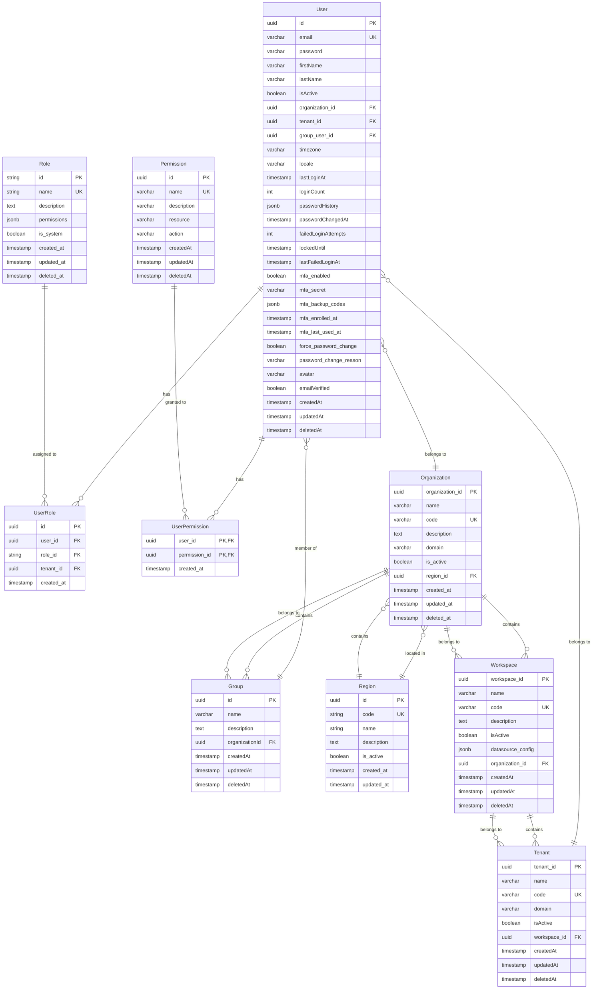

# IAM Module - Entity Relationship Diagram

## Overview
This ERD represents the Identity and Access Management (IAM) module entities and their relationships in the TelemetryFlow platform.

## Entities
- **User**: System users with authentication and profile information
- **Role**: Role definitions with associated permissions
- **Permission**: Granular access control permissions
- **Region**: Geographic regions for organizations
- **Organization**: Top-level organizational units
- **Workspace**: Project workspaces within organizations
- **Tenant**: Multi-tenant isolation units within workspaces
- **Group**: User grouping for organizational structure
- **UserRole**: Junction table for User-Role many-to-many relationship
- **UserPermission**: Junction table for User-Permission many-to-many relationship

## Entity Relationship Diagram

## Cardinality Summary

### One-to-Many Relationships
- **Region → Organization**: One region contains many organizations (1:N)
- **Organization → Workspace**: One organization contains many workspaces (1:N)
- **Organization → Group**: One organization contains many groups (1:N)
- **Workspace → Tenant**: One workspace contains many tenants (1:N)
- **Organization → User**: One organization has many users (1:N)
- **Tenant → User**: One tenant has many users (1:N)
- **Group → User**: One group has many users (1:N)

### Many-to-Many Relationships
- **User ←→ Role**: Users can have multiple roles, roles can be assigned to multiple users (N:M via UserRole)
- **User ←→ Permission**: Users can have multiple direct permissions, permissions can be granted to multiple users (N:M via UserPermission)

## Key Constraints
- **User.email**: Unique constraint with soft delete consideration
- **Organization.code**: Unique constraint
- **Workspace.code**: Unique constraint
- **Tenant.code**: Unique constraint
- **Role.name**: Unique constraint
- **Permission.name**: Unique constraint
- **UserRole**: Composite unique index on (user_id, role_id)
- **UserPermission**: Composite primary key on (user_id, permission_id)

## Indexes
- User: (email, deletedAt)
- Organization: (code), (region_id)
- Workspace: (organization_id)
- Tenant: (workspace_id)
- UserRole: (user_id, role_id) unique

## Entity Counts
- **Total Entities**: 10
- **Primary Entities**: 8 (User, Role, Permission, Region, Organization, Workspace, Tenant, Group)
- **Junction Tables**: 2 (UserRole, UserPermission)
